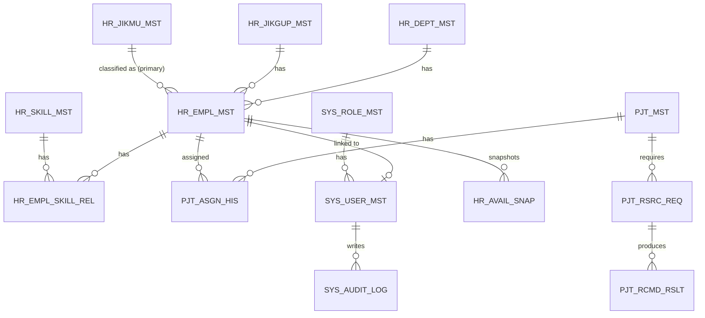

# HRM 자동화 시스템 — PostgreSQL ERD (최종 확정)

> 출처: `plan_docs/[DESIGN]HRM_Automation_System_Design_v0_6.md` § 5 (설계서는 수정하지 않음, 본 문서는 Phase 2 Alembic 마이그레이션 작성을 위한 실행용 정리본)
> 대상: 로드맵 §8 다음 작업 1번 — "PostgreSQL ERD 최종 확정 (`HR_EMPL_MST` 등 15개 테이블 관계 검토)"
> 작성일: 2026-07-02

---

## 1. 명명 규칙

`{대상 약어}_{필드 유형 접미사}`

| 접미사 | 의미 |
|---|---|
| `_ID` | 식별자 (UUID, PK/FK) |
| `_NO` | 업무 번호 |
| `_CD` | 코드 |
| `_NM` | 이름 |
| `_DT` | 날짜 (DATE) |
| `_DTTM` | 일시 (TIMESTAMPTZ) |
| `_YN` | 불리언 |
| `_RT` | 비율(%) |
| `_CNT` | 건수 |
| `_ORD` | 정렬 순서 |
| `_DESC` | 설명 |
| `_JSON` | JSON/JSONB |
| `_LEVL` | 레벨 |
| `_GRP` | 그룹 |
| `_SUMR` | 요약 |

공통 감사 컬럼(전 테이블): `REG_DTTM`, `REG_USER`, `UPD_DTTM`, `UPD_USER` (일부 테이블은 `REG_USER`/`UPD_USER` 생략 — 아래 표 참조)

---

## 2. ERD 다이어그램



> 설계서 다이어그램에는 `HR_EMPL_ROLE_REL`(사원-직무 다중 역할 N:M 연결 테이블)이 16번째 테이블로 함께 표시되어 있음. 로드맵 §2/§11의 "15개 테이블" 범위에는 포함되어 있지 않으나, `HR_EMPL_MST`↔`HR_JIKMU_MST` 다중 역할(예: "PM, AA")을 지원하려면 필요한 테이블이므로 **범위 확정 필요 이슈**로 별도 기록한다 (§9 리스크 참조).

---

## 3. 테이블 상세

### 3.1 HR_DEPT_MST — 부서 마스터

| 컬럼 | 타입 | 제약 | 설명 |
|---|---|---|---|
| DEPT_ID | UUID | PK | 부서 ID |
| DEPT_CD | VARCHAR(30) | UNIQUE NOT NULL | 부서 코드 |
| DEPT_NM | VARCHAR(100) | NOT NULL | 부서명 |
| PRNT_DEPT_ID | UUID | FK(self) NULL | 상위 부서 ID |
| DEPT_ORD | SMALLINT | DEFAULT 0 | 정렬 순서 |
| USE_YN | BOOLEAN | DEFAULT TRUE | 사용 여부 |
| REG_DTTM | TIMESTAMPTZ | NOT NULL | 등록일시 |
| UPD_DTTM | TIMESTAMPTZ | NOT NULL | 수정일시 |

FK: `PRNT_DEPT_ID → HR_DEPT_MST.DEPT_ID` (자기참조, 트리 구조)

**Seed (3건, `ResourceManagement_v2.xlsx` 기준):**

| DEPT_CD | DEPT_NM | PRNT_DEPT_ID |
|---|---|---|
| DELIVERY | 딜리버리 | NULL |
| SALES_PARTNER | 세일즈파트너 | NULL |
| SALES | 영업 | NULL |

---

### 3.2 HR_JIKGUP_MST — 직급 마스터

| 컬럼 | 타입 | 제약 | 설명 |
|---|---|---|---|
| JIKGUP_ID | UUID | PK | 직급 ID |
| JIKGUP_CD | VARCHAR(30) | UNIQUE NOT NULL | 직급 코드 |
| JIKGUP_NM | VARCHAR(100) | NOT NULL | 직급명 |
| JIKGUP_ORD | SMALLINT | NOT NULL | 정렬 순서(낮을수록 상위 직급) |
| USE_YN | BOOLEAN | DEFAULT TRUE | 사용 여부 |
| REG_DTTM | TIMESTAMPTZ | NOT NULL | 등록일시 |
| UPD_DTTM | TIMESTAMPTZ | NOT NULL | 수정일시 |

**Seed (10건):**

| JIKGUP_CD | JIKGUP_NM | JIKGUP_ORD |
|---|---|---|
| INTERN | 인턴 | 10 |
| SAWON | 사원 | 20 |
| DAERI | 대리 | 30 |
| CHAJANG | 차장 | 40 |
| BUJANG | 부장 | 50 |
| ISA | 이사 | 60 |
| SANGMUBO | 상무보 | 70 |
| SANGMU | 상무 | 80 |
| JUNMU | 전무 | 90 |
| BUDAEPYO | 부대표 | 100 |

---

### 3.3 HR_JIKMU_MST — 직무 마스터

| 컬럼 | 타입 | 제약 | 설명 |
|---|---|---|---|
| JIKMU_ID | UUID | PK | 직무 ID |
| JIKMU_CD | VARCHAR(50) | UNIQUE NOT NULL | 직무 코드 |
| JIKMU_NM | VARCHAR(100) | NOT NULL | 직무명(한글) |
| JIKMU_GRP_CD | VARCHAR(50) | NULL | 그룹 코드 (TECHNICAL/MANAGEMENT/ANALYSIS) |
| JIKMU_DESC | TEXT | NULL | 설명 |
| SORT_ORD | SMALLINT | DEFAULT 0 | 정렬 순서 |
| USE_YN | BOOLEAN | DEFAULT TRUE | 사용 여부 |
| REG_DTTM | TIMESTAMPTZ | NOT NULL | 등록일시 |
| UPD_DTTM | TIMESTAMPTZ | NOT NULL | 수정일시 |

**Seed (12건):**

| JIKMU_CD | JIKMU_NM | JIKMU_GRP_CD | Excel 원코드 |
|---|---|---|---|
| ARCHITECT | 아키텍트(AA) | TECHNICAL | AA |
| TECH_LEAD | 기술아키텍트(TA) | TECHNICAL | TA |
| BA | 비즈니스 애널리스트(BA) | ANALYSIS | BA |
| DBA | DBA | TECHNICAL | DBA |
| PM | 프로젝트 매니저(PM) | MANAGEMENT | PM |
| CONSULTANT | 컨설턴트 | MANAGEMENT | 컨설턴트 |
| PMO | 사업관리 | MANAGEMENT | 사업관리 |
| DEVELOPER | 개발자 | TECHNICAL | (신규) |
| DA | 데이터 애널리스트 | ANALYSIS | (신규) |
| QA | QA 엔지니어 | TECHNICAL | (신규) |
| DEVOPS | DevOps/인프라 | TECHNICAL | (신규) |
| DESIGNER | UI/UX 디자이너 | TECHNICAL | (신규) |

> 구분 유의: JIKGUP(연차/직급, 예 과장·부장) vs JIKMU(전문 직무, 예 ARCHITECT) vs `PJT_ASGN_HIS.PRJT_ROLE_NM`(프로젝트 내 역할, 자유 텍스트)는 서로 다른 개념.

---

### 3.4 HR_SKILL_MST — 기술 마스터

| 컬럼 | 타입 | 제약 | 설명 |
|---|---|---|---|
| SKILL_ID | UUID | PK | 기술 ID |
| SKILL_GRP_CD | VARCHAR(50) | NOT NULL | 기술 그룹 코드 (BACKEND/FRONTEND/DB/CLOUD 등) |
| SKILL_NM | VARCHAR(100) | NOT NULL | 기술명 (Java, Spring, React, AWS 등) |
| USE_YN | BOOLEAN | DEFAULT TRUE | 사용 여부 |
| REG_DTTM | TIMESTAMPTZ | NOT NULL | 등록일시 |
| UPD_DTTM | TIMESTAMPTZ | NOT NULL | 수정일시 |

> 설계서에 구체적 Seed 목록 없음 — 그룹 카테고리 예시만 제시. Phase 2 Seed 작업 시 운영팀 확정 필요 (로드맵 §9 리스크 "직원 기술 스택 표준화 기준 미정"과 연결).

---

### 3.5 HR_EMPL_MST — 사원 마스터

| 컬럼 | 타입 | 제약 | 설명 |
|---|---|---|---|
| EMPL_ID | UUID | PK | 사원 ID |
| EMPL_NO | VARCHAR(30) | UNIQUE NOT NULL | 사번 |
| EMPL_NM | VARCHAR(100) | NOT NULL | 성명 |
| DEPT_ID | UUID | FK | 부서 ID (`HR_DEPT_MST`) |
| JIKGUP_ID | UUID | FK | 직급 ID (`HR_JIKGUP_MST`) |
| JIKMU_ID | UUID | FK NULL | 주 직무 ID (`HR_JIKMU_MST`) |
| EMPL_STAT_CD | VARCHAR(20) | NOT NULL | 재직 상태 코드 (ACTIVE/LEAVE/RETIRED) |
| EMAIL_ADDR | VARCHAR(255) | UNIQUE | 이메일 |
| MPHONE_NO | VARCHAR(50) | NULL | 휴대전화 |
| HIRE_DT | DATE | NULL | 입사일 |
| RETIR_DT | DATE | NULL | 퇴사일 |
| REG_DTTM | TIMESTAMPTZ | NOT NULL | 등록일시 |
| REG_USER | VARCHAR(100) | NULL | 등록자 |
| UPD_DTTM | TIMESTAMPTZ | NOT NULL | 수정일시 |
| UPD_USER | VARCHAR(100) | NULL | 수정자 |

FK: `DEPT_ID → HR_DEPT_MST.DEPT_ID`, `JIKGUP_ID → HR_JIKGUP_MST.JIKGUP_ID`, `JIKMU_ID → HR_JIKMU_MST.JIKMU_ID` (nullable)
Enum: `EMPL_STAT_CD ∈ {ACTIVE, LEAVE, RETIRED}`

---

### 3.6 HR_EMPL_SKILL_REL — 사원기술 연결 (N:M 연결 테이블)

| 컬럼 | 타입 | 제약 | 설명 |
|---|---|---|---|
| EMPL_SKILL_ID | UUID | PK | 행 ID |
| EMPL_ID | UUID | FK NOT NULL | 사원 ID (`HR_EMPL_MST`) |
| SKILL_ID | UUID | FK NOT NULL | 기술 ID (`HR_SKILL_MST`) |
| PRFCY_LEVL | SMALLINT | CHECK 1~5 | 숙련도 (1=초급 ~ 5=전문가) |
| EXPR_YEAR | NUMERIC(4,1) | NULL | 경력 연수 |
| LAST_USE_DT | DATE | NULL | 최근 사용일 |
| RMRK | TEXT | NULL | 비고 |
| REG_DTTM | TIMESTAMPTZ | NOT NULL | 등록일시 |
| UPD_DTTM | TIMESTAMPTZ | NOT NULL | 수정일시 |

FK: `EMPL_ID → HR_EMPL_MST.EMPL_ID`, `SKILL_ID → HR_SKILL_MST.SKILL_ID`
Check: `PRFCY_LEVL BETWEEN 1 AND 5`

---

### 3.7 HR_AVAIL_SNAP — 가동가능 스냅샷

| 컬럼 | 타입 | 제약 | 설명 |
|---|---|---|---|
| SNAP_ID | UUID | PK | 스냅샷 ID |
| EMPL_ID | UUID | FK NOT NULL | 사원 ID (`HR_EMPL_MST`) |
| SNAP_DT | DATE | NOT NULL | 스냅샷 일자 |
| TOT_ALLOC_RT | SMALLINT | NOT NULL | 총 투입률(%) |
| AVAIL_RT | SMALLINT | NOT NULL | 가용률(%) |
| AVAIL_STRT_DT | DATE | NULL | 가동 가능 시작일 |
| AVAIL_STAT_CD | VARCHAR(20) | NOT NULL | 가동 상태 코드 (AVAILABLE/PARTIAL/FULL) |
| REG_DTTM | TIMESTAMPTZ | NOT NULL | 등록일시 |

FK: `EMPL_ID → HR_EMPL_MST.EMPL_ID`
Enum: `AVAIL_STAT_CD ∈ {AVAILABLE, PARTIAL, FULL}`

**산정 로직 (설계서 §5.4):**

```
1. ACTIVE 상태 PJT_ASGN_HIS 없음 또는 ALLOC_RT 합계 = 0%  → 오늘 (AVAILABLE)
2. ALLOC_RT 합계 < 100%                                    → PARTIAL
3. ALLOC_RT 합계 >= 100%                                   → MAX(ASGN_END_DT) + 1일 (FULL)
```

`AVAIL_STRT_DT`는 자동 계산 필드로 직접 입력 불가. 매일 01:00 배치 `HR_AVAIL_SNAP_GEN`으로 생성 (Phase 7).

---

### 3.8 PJT_MST — 프로젝트 마스터

| 컬럼 | 타입 | 제약 | 설명 |
|---|---|---|---|
| PJT_ID | UUID | PK | 프로젝트 ID |
| PJT_CD | VARCHAR(30) | UNIQUE NOT NULL | 프로젝트 코드 |
| PJT_NM | VARCHAR(200) | NOT NULL | 프로젝트명 |
| CLNT_NM | VARCHAR(200) | NULL | 고객사명 |
| PJT_STAT_CD | VARCHAR(20) | NOT NULL | 프로젝트 상태 코드 (PLANNED/RUNNING/CLOSED/HOLD) |
| STRT_DT | DATE | NOT NULL | 시작일 |
| END_DT | DATE | NULL | 종료 예정일 |
| PJT_DESC | TEXT | NULL | 설명 |
| REG_DTTM | TIMESTAMPTZ | NOT NULL | 등록일시 |
| REG_USER | VARCHAR(100) | NULL | 등록자 |
| UPD_DTTM | TIMESTAMPTZ | NOT NULL | 수정일시 |
| UPD_USER | VARCHAR(100) | NULL | 수정자 |

Enum: `PJT_STAT_CD ∈ {PLANNED, RUNNING, CLOSED, HOLD}`

---

### 3.9 PJT_ASGN_HIS — 투입 이력

| 컬럼 | 타입 | 제약 | 설명 |
|---|---|---|---|
| ASGN_ID | UUID | PK | 투입 ID |
| EMPL_ID | UUID | FK NOT NULL | 사원 ID (`HR_EMPL_MST`) |
| PJT_ID | UUID | FK NOT NULL | 프로젝트 ID (`PJT_MST`) |
| ASGN_TYPE_CD | VARCHAR(20) | NOT NULL DEFAULT 'RUNNING' | 투입 유형 코드 (RUNNING/COMMITTED/PROPOSED) |
| PRJT_ROLE_NM | VARCHAR(100) | NOT NULL | 프로젝트 내 역할명 |
| ALLOC_RT | SMALLINT | CHECK 0~100 | 투입률(%) |
| ASGN_STRT_DT | DATE | NOT NULL | 투입 시작일 |
| ASGN_END_DT | DATE | NULL | 투입 종료 예정일 |
| ASGN_STAT_CD | VARCHAR(20) | NOT NULL | 투입 상태 코드 (PLANNED/ACTIVE/DONE/CANCELED) |
| RMRK | TEXT | NULL | 비고 |
| REG_DTTM | TIMESTAMPTZ | NOT NULL | 등록일시 |
| REG_USER | VARCHAR(100) | NULL | 등록자 |
| UPD_DTTM | TIMESTAMPTZ | NOT NULL | 수정일시 |
| UPD_USER | VARCHAR(100) | NULL | 수정자 |

FK: `EMPL_ID → HR_EMPL_MST.EMPL_ID`, `PJT_ID → PJT_MST.PJT_ID`
Check: `ALLOC_RT BETWEEN 0 AND 100`
Enum: `ASGN_TYPE_CD ∈ {RUNNING, COMMITTED, PROPOSED}`, `ASGN_STAT_CD ∈ {PLANNED, ACTIVE, DONE, CANCELED}`

**데이터 정합성 규칙 (§5.5):** 동일 사원의 겹치는 기간 `ALLOC_RT` 합계는 100%를 초과할 수 없음. `ASGN_END_DT`는 원칙적으로 `PJT_MST.END_DT`보다 늦을 수 없음(운영상 예외 허용). "가동 가능일" = `ASGN_END_DT + 1` (계산값, 별도 저장/직접 입력 없음).

---

### 3.10 PJT_RSRC_REQ — 리소스 요청

| 컬럼 | 타입 | 제약 | 설명 |
|---|---|---|---|
| REQ_ID | UUID | PK | 요청 ID |
| PJT_ID | UUID | FK NOT NULL | 프로젝트 ID (`PJT_MST`) |
| REQ_USER_ID | UUID | FK NOT NULL | 요청자 ID (`SYS_USER_MST`) |
| REQ_JIKMU_ID | UUID | FK NULL | 요구 직무 ID (`HR_JIKMU_MST`, 선택) |
| REQ_ROLE_NM | VARCHAR(100) | NOT NULL | 요구 역할명 |
| REQ_SKILL_JSON | JSONB | NOT NULL | 요구 기술+최소 숙련도 목록 |
| MIN_ALLOC_RT | SMALLINT | NOT NULL | 최소 투입률(%) |
| REQ_AVAIL_DT | DATE | NOT NULL | 희망 가동일 |
| REQ_HC | SMALLINT | DEFAULT 1 | 요청 인원수 |
| REQ_STAT_CD | VARCHAR(20) | NOT NULL | 요청 상태 코드 (OPEN/IN_REVIEW/FULFILLED/CANCELED) |
| RMRK | TEXT | NULL | 비고 |
| REG_DTTM | TIMESTAMPTZ | NOT NULL | 등록일시 |
| REG_USER | VARCHAR(100) | NULL | 등록자 |
| UPD_DTTM | TIMESTAMPTZ | NOT NULL | 수정일시 |
| UPD_USER | VARCHAR(100) | NULL | 수정자 |

FK: `PJT_ID → PJT_MST.PJT_ID`, `REQ_USER_ID → SYS_USER_MST.USER_ID`, `REQ_JIKMU_ID → HR_JIKMU_MST.JIKMU_ID` (nullable)
Enum: `REQ_STAT_CD ∈ {OPEN, IN_REVIEW, FULFILLED, CANCELED}`

---

### 3.11 PJT_RCMD_RSLT — 추천 결과

| 컬럼 | 타입 | 제약 | 설명 |
|---|---|---|---|
| RCMD_ID | UUID | PK | 추천 ID |
| REQ_ID | UUID | FK NOT NULL | 요청 ID (`PJT_RSRC_REQ`) |
| EMPL_ID | UUID | FK NOT NULL | 추천 사원 ID (`HR_EMPL_MST`) |
| RCMD_RANK | SMALLINT | NOT NULL | 추천 순위 |
| TOT_SCORE | NUMERIC(5,2) | NOT NULL | 총점 |
| SCORE_DTL_JSON | JSONB | NULL | 항목별 점수 상세 |
| RCMD_RSN | TEXT | NULL | 추천 사유 |
| SEL_YN | BOOLEAN | DEFAULT FALSE | 최종 선정 여부 |
| REG_DTTM | TIMESTAMPTZ | NOT NULL | 등록일시 |

FK: `REQ_ID → PJT_RSRC_REQ.REQ_ID`, `EMPL_ID → HR_EMPL_MST.EMPL_ID`

> 점수 산정 가중치는 로드맵 §4 Phase 5 / §11 검색추천 체크리스트 참조 (직무 15% + 기술 35% + 숙련도 25% + 가동일 15% + 유사경험 7% + 역할적합도 3%). 설계서 §5 인용 구간에는 일부 가중치만 명시되어 있어 Phase 5 착수 시 로드맵 수치를 기준으로 확정할 것.

---

### 3.12 SYS_USER_MST — 시스템 사용자 마스터

| 컬럼 | 타입 | 제약 | 설명 |
|---|---|---|---|
| USER_ID | UUID | PK | 사용자 ID |
| EMPL_ID | UUID | FK NULL | 연계 사원 ID (`HR_EMPL_MST`, 선택) |
| USER_LGID | VARCHAR(100) | UNIQUE NOT NULL | 로그인 ID |
| EMAIL_ADDR | VARCHAR(255) | UNIQUE NOT NULL | 이메일 |
| ENCR_PWD | VARCHAR(255) | NULL | 암호화된 비밀번호 (SSO인 경우 NULL) |
| ROLE_ID | UUID | FK NOT NULL | 역할 ID (`SYS_ROLE_MST`) |
| USE_YN | BOOLEAN | DEFAULT TRUE | 계정 활성 여부 |
| LAST_LGN_DTTM | TIMESTAMPTZ | NULL | 최근 로그인 일시 |
| REG_DTTM | TIMESTAMPTZ | NOT NULL | 등록일시 |
| UPD_DTTM | TIMESTAMPTZ | NOT NULL | 수정일시 |

FK: `EMPL_ID → HR_EMPL_MST.EMPL_ID` (nullable, 1:0..1), `ROLE_ID → SYS_ROLE_MST.ROLE_ID`

> 보안: `ENCR_PWD`는 bcrypt/argon2 해시 필수, 평문 저장 금지 (설계서 §11).

---

### 3.13 SYS_ROLE_MST — 역할 마스터

| 컬럼 | 타입 | 제약 | 설명 |
|---|---|---|---|
| ROLE_ID | UUID | PK | 역할 ID |
| ROLE_CD | VARCHAR(50) | UNIQUE NOT NULL | 역할 코드 |
| ROLE_NM | VARCHAR(100) | NOT NULL | 역할명 |
| ROLE_DESC | TEXT | NULL | 역할 설명 |
| PERM_JSON | JSONB | NULL | 세부 권한 목록(JSON, 확장용) |
| USE_YN | BOOLEAN | DEFAULT TRUE | 사용 여부 |

**Seed (6종, `ROLE_CD` enum):** `ADMIN`, `HR_MGR`, `PM`, `TEAM_LEAD`, `EXEC`, `VIEWER`

> 설계서에는 6개 역할 코드가 제약 값 목록으로만 제시되어 있고 별도 Seed 데이터 테이블은 없음 — Phase 2 Seed 작성 시 `ROLE_NM`/`ROLE_DESC`/`PERM_JSON` 값은 로드맵 §9 "인증/권한 범위 미정" 이슈에 따라 관계자 승인 후 확정 필요.

---

### 3.14 SYS_AUDIT_LOG — 감사 로그

| 컬럼 | 타입 | 제약 | 설명 |
|---|---|---|---|
| AUDIT_ID | UUID | PK | 로그 ID |
| USER_ID | UUID | FK NOT NULL | 행위자 ID (`SYS_USER_MST`) |
| ACT_CD | VARCHAR(50) | NOT NULL | 행위 코드 (CREATE/UPDATE/DELETE/LOGIN/IMPORT 등) |
| TGT_TBL_NM | VARCHAR(100) | NOT NULL | 대상 테이블명 |
| TGT_ID | UUID | NULL | 대상 레코드 ID |
| BFR_VAL_JSON | JSONB | NULL | 변경 전 값 |
| AFT_VAL_JSON | JSONB | NULL | 변경 후 값 |
| CLNT_IP | VARCHAR(45) | NULL | 클라이언트 IP |
| USER_AGT | TEXT | NULL | User-Agent |
| REG_DTTM | TIMESTAMPTZ | NOT NULL | 이벤트 일시 |

FK: `USER_ID → SYS_USER_MST.USER_ID`

> 보안: JWT/비밀번호/API 키 등 민감정보는 로그 기록 시 마스킹 필수 (설계서 §11).

---

### 3.15 SYS_BATCH_HIS — 배치 실행 이력

| 컬럼 | 타입 | 설명 |
|---|---|---|
| BATCH_ID | UUID | 배치 실행 ID (PK) |
| BATCH_NM | VARCHAR(100) | 배치명 |
| EXEC_STAT_CD | VARCHAR(20) | 실행 상태 코드 (SUCCESS/FAILED/RUNNING) |
| EXEC_STRT_DTTM | TIMESTAMPTZ | 실행 시작 시각 |
| EXEC_END_DTTM | TIMESTAMPTZ | 실행 종료 시각 |
| RSLT_SUMR | TEXT | 결과 요약 |
| ERR_MSG | TEXT | 오류 메시지 |
| CRT_CNT | INTEGER | 생성 건수 |
| UPD_CNT | INTEGER | 수정 건수 |
| FAIL_CNT | INTEGER | 실패 건수 |
| REG_DTTM | TIMESTAMPTZ | 등록일시 |

FK 관계 없음 (독립 테이블). 연계 배치: `HR_AVAIL_SNAP_GEN`(매일 01:00) 등 Phase 7 배치 5종.

---

## 4. 관계(카디널리티) 요약

| 관계 | 카디널리티 | 비고 |
|---|---|---|
| HR_DEPT_MST → HR_EMPL_MST | 1:N | `DEPT_ID` |
| HR_JIKGUP_MST → HR_EMPL_MST | 1:N | `JIKGUP_ID` |
| HR_JIKMU_MST → HR_EMPL_MST | 1:N | `JIKMU_ID` (주 직무만) |
| HR_EMPL_MST ↔ HR_SKILL_MST | N:M | 연결 테이블 `HR_EMPL_SKILL_REL` |
| PJT_MST → PJT_ASGN_HIS | 1:N | `PJT_ID` |
| HR_EMPL_MST → PJT_ASGN_HIS | 1:N | `EMPL_ID` |
| PJT_MST → PJT_RSRC_REQ | 1:N | `PJT_ID` |
| PJT_RSRC_REQ → PJT_RCMD_RSLT | 1:N | `REQ_ID` |
| HR_EMPL_MST → HR_AVAIL_SNAP | 1:N | `EMPL_ID` (일별 스냅샷) |
| SYS_USER_MST → SYS_AUDIT_LOG | 1:N | `USER_ID` |
| HR_EMPL_MST ↔ SYS_USER_MST | 1:0..1 | 사원이 시스템 계정과 선택적으로 연계 |
| SYS_ROLE_MST → SYS_USER_MST | 1:N | `ROLE_ID` |
| PJT_RSRC_REQ → HR_JIKMU_MST | N:1 (선택) | `REQ_JIKMU_ID`, nullable |
| SYS_BATCH_HIS | 독립 | FK 관계 없음 |

---

## 5. Phase 2 착수 전 확인 필요 사항

1. **`HR_EMPL_ROLE_REL` 테이블 범위 포함 여부** — 설계서 ERD 다이어그램에는 존재하나 로드맵 15개 테이블 목록에는 없음. 사원의 다중 직무(예: "PM, AA") 지원 여부에 따라 Phase 2 범위 포함 여부 결정 필요 (관계자 확인 필요).
2. **`HR_SKILL_MST` Seed 데이터** — 설계서에 구체적 기술 목록 없음. 로드맵 §9 리스크 "직원 기술 스택 표준화 기준 미정"과 동일 이슈.
3. **`SYS_ROLE_MST` 세부 값** — 역할 코드 6종은 확정되었으나 `ROLE_NM`/`ROLE_DESC`/`PERM_JSON` 상세는 미정 (로드맵 §9 "인증/권한 범위 미정"과 동일 이슈).
4. **`PJT_RCMD_RSLT` 점수 가중치** — 설계서 §5 인용 구간 가중치와 로드맵 §11 명시 가중치(직무 15%+기술 35%+숙련도 25%+가동일 15%+유사경험 7%+역할적합도 3%) 간 표기 차이 있음 — Phase 5 착수 시 로드맵 수치 기준으로 확정.

이 문서는 Alembic 마이그레이션(로드맵 §8 다음 작업 4번) 작성 시 테이블 스키마의 근거 자료로 사용한다.
