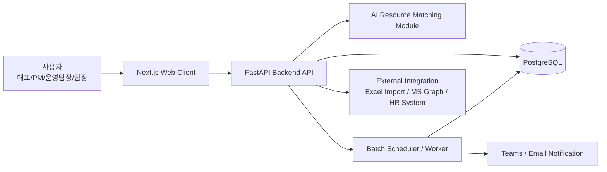
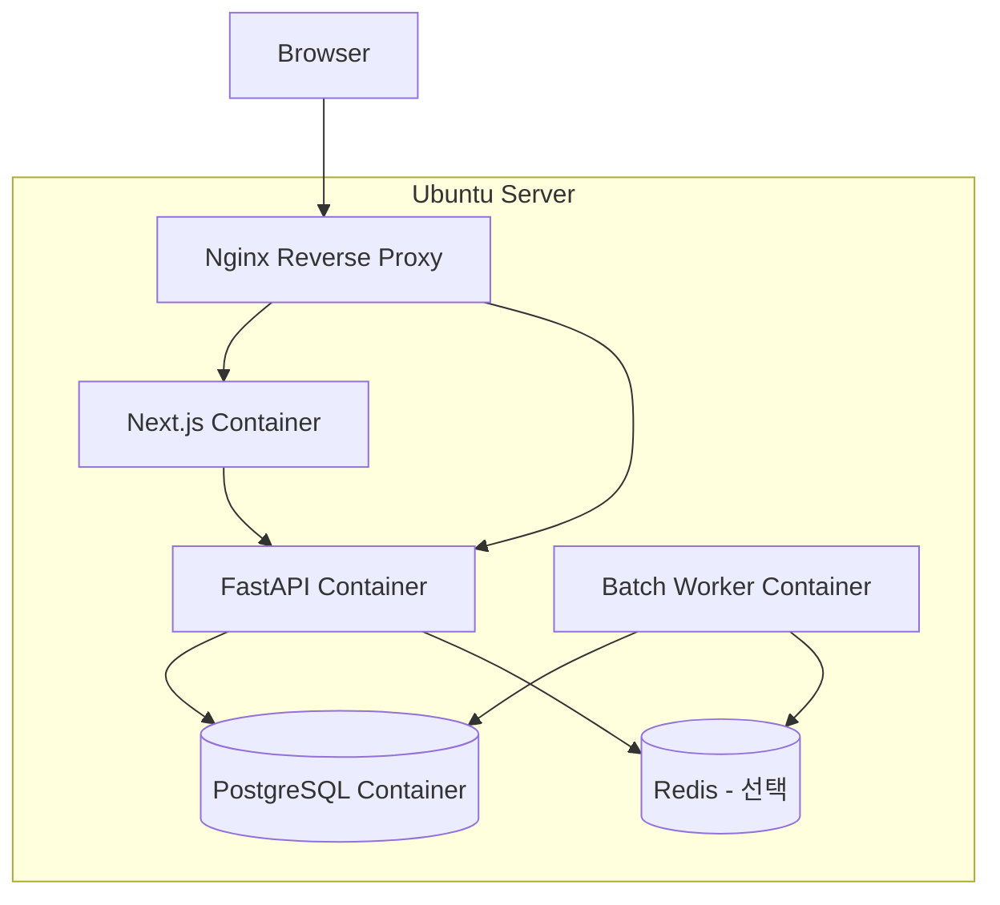
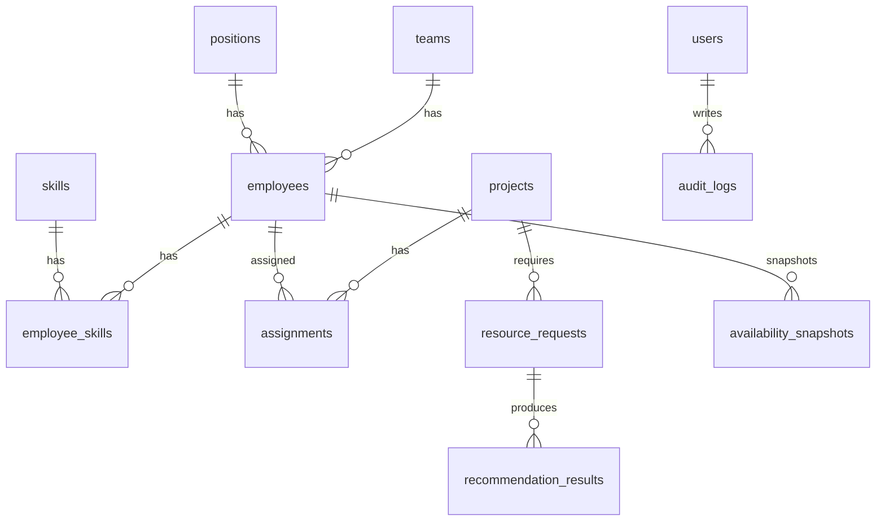
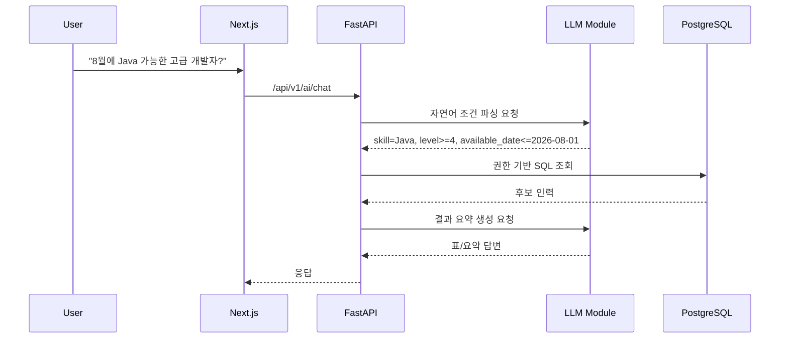

# Human Resource Management Automation System
## 통합 기획·설계서 v0.1  

**작성일:** 2026년 7월 1일  
**문서 목적:** 기존 MS 365 기반 리소스 관리 자동화 설계를 독립형 웹 애플리케이션 아키텍처로 리팩토링  
**대상 시스템:** SI/IT 조직의 인력 현황, 기술 스택, 투입률, 프로젝트 배치, 가동 가능일, 리소스 추천 자동화 시스템

---

## 목차

1. [프로젝트 개요](#1-프로젝트-개요)
2. [기존 설계 대비 변경 방향](#2-기존-설계-대비-변경-방향)
3. [목표 아키텍처](#3-목표-아키텍처)
4. [업무 범위 및 주요 기능](#4-업무-범위-및-주요-기능)
5. [도메인 모델 및 데이터베이스 설계](#5-도메인-모델-및-데이터베이스-설계)
6. [FastAPI 백엔드 설계](#6-fastapi-백엔드-설계)
7. [Next.js 웹 클라이언트 설계](#7-nextjs-웹-클라이언트-설계)
8. [Docker 및 Ubuntu 운영 환경 설계](#8-docker-및-ubuntu-운영-환경-설계)
9. [AI 질의응답 및 리소스 추천 설계](#9-ai-질의응답-및-리소스-추천-설계)
10. [자동화 배치 및 알림 설계](#10-자동화-배치-및-알림-설계)
11. [보안·권한·감사 설계](#11-보안권한감사-설계)
12. [운영 프로세스](#12-운영-프로세스)
13. [마이그레이션 전략](#13-마이그레이션-전략)
14. [구현 일정 및 완료 체크리스트](#14-구현-일정-및-완료-체크리스트)
15. [리스크 및 대응 방안](#15-리스크-및-대응-방안)
16. [부록: 초기 프로젝트 구조 예시](#16-부록-초기-프로젝트-구조-예시)

---

## 1. 프로젝트 개요

본 시스템은 조직 내 인력 리소스를 체계적으로 관리하고, 프로젝트 투입 가능 인력과 기술 역량을 빠르게 검색·추천하기 위한 Human Resource Management Automation 시스템이다.

기존 설계는 Excel, SharePoint List, Python 스크립트, Power Virtual Agents를 중심으로 구성되었으나, 본 리팩토링 버전에서는 다음 기술 스택을 기준으로 독립형 업무 시스템으로 재설계한다.

| 구분 | 적용 기술 |
|---|---|
| 백엔드 | FastAPI |
| 데이터베이스 | PostgreSQL(기존 운영 DB) |
| 웹 클라이언트 | Next.js |
| 운영 환경 | Ubuntu Server |
| 실행 환경 | Docker / Docker Compose |
| 인증 방식 | 1차 MVP: JWT 기반 자체 인증 / 확장: Microsoft Entra ID 연동 |
| 자동화 | FastAPI Background Task, APScheduler 또는 Celery 기반 배치 |
| 알림 | Teams Webhook, Email, Slack 등 확장 가능 |
| AI 연동 | LLM API 또는 사내 LLM 기반 자연어 질의응답 |

### 1.1 목적

| 구분 | 내용 |
|---|---|
| 인력 현황 관리 | 직원, 팀, 직급, 기술 스택, 숙련도, 프로젝트 투입 현황 통합 관리 |
| 가동률 관리 | 개인·팀·전체 조직 단위의 투입률, 대기 인력, 종료 예정자 현황 파악 |
| 리소스 매칭 | 기술, 숙련도, 역할, 가동 가능일 기준으로 프로젝트 투입 후보 추천 |
| 운영 자동화 | 주간 업데이트, 월간 리포트, 가동률 알림, 프로젝트 종료 예정자 알림 자동화 |
| AI 질의응답 | “다음 달 Java 고급 개발자 중 투입 가능한 사람”과 같은 자연어 질의 지원 |

### 1.2 적용 대상

| 항목 | 기준 |
|---|---|
| 조직 규모 | 1차 기준 약 70명 |
| 확장 가능 규모 | 수백 명 수준까지 확장 가능 |
| 주요 사용자 | 대표, 임원, 운영팀장, PM, 팀장, 인사/리소스 관리자 |
| 주요 데이터 | 직원 정보, 기술 역량, 프로젝트, 투입률, 가동 가능일, 리소스 이력 |

### 1.3 핵심 성공 기준

- 전체 인력의 현재 투입 상태를 웹 대시보드에서 즉시 확인할 수 있다.
- 특정 기술과 숙련도를 가진 투입 가능 인력을 10초 이내에 조회할 수 있다.
- 프로젝트 종료 예정자와 대기 인력을 주간 단위로 자동 리포트한다.
- Excel 수작업 중심 관리에서 벗어나 PostgreSQL 기반의 정합성 있는 데이터 관리 체계를 구축한다.
- 향후 AI Agent, RAG, 프로젝트 이력 분석, 인력 수요 예측으로 확장 가능한 구조를 가진다.

---

## 2. 기존 설계 대비 변경 방향

기존 문서는 MS 365 생태계 기반의 경량 자동화 구조였다. 본 문서는 이를 웹 애플리케이션 중심의 시스템 아키텍처로 전환한다.

### 2.1 기존 구조

| 영역 | 기존 설계 |
|---|---|
| 마스터 입력 | Excel ResourceTable |
| 저장소 | SharePoint List |
| 동기화 | Python Script 또는 Power Automate |
| AI 질의 | Power Virtual Agents / Copilot Studio |
| 운영 | Windows 작업 스케줄러, Teams 알림 |
| 장점 | 빠른 구축, 낮은 비용, MS 365 환경 활용 |
| 한계 | 데이터 정규화 한계, 권한 통제 제한, 화면 UX 제한, 이력 관리 취약, 확장성 제한 |

### 2.2 리팩토링 후 구조

| 영역 | 리팩토링 설계 |
|---|---|
| 마스터 입력 | Next.js 웹 화면 |
| 저장소 | PostgreSQL |
| API | FastAPI REST API |
| 인증/권한 | JWT + Role Based Access Control |
| 자동화 | 컨테이너 기반 Batch Worker |
| AI 질의 | FastAPI AI API + LLM/RAG 모듈 |
| 운영 | Ubuntu + Docker Compose |
| 장점 | 데이터 정합성, 확장성, 감사 이력, 권한 관리, 독립 운영성, 시스템화 가능 |

### 2.3 전환 원칙

| 원칙 | 설명 |
|---|---|
| Excel은 입력 원장이 아니라 이관·업로드 수단으로 격하 | 운영 데이터의 Single Source of Truth는 PostgreSQL로 설정 |
| SharePoint List는 필수 구성에서 제외 | 필요 시 외부 연동 채널 또는 백업 Export 대상으로만 사용 |
| PVA는 선택 사항으로 전환 | 사내 웹 AI Agent 또는 LLM API 기반으로 대체 가능 |
| 수작업 동기화보다 실시간 CRUD 우선 | 웹 화면에서 직접 등록·수정·삭제하는 구조 적용 |
| 감사 이력 필수화 | 인력 정보 변경, 투입률 변경, 프로젝트 배치 변경을 Audit Log로 관리 |

---

## 3. 목표 아키텍처

### 3.1 논리 아키텍처



### 3.2 컨테이너 아키텍처



### 3.3 배포 구성

| 구성 요소 | 컨테이너명 | 기본 포트 | 역할 |
|---|---:|---:|---|
| Next.js | `hrm-web` | 3030 | 웹 클라이언트 |
| FastAPI | `hrm-api` | 8000 | REST API, 인증, 업무 로직 |
| PostgreSQL | `hrm-db` | 5432 | 업무 데이터 저장소(기존 설치된 PostgreSQL 활용) |
| Redis | `hrm-redis` | 6379 | 캐시, 비동기 작업 큐 선택 |
| Worker | `hrm-worker` | - | 배치, 리포트, 알림 |

### 3.4 MVP 기준 구성

MVP에서는 Redis와 Celery는 생략 가능하다. 초기에는 FastAPI 내부 APScheduler 또는 별도 `worker` 컨테이너의 단순 스케줄러로 충분하다.

| 단계 | 권장 구성 |
|---|---|
| MVP | FastAPI + PostgreSQL + Next.js + Docker Compose |
| 운영 안정화 | HTTPS + Backup + Audit Log |
| 확장 단계 | Redis + Celery + AI/RAG + SSO + CI/CD |

---

## 4. 업무 범위 및 주요 기능

### 4.1 사용자 역할

| 역할 | 설명 | 주요 권한 |
|---|---|---|
| Admin | 시스템 관리자 | 전체 설정, 사용자 관리, 권한 관리 |
| HR Manager | 인사/리소스 관리자 | 직원/기술/프로젝트/투입 정보 전체 관리 |
| PM | 프로젝트 관리자 | 프로젝트별 필요 인력 조회, 후보 추천, 투입 요청 |
| Team Lead | 팀장 | 소속 팀원 정보 조회·일부 수정 |
| Executive | 대표/임원 | 전체 현황, 가동률, 리포트 조회 |
| Viewer | 일반 조회자 | 제한된 조회 |

### 4.2 주요 메뉴

| 메뉴 | 기능 |
|---|---|
| 대시보드 | 전체 인원, 투입률, 대기 인력, 종료 예정자, 팀별 가동률 |
| 직원 관리 | 직원 등록, 수정, 퇴직 처리, 팀/직급 관리 |
| 기술 스택 관리 | 기술 카테고리, 기술명, 직원별 숙련도 관리 |
| 프로젝트 관리 | 프로젝트 등록, 기간, 고객사, 필요 기술, 투입 인력 관리 |
| 투입 관리 | 직원별 프로젝트 배치, 투입률, 시작일, 종료 예정일 관리 |
| 리소스 추천 | 기술, 숙련도, 가동 가능일, 역할 기준 후보 추천 |
| AI 질의응답 | 자연어 기반 인력 검색 및 추천 |
| 리포트 | 주간/월간 가동률, 종료 예정자, 대기 인력, 기술 분포 |
| 설정 | 사용자, 권한, 코드, 알림 채널, 배치 주기 관리 |

### 4.3 MVP 기능 범위

| 우선순위 | 기능 | MVP 포함 여부 |
|---|---|---|
| P0 | 직원 기본 정보 CRUD | 포함 |
| P0 | 프로젝트 CRUD | 포함 |
| P0 | 투입률/가동 가능일 관리 | 포함 |
| P0 | 기술 스택 및 숙련도 관리 | 포함 |
| P0 | 대시보드 | 포함 |
| P0 | 리소스 검색/필터 | 포함 |
| P1 | 추천 점수 기반 후보 추천 | 포함 |
| P1 | Excel Import/Export | 포함 |
| P1 | Teams 알림 | 포함 |
| P2 | AI 자연어 질의 | 2차 적용 가능 |
| P2 | Microsoft Entra ID SSO | 2차 적용 가능 |
| P3 | 인력 수요 예측 | 장기 확장 |

---

## 5. 도메인 모델 및 데이터베이스 설계

### 5.1 핵심 엔티티

| 엔티티 | 설명 |
|---|---|
| `employees` | 직원 기본 정보 |
| `teams` | 조직/팀 정보 |
| `positions` | 직급/직책 코드 |
| `skills` | 기술 스택 마스터 |
| `employee_skills` | 직원별 기술 및 숙련도 |
| `projects` | 프로젝트 정보 |
| `assignments` | 직원의 프로젝트 투입 이력 |
| `availability_snapshots` | 일자별/주차별 가동 가능 상태 스냅샷 |
| `resource_requests` | 프로젝트 인력 요청 |
| `recommendation_results` | 추천 실행 결과 |
| `users` | 로그인 사용자 |
| `roles` | 권한 그룹 |
| `audit_logs` | 변경 이력 |
| `batch_jobs` | 배치 실행 이력 |

### 5.2 ERD 개요



### 5.3 주요 테이블 설계

#### 5.3.1 `employees`

| 컬럼 | 타입 | 제약 | 설명 |
|---|---|---|---|
| `id` | UUID | PK | 직원 ID |
| `employee_no` | VARCHAR(30) | UNIQUE | 사번 |
| `name` | VARCHAR(100) | NOT NULL | 성명 |
| `team_id` | UUID | FK | 소속 팀 |
| `position_id` | UUID | FK | 직급 |
| `employment_status` | VARCHAR(20) | NOT NULL | ACTIVE, LEAVE, RETIRED |
| `email` | VARCHAR(255) | UNIQUE | 이메일 |
| `phone` | VARCHAR(50) | NULL | 연락처 |
| `hire_date` | DATE | NULL | 입사일 |
| `created_at` | TIMESTAMPTZ | NOT NULL | 생성일시 |
| `updated_at` | TIMESTAMPTZ | NOT NULL | 수정일시 |

#### 5.3.2 `skills`

| 컬럼 | 타입 | 제약 | 설명 |
|---|---|---|---|
| `id` | UUID | PK | 기술 ID |
| `category` | VARCHAR(50) | NOT NULL | Backend, Frontend, DB, Cloud 등 |
| `name` | VARCHAR(100) | NOT NULL | Java, Spring, React, AWS 등 |
| `is_active` | BOOLEAN | DEFAULT TRUE | 사용 여부 |

#### 5.3.3 `employee_skills`

| 컬럼 | 타입 | 제약 | 설명 |
|---|---|---|---|
| `id` | UUID | PK | 직원 기술 ID |
| `employee_id` | UUID | FK | 직원 |
| `skill_id` | UUID | FK | 기술 |
| `level` | SMALLINT | CHECK 1~5 | 숙련도 |
| `years_experience` | NUMERIC(4,1) | NULL | 경력 연수 |
| `last_used_at` | DATE | NULL | 최근 사용일 |
| `memo` | TEXT | NULL | 비고 |

#### 5.3.4 `projects`

| 컬럼 | 타입 | 제약 | 설명 |
|---|---|---|---|
| `id` | UUID | PK | 프로젝트 ID |
| `project_code` | VARCHAR(30) | UNIQUE | 프로젝트 코드 |
| `name` | VARCHAR(200) | NOT NULL | 프로젝트명 |
| `client_name` | VARCHAR(200) | NULL | 고객사 |
| `status` | VARCHAR(20) | NOT NULL | PLANNED, RUNNING, CLOSED, HOLD |
| `start_date` | DATE | NOT NULL | 시작일 |
| `end_date` | DATE | NULL | 종료 예정일 |
| `description` | TEXT | NULL | 설명 |

#### 5.3.5 `assignments`

| 컬럼 | 타입 | 제약 | 설명 |
|---|---|---|---|
| `id` | UUID | PK | 투입 ID |
| `employee_id` | UUID | FK | 직원 |
| `project_id` | UUID | FK | 프로젝트 |
| `role_name` | VARCHAR(100) | NOT NULL | PM, Backend, Frontend, QA 등 |
| `allocation_rate` | SMALLINT | CHECK 0~100 | 투입률 |
| `start_date` | DATE | NOT NULL | 투입 시작일 |
| `end_date` | DATE | NULL | 종료 예정일 |
| `status` | VARCHAR(20) | NOT NULL | PLANNED, ACTIVE, DONE, CANCELED |
| `created_at` | TIMESTAMPTZ | NOT NULL | 생성일시 |
| `updated_at` | TIMESTAMPTZ | NOT NULL | 수정일시 |

### 5.4 가동 가능일 산정 기준

직원의 가동 가능일은 단순 컬럼 입력값이 아니라 현재 활성 투입 이력을 기준으로 계산한다.

```text
가동 가능일 =
1. ACTIVE 투입 건이 없거나 총 투입률이 0%이면 오늘
2. ACTIVE 투입률 합계가 100% 미만이면 부분 투입 가능
3. ACTIVE 투입률 합계가 100% 이상이면 가장 늦은 종료 예정일 + 1일
```

### 5.5 데이터 정합성 규칙

| 규칙 | 설명 |
|---|---|
| 직원명만 기준키로 사용하지 않음 | 동명이인 가능성이 있으므로 `employee_no` 또는 UUID를 기준으로 사용 |
| 투입률 합계 검증 | 동일 기간에 직원별 투입률 합계가 100% 초과하지 않도록 검증 |
| 프로젝트 종료일 검증 | 투입 종료일은 프로젝트 종료일보다 늦을 수 없음. 단, 운영 예외 가능 |
| 기술명 표준화 | 자유 입력 대신 `skills` 마스터 기준으로 관리 |
| 퇴직자 처리 | 직원 삭제가 아니라 `employment_status='RETIRED'`로 상태 변경 |

---

## 6. FastAPI 백엔드 설계

### 6.1 백엔드 역할

FastAPI 백엔드는 다음 역할을 수행한다.

- REST API 제공
- 인증 및 권한 검증
- 직원/프로젝트/투입/기술 관리
- 리소스 검색 및 추천 로직 수행
- AI 질의응답 API 제공
- 배치 작업 트리거 및 실행 이력 관리
- 감사 로그 기록

### 6.2 백엔드 기술 구성

| 영역 | 권장 기술 |
|---|---|
| Web Framework | FastAPI |
| ASGI Server | Uvicorn |
| ORM | SQLAlchemy 2.x |
| Migration | Alembic |
| Validation | Pydantic |
| Auth | JWT, OAuth2 Password Flow |
| DB Driver | psycopg 또는 asyncpg |
| Test | Pytest |
| Logging | structlog 또는 Python logging |
| Batch | APScheduler 또는 Celery |
| API 문서 | OpenAPI / Swagger UI |

### 6.3 API Prefix

```text
/api/v1
```

### 6.4 주요 API 설계

#### 인증

| Method | Endpoint | 설명 |
|---|---|---|
| POST | `/api/v1/auth/login` | 로그인 |
| POST | `/api/v1/auth/refresh` | Access Token 갱신 |
| GET | `/api/v1/auth/me` | 현재 사용자 조회 |
| POST | `/api/v1/auth/logout` | 로그아웃 |

#### 직원

| Method | Endpoint | 설명 |
|---|---|---|
| GET | `/api/v1/employees` | 직원 목록 조회 |
| POST | `/api/v1/employees` | 직원 등록 |
| GET | `/api/v1/employees/{employee_id}` | 직원 상세 조회 |
| PATCH | `/api/v1/employees/{employee_id}` | 직원 정보 수정 |
| DELETE | `/api/v1/employees/{employee_id}` | 직원 비활성/퇴직 처리 |
| GET | `/api/v1/employees/{employee_id}/skills` | 직원 기술 조회 |
| PUT | `/api/v1/employees/{employee_id}/skills` | 직원 기술 일괄 수정 |
| GET | `/api/v1/employees/{employee_id}/assignments` | 직원 투입 이력 조회 |

#### 프로젝트

| Method | Endpoint | 설명 |
|---|---|---|
| GET | `/api/v1/projects` | 프로젝트 목록 |
| POST | `/api/v1/projects` | 프로젝트 등록 |
| GET | `/api/v1/projects/{project_id}` | 프로젝트 상세 |
| PATCH | `/api/v1/projects/{project_id}` | 프로젝트 수정 |
| GET | `/api/v1/projects/{project_id}/assignments` | 프로젝트 투입 현황 |

#### 투입 관리

| Method | Endpoint | 설명 |
|---|---|---|
| GET | `/api/v1/assignments` | 투입 현황 조회 |
| POST | `/api/v1/assignments` | 투입 등록 |
| PATCH | `/api/v1/assignments/{assignment_id}` | 투입 수정 |
| DELETE | `/api/v1/assignments/{assignment_id}` | 투입 취소 |
| GET | `/api/v1/availability` | 가동 가능 인력 조회 |

#### 리소스 추천

| Method | Endpoint | 설명 |
|---|---|---|
| POST | `/api/v1/resource-requests` | 인력 요청 등록 |
| POST | `/api/v1/recommendations/search` | 조건 기반 후보 검색 |
| POST | `/api/v1/recommendations/score` | 점수 기반 후보 추천 |
| GET | `/api/v1/recommendations/{request_id}` | 추천 결과 조회 |

#### 대시보드/리포트

| Method | Endpoint | 설명 |
|---|---|---|
| GET | `/api/v1/dashboard/summary` | 전체 요약 |
| GET | `/api/v1/dashboard/team-utilization` | 팀별 가동률 |
| GET | `/api/v1/reports/weekly` | 주간 리포트 |
| GET | `/api/v1/reports/monthly` | 월간 리포트 |
| POST | `/api/v1/reports/weekly/send` | 주간 리포트 수동 발송 |

#### AI 질의

| Method | Endpoint | 설명 |
|---|---|---|
| POST | `/api/v1/ai/chat` | 자연어 질의응답 |
| POST | `/api/v1/ai/parse-resource-query` | 자연어 조건 파싱 |
| POST | `/api/v1/ai/recommend` | AI 기반 리소스 추천 |

### 6.5 API 응답 표준

```json
{
  "success": true,
  "data": {},
  "message": "OK",
  "trace_id": "f80f1d32-0000-0000-0000-000000000000"
}
```

오류 응답:

```json
{
  "success": false,
  "error": {
    "code": "VALIDATION_ERROR",
    "message": "투입률은 0~100 사이여야 합니다.",
    "details": []
  },
  "trace_id": "f80f1d32-0000-0000-0000-000000000000"
}
```

### 6.6 추천 점수 산정 예시

```text
추천 점수 = 기술 매칭 점수 40%
        + 숙련도 점수 25%
        + 가동 가능일 점수 20%
        + 최근 유사 프로젝트 경험 10%
        + 팀/역할 적합도 5%
```

| 항목 | 산정 기준 |
|---|---|
| 기술 매칭 | 요청 기술과 직원 기술의 일치 개수 및 핵심 기술 포함 여부 |
| 숙련도 | 요구 숙련도 이상이면 가점 |
| 가동 가능일 | 즉시 가동 가능 또는 요청 시작일 이전 가능 여부 |
| 유사 프로젝트 경험 | 동일 고객사, 동일 도메인, 동일 역할 이력 |
| 팀/역할 적합도 | 요청 역할과 과거 담당 역할 매칭 |

---

## 7. Next.js 웹 클라이언트 설계

### 7.1 웹 클라이언트 역할

Next.js는 사용자가 인력 현황을 조회·관리하는 프론트엔드 역할을 수행한다.

- 대시보드 시각화
- 직원/기술/프로젝트/투입 관리 화면
- 리소스 검색 및 추천 화면
- AI Chat UI
- Excel Import/Export UI
- 권한별 메뉴 제어

### 7.2 권장 화면 구성

| URL | 화면명 | 주요 기능 |
|---|---|---|
| `/login` | 로그인 | 사용자 인증 |
| `/dashboard` | 대시보드 | 전체 인원, 가동률, 대기 인력, 종료 예정자 |
| `/employees` | 직원 목록 | 검색, 필터, 등록, 수정 |
| `/employees/[id]` | 직원 상세 | 기본 정보, 기술, 투입 이력 |
| `/skills` | 기술 관리 | 기술 마스터 관리 |
| `/projects` | 프로젝트 목록 | 프로젝트 검색, 등록, 수정 |
| `/projects/[id]` | 프로젝트 상세 | 투입 인력, 필요 기술, 진행 상태 |
| `/assignments` | 투입 관리 | 직원별/프로젝트별 투입률 관리 |
| `/availability` | 가동 가능 인력 | 날짜·기술·숙련도 필터 |
| `/recommendations` | 리소스 추천 | 조건 입력 및 후보 추천 |
| `/ai-chat` | AI 질의응답 | 자연어 검색 |
| `/reports` | 리포트 | 주간/월간 리포트 |
| `/settings` | 설정 | 사용자, 권한, 코드 관리 |

### 7.3 대시보드 지표

| 지표 | 계산 방식 |
|---|---|
| 전체 인원 | ACTIVE 직원 수 |
| 즉시 투입 가능 인원 | 투입률 0% 또는 가동 가능일 ≤ 오늘 |
| 평균 가동률 | ACTIVE 직원의 현재 투입률 평균 |
| 100% 이상 투입 인원 | 현재 투입률 합계 ≥ 100 |
| 부분 가동 가능 인원 | 현재 투입률 합계 1~99 |
| 이번 달 종료 예정자 | 종료 예정일이 당월인 ACTIVE 투입 건 |
| 기술별 인력 분포 | 기술 마스터 기준 직원 수 |
| 팀별 가동률 | 팀별 평균 투입률 |

### 7.4 리소스 추천 화면 입력 항목

| 항목 | 설명 |
|---|---|
| 필요 기술 | Java, Spring, React, PostgreSQL 등 복수 선택 |
| 최소 숙련도 | 1~5 |
| 투입 시작 희망일 | 요청 시작일 |
| 최소 투입률 | 예: 50%, 80%, 100% |
| 역할 | PM, Backend, Frontend, QA, DBA 등 |
| 제외 조건 | 특정 프로젝트 투입 중 제외, 특정 팀 제외 등 |
| 정렬 기준 | 추천 점수, 가동 가능일, 숙련도, 투입률 |

### 7.5 UI/UX 원칙

| 원칙 | 설명 |
|---|---|
| 표 중심 업무 화면 | 인력/프로젝트/투입 관리는 Data Grid 중심 |
| 빠른 필터링 | 기술, 팀, 투입률, 가동 가능일 필터는 상단 고정 |
| 상태 색상 명확화 | 대기, 부분 투입, 풀 투입, 종료 예정 상태를 구분 |
| 변경 이력 노출 | 직원 상세와 프로젝트 상세에서 주요 변경 이력 확인 |
| Excel 친화성 | 운영팀이 익숙한 Excel 형태의 Bulk Edit/Import 기능 제공 |

---

## 8. Docker 및 Ubuntu 운영 환경 설계

### 8.1 서버 기본 구성

| 항목 | 권장값 |
|---|---|
| OS | Ubuntu Server 24.04 LTS 이상 |
| CPU | MVP: 2 vCPU 이상 / 권장: 4 vCPU 이상 |
| Memory | MVP: 4GB 이상 / 권장: 8GB 이상 |
| Disk | 50GB 이상, DB 백업 고려 시 100GB 이상 |
| Runtime | Docker Engine, Docker Compose Plugin |
| Domain | 사내 도메인 또는 내부 IP |
| TLS | 운영 환경에서는 HTTPS 적용 권장 |

### 8.2 Docker Compose 구성 예시

```yaml
services:

  api:
    build:
      context: ./backend
      dockerfile: Dockerfile
    container_name: hrm-api
    restart: unless-stopped
    env_file:
      - .env
    depends_on:
      db:
        condition: service_healthy
    ports:
      - "8000:8000"

  web:
    build:
      context: ./frontend
      dockerfile: Dockerfile
    container_name: hrm-web
    restart: unless-stopped
    env_file:
      - .env
    depends_on:
      - api
    ports:
      - "3000:3000"

  worker:
    build:
      context: ./backend
      dockerfile: Dockerfile
    container_name: hrm-worker
    restart: unless-stopped
    env_file:
      - .env
    command: ["python", "-m", "app.worker"]
    depends_on:
      db:
        condition: service_healthy

```

### 8.3 FastAPI Dockerfile 예시

```dockerfile
FROM python:3.12-slim

WORKDIR /app

ENV PYTHONDONTWRITEBYTECODE=1
ENV PYTHONUNBUFFERED=1

RUN apt-get update \
    && apt-get install -y --no-install-recommends gcc libpq-dev curl \
    && rm -rf /var/lib/apt/lists/*

COPY requirements.txt .
RUN pip install --no-cache-dir -r requirements.txt

COPY . .

CMD ["uvicorn", "app.main:app", "--host", "0.0.0.0", "--port", "8000"]
```

운영 트래픽이 증가하면 Gunicorn + Uvicorn Worker 구성을 검토한다.

### 8.4 Next.js Dockerfile 예시

```dockerfile
FROM node:22-alpine AS deps
WORKDIR /app
COPY package.json package-lock.json ./
RUN npm ci

FROM node:22-alpine AS builder
WORKDIR /app
COPY --from=deps /app/node_modules ./node_modules
COPY . .
RUN npm run build

FROM node:22-alpine AS runner
WORKDIR /app
ENV NODE_ENV=production
COPY --from=builder /app ./
EXPOSE 3000
CMD ["npm", "run", "start"]
```

Next.js의 `output: "standalone"` 설정을 적용하면 운영 이미지 크기를 더 줄일 수 있다.

### 8.5 `.env` 예시

```env
APP_ENV=production
APP_NAME=HRM Automation System

POSTGRES_DB=hrm
POSTGRES_USER=hrm_user
POSTGRES_PASSWORD=change_me
DATABASE_URL=postgresql+psycopg://hrm_user:change_me@db:5432/hrm

JWT_SECRET_KEY=change_me_to_long_random_secret
JWT_ALGORITHM=HS256
ACCESS_TOKEN_EXPIRE_MINUTES=60

NEXT_PUBLIC_API_BASE_URL=/api

TEAMS_WEBHOOK_URL=
OPENAI_API_KEY=
```

### 8.6 운영 명령어

```bash
# 최초 빌드 및 실행
docker compose up -d --build

# 로그 확인
docker compose logs -f api
docker compose logs -f web
docker compose logs -f worker

# DB 접속
docker exec -it hrm-db psql -U hrm_user -d hrm

# 마이그레이션 실행
docker compose exec api alembic upgrade head

# 중지
docker compose down

# 볼륨 포함 전체 삭제 - 운영에서는 주의
docker compose down -v
```

### 8.7 백업 정책

| 항목 | 권장 정책 |
|---|---|
| DB 백업 | 매일 1회 `pg_dump` |
| 보관 주기 | 일별 14일, 월별 6개월 |
| 백업 위치 | 서버 내 `/backup/hrm` + 외부 스토리지 복제 |
| 복구 테스트 | 월 1회 샘플 복구 |
| 첨부파일 | 운영 단계에서 파일 업로드 기능이 생기면 별도 볼륨 백업 |

백업 명령 예시:

```bash
docker exec hrm-db pg_dump -U hrm_user -d hrm > /backup/hrm/hrm_$(date +%Y%m%d).sql
```

---

## 9. AI 질의응답 및 리소스 추천 설계

### 9.1 AI 적용 방향

AI는 PostgreSQL 데이터를 직접 변경하지 않고, 조회·추천·요약 보조 역할로 제한한다. 시스템의 기준 데이터와 권한 검증은 반드시 FastAPI에서 수행한다.

### 9.2 AI 질의 처리 흐름



### 9.3 AI가 직접 수행하면 안 되는 일

| 금지 항목 | 이유 |
|---|---|
| DB 직접 접속 | 권한·감사·보안 우회 위험 |
| 직원 정보 임의 수정 | 업무 데이터 오염 위험 |
| 불확실한 데이터 추측 | 인력 배치 의사결정 오류 |
| 개인정보 과다 노출 | 보안 및 프라이버시 위험 |
| 권한 없는 사용자에게 민감 정보 제공 | 내부통제 위반 |

### 9.4 AI 시스템 프롬프트 초안

```text
너는 회사 내부 HRM 리소스 매니저다.
너는 PostgreSQL 기반 HRM 시스템에서 조회된 데이터만 사용하여 답변한다.
데이터가 없거나 불확실하면 추측하지 말고 "데이터를 확인할 수 없습니다"라고 답한다.

답변 규칙:
1. 투입 가능 여부는 현재 투입률, 가동 가능일, 요청 시작일을 기준으로 판단한다.
2. 기술 매칭은 등록된 skills 마스터와 employee_skills 데이터를 기준으로 판단한다.
3. 후보 추천 시 성명, 팀, 주요 기술, 숙련도, 현재 투입률, 가동 가능일, 추천 사유를 포함한다.
4. 개인정보는 필요한 범위에서만 제공한다.
5. 사용자가 권한이 없는 정보를 요청하면 권한이 없다고 답한다.
```

### 9.5 추천 결과 예시

| 순위 | 성명 | 팀 | 주요 기술 | 숙련도 | 현재 투입률 | 가동 가능일 | 추천 사유 |
|---:|---|---|---|---:|---:|---|---|
| 1 | 홍길동 | 개발1팀 | Java, Spring, PostgreSQL | 5 | 0% | 2026-07-01 | 즉시 투입 가능, 핵심 기술 완전 일치 |
| 2 | 김철수 | 개발2팀 | Java, Spring, AWS | 4 | 50% | 2026-07-15 | 부분 투입 가능, 요구 숙련도 충족 |
| 3 | 박영희 | 개발3팀 | Java, React, Spring | 4 | 100% | 2026-08-01 | 요청 시작일 이후 투입 가능 |

---

## 10. 자동화 배치 및 알림 설계

### 10.1 자동화 대상

| 배치 | 주기 | 설명 |
|---|---|---|
| 가동률 스냅샷 생성 | 매일 01:00 | 직원별 현재 투입률 및 가동 상태 저장 |
| 주간 리포트 생성 | 매주 월요일 09:00 | 전체/팀별 가동률, 대기 인력, 종료 예정자 |
| 프로젝트 종료 예정 알림 | 매주 금요일 17:00 | 30일 이내 종료 예정 투입 건 알림 |
| 데이터 품질 점검 | 매주 금요일 18:00 | 투입률 초과, 종료일 누락, 기술 미등록 점검 |
| DB 백업 | 매일 02:00 | PostgreSQL 백업 |

### 10.2 Teams 알림 예시

```text
📅 HRM 주간 리소스 리포트

👥 전체 ACTIVE 인원: 70명
✅ 즉시 투입 가능: 8명
🟡 부분 투입 가능: 11명
🔴 풀 투입: 51명

📌 이번 달 종료 예정: 6명
📌 기술 미등록 인원: 3명
📌 투입률 100% 초과 데이터: 1건

상세 현황은 HRM 대시보드를 확인하세요.
```

### 10.3 배치 실행 이력 관리

`batch_jobs` 테이블에 다음 정보를 저장한다.

| 컬럼 | 설명 |
|---|---|
| `job_name` | 배치명 |
| `status` | SUCCESS, FAILED, RUNNING |
| `started_at` | 시작 시간 |
| `finished_at` | 종료 시간 |
| `result_summary` | 처리 결과 요약 |
| `error_message` | 오류 메시지 |
| `created_count` | 생성 건수 |
| `updated_count` | 수정 건수 |
| `failed_count` | 실패 건수 |

---

## 11. 보안·권한·감사 설계

### 11.1 인증 방식

| 단계 | 방식 |
|---|---|
| MVP | 자체 계정 + JWT 인증 |
| 운영 확장 | Microsoft Entra ID OAuth2/OIDC 연동 |
| 사내망 전용 | VPN 또는 내부망 Reverse Proxy와 병행 가능 |

### 11.2 권한 모델

| 기능 | Admin | HR Manager | PM | Team Lead | Executive | Viewer |
|---|---:|---:|---:|---:|---:|---:|
| 직원 전체 조회 | O | O | O | 일부 | O | 일부 |
| 직원 등록/수정 | O | O | X | 일부 | X | X |
| 기술 수정 | O | O | X | 일부 | X | X |
| 프로젝트 등록/수정 | O | O | O | 일부 | X | X |
| 투입률 수정 | O | O | O | 일부 | X | X |
| 추천 조회 | O | O | O | O | O | 일부 |
| AI 질의 | O | O | O | O | O | 일부 |
| 시스템 설정 | O | X | X | X | X | X |

### 11.3 감사 로그 대상

| 이벤트 | 로그 필요 여부 |
|---|---|
| 직원 생성/수정/퇴직 처리 | 필수 |
| 기술 숙련도 변경 | 필수 |
| 프로젝트 생성/수정/종료 | 필수 |
| 투입률 변경 | 필수 |
| 권한 변경 | 필수 |
| Excel Import | 필수 |
| AI 질의 | 선택. 단, 민감정보 요청 이력은 기록 권장 |

### 11.4 보안 고려사항

- `.env` 파일은 Git에 포함하지 않는다.
- 운영 DB 포트는 외부에 직접 노출하지 않는다.
- 관리자 계정은 MFA 적용을 권장한다.
- 직원 개인정보 필드는 최소화한다.
- AI 질의응답에는 권한 필터링 결과만 전달한다.
- 운영 로그에 JWT, 비밀번호, API Key가 출력되지 않도록 마스킹한다.

---

## 12. 운영 프로세스

### 12.1 주간 운영 사이클

| 시점 | 담당 | 업무 |
|---|---|---|
| 상시 | PM/운영팀장 | 프로젝트 및 투입률 변경 발생 시 즉시 등록 |
| 매주 금요일 17:00 | 시스템 | 종료 예정자, 데이터 품질 점검 자동 실행 |
| 매주 월요일 09:00 | 시스템 | 주간 리소스 리포트 자동 발송 |
| 월 1회 | 운영팀장 | 직원/기술/투입 데이터 정합성 점검 |
| 분기 1회 | 관리자 | 권한, 계정, 퇴직자 접근권한 점검 |

### 12.2 데이터 품질 기준

| 품질 항목 | 기준 |
|---|---|
| 직원 기본정보 | ACTIVE 직원은 팀, 직급, 이메일 필수 |
| 기술 정보 | ACTIVE 직원은 최소 1개 이상 기술 등록 |
| 숙련도 | 1~5 범위 |
| 투입률 | 동일 기간 직원별 합계 100% 이하 |
| 종료 예정일 | ACTIVE 투입 건은 종료 예정일 입력 권장 |
| 퇴직자 | 퇴직 처리 후 로그인 차단 |

### 12.3 운영 지표

| 지표 | 목표 |
|---|---|
| 데이터 최신성 | 주요 변경 1영업일 이내 반영 |
| 주간 리포트 성공률 | 99% 이상 |
| 시스템 가용성 | 업무시간 기준 99% 이상 |
| 검색 응답시간 | 일반 조회 2초 이내 |
| 추천 응답시간 | 5초 이내 |
| AI 응답시간 | 10초 이내 |

---

## 13. 마이그레이션 전략

### 13.1 기존 Excel/SharePoint 데이터 이관

기존 MS 365 기반 설계의 Excel ResourceTable은 초기 마이그레이션 데이터로 활용한다.

| 기존 컬럼 | 신규 테이블/컬럼 | 비고 |
|---|---|---|
| 성명 | `employees.name` | 사번이 없으면 임시 employee_no 생성 |
| 팀 | `teams.name` | 팀 마스터 생성 후 FK 연결 |
| 직급 | `positions.name` | 직급 마스터 생성 후 FK 연결 |
| 주요기술 | `skills`, `employee_skills` | 쉼표 분리 후 기술 마스터화 |
| 숙련도 | `employee_skills.level` | 전체 기술에 동일 숙련도 적용 또는 수동 보정 |
| 현재 프로젝트명 | `projects.name` | 프로젝트 마스터 생성 |
| 역할 | `assignments.role_name` | 투입 역할 |
| 투입률(%) | `assignments.allocation_rate` | 현재 활성 투입 건으로 생성 |
| 종료 예정일 | `assignments.end_date` | 종료 예정일 |
| 가동 가능일 | 계산값 | DB 저장보다 API 계산 권장 |

### 13.2 이관 단계

| 단계 | 작업 |
|---|---|
| 1 | 기존 Excel 데이터 정리 |
| 2 | 사번 또는 임시 직원코드 부여 |
| 3 | 팀/직급/기술/프로젝트 마스터 생성 |
| 4 | 직원 데이터 Import |
| 5 | 기술 스택 Import |
| 6 | 현재 투입 정보 Import |
| 7 | 가동률 및 추천 결과 검증 |
| 8 | 운영팀 사용자 검수 |
| 9 | 웹 시스템 기준 운영 전환 |

### 13.3 Excel Import 기능 설계

MVP에서도 Excel Import 기능은 유지하는 것이 좋다. 다만 운영 원장은 Excel이 아니라 PostgreSQL이다.

| 기능 | 설명 |
|---|---|
| 템플릿 다운로드 | 시스템 표준 Excel 양식 제공 |
| 사전 검증 | 필수값, 코드값, 투입률, 날짜 형식 검증 |
| 미리보기 | Import 전 오류/경고 표시 |
| 부분 반영 | 정상 행만 반영 또는 전체 실패 선택 가능 |
| 이력 저장 | Import 실행자, 파일명, 처리 건수, 오류 저장 |

---

## 14. 구현 일정 및 완료 체크리스트

### 14.1 권장 구현 일정

| 주차 | 단계 | 주요 작업 |
|---|---|---|
| 1주차 | 기획 확정 | 요구사항, 권한, 데이터 항목, 화면 범위 확정 |
| 2주차 | DB/백엔드 기반 | PostgreSQL 스키마, Alembic, FastAPI 기본 API |
| 3주차 | 직원/기술/프로젝트 | CRUD API 및 화면 구현 |
| 4주차 | 투입/가동률 | 투입률 계산, 가동 가능일, 대시보드 |
| 5주차 | 추천/리포트 | 조건 검색, 추천 점수, 주간 리포트, Teams 알림 |
| 6주차 | Docker/운영 | Ubuntu 배포, Nginx, 백업, 로그, 운영 가이드 |
| 7주차 | AI 연동 | 자연어 질의 파싱, AI 답변, 권한 필터링 |
| 8주차 | 안정화 | 데이터 이관, 사용자 테스트, 오류 보완, 정식 오픈 |

### 14.2 MVP 완료 체크리스트

#### 인프라

- [ ] Ubuntu 서버 준비
- [ ] Docker Engine 설치
- [ ] Docker Compose Plugin 설치
- [ ] Git Repository 구성
- [ ] `.env` 분리
- [ ] HTTPS 적용 또는 사내망 접근 제한 설정

#### 데이터베이스

- [ ] PostgreSQL 컨테이너 구성
- [ ] DB 볼륨 구성
- [ ] Alembic Migration 구성
- [ ] 핵심 테이블 생성
- [ ] Seed 데이터 입력
- [ ] DB 백업 스크립트 작성
- [ ] 복구 테스트 완료

#### 백엔드

- [ ] FastAPI 프로젝트 구조 생성
- [ ] 인증 API 구현
- [ ] 직원 CRUD 구현
- [ ] 기술 CRUD 구현
- [ ] 프로젝트 CRUD 구현
- [ ] 투입 관리 API 구현
- [ ] 가동률 계산 API 구현
- [ ] 리소스 검색 API 구현
- [ ] 추천 점수 API 구현
- [ ] 감사 로그 구현
- [ ] OpenAPI 문서 확인

#### 프론트엔드

- [ ] Next.js 프로젝트 생성
- [ ] 로그인 화면 구현
- [ ] 대시보드 구현
- [ ] 직원 관리 화면 구현
- [ ] 직원 상세 화면 구현
- [ ] 기술 관리 화면 구현
- [ ] 프로젝트 관리 화면 구현
- [ ] 투입 관리 화면 구현
- [ ] 리소스 추천 화면 구현
- [ ] 리포트 화면 구현

#### 자동화/운영

- [ ] 주간 리포트 배치 구현
- [ ] 프로젝트 종료 예정자 알림 구현
- [ ] 데이터 품질 점검 배치 구현
- [ ] Teams Webhook 연동
- [ ] 로그 확인 절차 수립
- [ ] 장애 시 재기동 절차 작성

#### AI

- [ ] AI 질의 API 초안 구현
- [ ] 자연어 조건 파싱 구현
- [ ] 권한 필터링 후 응답 생성
- [ ] 환각 방지 프롬프트 적용
- [ ] 테스트 질문 10개 이상 검증

---

## 15. 리스크 및 대응 방안

| 구분 | 리스크 | 수준 | 대응 방안 |
|---|---|---:|---|
| 데이터 | 기존 Excel 데이터 품질 낮음 | 높음 | Import 전 검증, 오류 리포트, 마스터 정제 |
| 운영 | 운영자가 웹 입력보다 Excel을 선호 | 중간 | Excel Import/Export 제공, 초기 병행 운영 |
| 보안 | 직원 개인정보 노출 | 높음 | RBAC, 감사 로그, 최소 정보 노출 |
| 기술 | Docker 운영 경험 부족 | 중간 | 운영 명령어 문서화, 자동 재시작, 로그 표준화 |
| DB | 백업 누락 | 높음 | 매일 백업, 월 1회 복구 테스트 |
| AI | 부정확한 추천 또는 환각 | 중간 | AI는 보조 역할로 제한, SQL 조회 결과 기반 답변 |
| 권한 | PM이 타 팀 민감 정보를 과다 조회 | 중간 | 역할별 조회 범위 제한 |
| 확장 | 초기 단일 서버 한계 | 낮음 | 추후 DB 분리, Redis/Celery, CI/CD 확장 |

---

## 16. 부록: 초기 프로젝트 구조 예시

```text
hrm-automation-system/
├── backend/
│   ├── app/
│   │   ├── main.py
│   │   ├── core/
│   │   │   ├── config.py
│   │   │   ├── security.py
│   │   │   └── logging.py
│   │   ├── db/
│   │   │   ├── session.py
│   │   │   └── base.py
│   │   ├── models/
│   │   │   ├── employee.py
│   │   │   ├── skill.py
│   │   │   ├── project.py
│   │   │   ├── assignment.py
│   │   │   └── audit_log.py
│   │   ├── schemas/
│   │   ├── repositories/
│   │   ├── services/
│   │   │   ├── availability_service.py
│   │   │   ├── recommendation_service.py
│   │   │   ├── report_service.py
│   │   │   └── ai_service.py
│   │   ├── api/
│   │   │   └── v1/
│   │   │       ├── auth.py
│   │   │       ├── employees.py
│   │   │       ├── skills.py
│   │   │       ├── projects.py
│   │   │       ├── assignments.py
│   │   │       ├── dashboard.py
│   │   │       ├── recommendations.py
│   │   │       └── ai.py
│   │   └── worker.py
│   ├── alembic/
│   ├── tests/
│   ├── requirements.txt
│   └── Dockerfile
│
├── frontend/
│   ├── app/
│   │   ├── login/
│   │   ├── dashboard/
│   │   ├── employees/
│   │   ├── projects/
│   │   ├── assignments/
│   │   ├── recommendations/
│   │   ├── ai-chat/
│   │   └── reports/
│   ├── components/
│   ├── lib/
│   │   ├── api.ts
│   │   └── auth.ts
│   ├── package.json
│   ├── next.config.js
│   └── Dockerfile
│
├── docker-compose.yml
├── .env.example
├── .gitignore
└── README.md
```

---

## 최종 정리

본 리팩토링 설계는 기존 MS 365 기반 경량 자동화 문서의 핵심 업무 목적은 유지하되, 운영 기준점을 PostgreSQL 중심의 독립형 HRM 웹 시스템으로 전환한다.

핵심 변경은 다음과 같다.

1. Excel/SharePoint 중심 관리에서 PostgreSQL 중심 관리로 전환
2. Power Automate/Python 단일 스크립트 자동화에서 FastAPI 기반 업무 API로 전환
3. PVA 중심 AI 질의에서 백엔드 통제형 AI 질의응답 구조로 전환
4. Windows 작업 스케줄러에서 Ubuntu + Docker 기반 배치 Worker로 전환
5. 단순 리스트 관리에서 직원·기술·프로젝트·투입 이력을 정규화한 업무 시스템으로 전환

이 구조는 초기 70명 규모의 조직 리소스 관리에는 충분히 가볍게 운영할 수 있으며, 향후 수백 명 규모의 인력 운영, 프로젝트 수요 예측, AI Agent 기반 리소스 배치 의사결정으로 확장 가능한 기반 구조가 된다.
