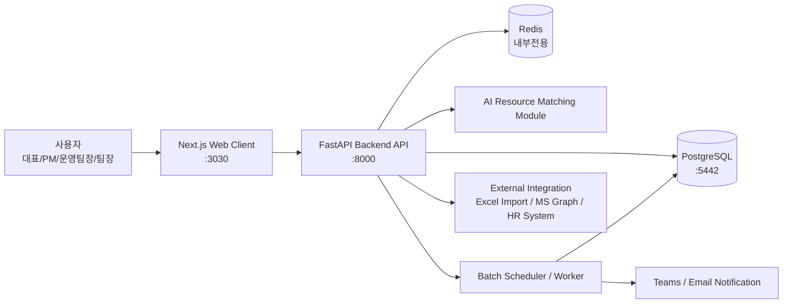
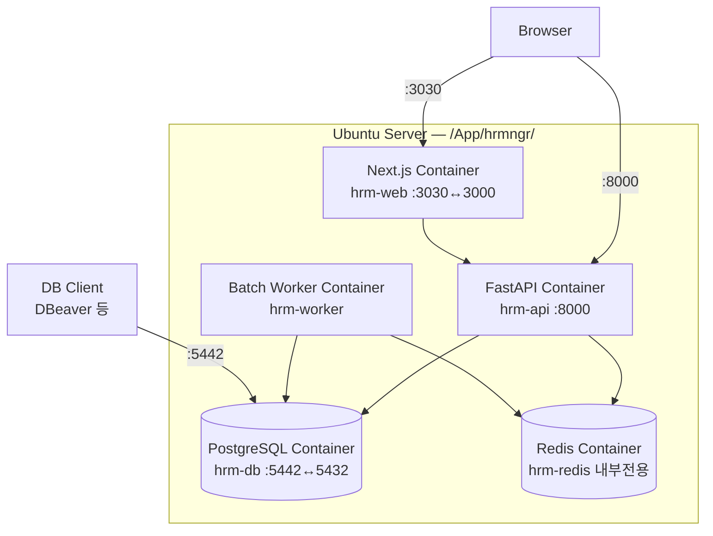
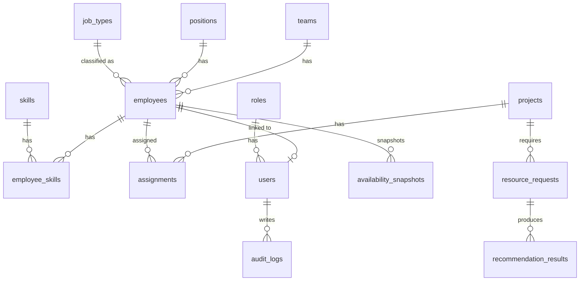
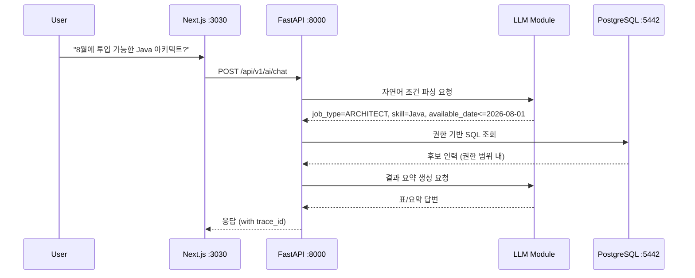

# Human Resource Management Automation System
## 통합 기획·설계서 v0.3

**작성일:** 2026년 7월 1일
**문서 목적:** 기존 MS 365 기반 리소스 관리 자동화 설계를 독립형 웹 애플리케이션 아키텍처로 리팩토링
**대상 시스템:** SI/IT 조직의 인력 현황, 기술 스택, 투입률, 프로젝트 배치, 가동 가능일, 리소스 추천 자동화 시스템

---

## 문서 변경 이력

| 버전 | 날짜 | 변경 내용 |
|---|---|---|
| v0.1 | 2026-07-01 | 초안 작성 (MS 365 기반 → FastAPI + PostgreSQL + Next.js 리팩토링 설계) |
| v0.2 | 2026-07-01 | Docker Compose 서비스 완성, 누락 테이블 설계 추가, ERD 보완, API 엔드포인트 보강, Nginx 설정 예시 추가, Next.js Dockerfile standalone 최적화, .env 보강, 보안 항목 보강, LLM/RAG 방향 보강, 프로젝트 구조 보강, 체크리스트 보완 |
| v0.3 | 2026-07-01 | Nginx 구성 전면 제거, PostgreSQL을 Docker 컨테이너로 독립 설치(외부 포트 5442), 프로젝트 기준 경로 `/App/hrmngr/` 적용, 데이터·백업 디렉토리 경로 체계 정립, Next.js 외부 포트 3030으로 변경, 직무 유형(`job_types`) 마스터 및 직원 연결 설계 추가 |

---

## 목차

1. [프로젝트 개요](#1-프로젝트-개요)
2. [기존 설계 대비 변경 방향](#2-기존-설계-대비-변경-방향)
3. [목표 아키텍처](#3-목표-아키텍처)
4. [업무 범위 및 주요 기능](#4-업무-범위-및-주요-기능)
5. [도메인 모델 및 데이터베이스 설계](#5-도메인-모델-및-데이터베이스-설계)
6. [FastAPI 백엔드 설계](#6-fastapi-백엔드-설계)
7. [Next.js 웹 클라이언트 설계](#7-nextjs-웹-클라이언트-설계)
8. [Docker 및 Ubuntu 운영 환경 설계](#8-docker-및-ubuntu-운영-환경-설계)
9. [AI 질의응답 및 리소스 추천 설계](#9-ai-질의응답-및-리소스-추천-설계)
10. [자동화 배치 및 알림 설계](#10-자동화-배치-및-알림-설계)
11. [보안·권한·감사 설계](#11-보안권한감사-설계)
12. [운영 프로세스](#12-운영-프로세스)
13. [마이그레이션 전략](#13-마이그레이션-전략)
14. [구현 일정 및 완료 체크리스트](#14-구현-일정-및-완료-체크리스트)
15. [리스크 및 대응 방안](#15-리스크-및-대응-방안)
16. [부록: 프로젝트 디렉토리 구조](#16-부록-프로젝트-디렉토리-구조)

---

## 1. 프로젝트 개요

본 시스템은 조직 내 인력 리소스를 체계적으로 관리하고, 프로젝트 투입 가능 인력과 기술 역량을 빠르게 검색·추천하기 위한 Human Resource Management Automation 시스템이다.

기존 설계는 Excel, SharePoint List, Python 스크립트, Power Virtual Agents를 중심으로 구성되었으나, 본 리팩토링 버전에서는 다음 기술 스택을 기준으로 독립형 업무 시스템으로 재설계한다.

| 구분 | 적용 기술 |
|---|---|
| 백엔드 | FastAPI |
| 데이터베이스 | PostgreSQL 16 (Docker 컨테이너, 외부 포트 **5442**) |
| 웹 클라이언트 | Next.js (외부 포트 **3030**) |
| 운영 환경 | Ubuntu Server |
| 실행 환경 | Docker / Docker Compose |
| 프로젝트 기준 경로 | `/App/hrmngr/` |
| 인증 방식 | 1차 MVP: JWT 기반 자체 인증 / 확장: Microsoft Entra ID 연동 |
| 자동화 | FastAPI Background Task, APScheduler 또는 Celery 기반 배치 |
| 알림 | Teams Webhook, Email, Slack 등 확장 가능 |
| AI 연동 | LLM API 또는 사내 LLM 기반 자연어 질의응답 |

> **포트 정책 요약**
> - Next.js 웹 클라이언트: 외부 포트 **3030** (컨테이너 내부 3000, 매핑 `3030:3000`)
> - FastAPI 백엔드: 외부/내부 모두 **8000**
> - PostgreSQL: 외부 포트 **5442** → 컨테이너 내부 **5432** (매핑 `5442:5432`)
> - Redis: 외부 미노출, Docker 내부 전용

### 1.1 목적

| 구분 | 내용 |
|---|---|
| 인력 현황 관리 | 직원, 팀, 직급, 직무 유형, 기술 스택, 숙련도, 프로젝트 투입 현황 통합 관리 |
| 가동률 관리 | 개인·팀·전체 조직 단위의 투입률, 대기 인력, 종료 예정자 현황 파악 |
| 리소스 매칭 | 직무 유형, 기술, 숙련도, 역할, 가동 가능일 기준으로 프로젝트 투입 후보 추천 |
| 운영 자동화 | 주간 업데이트, 월간 리포트, 가동률 알림, 프로젝트 종료 예정자 알림 자동화 |
| AI 질의응답 | "다음 달 투입 가능한 Java 아키텍트"와 같은 자연어 질의 지원 |

### 1.2 적용 대상

| 항목 | 기준 |
|---|---|
| 조직 규모 | 1차 기준 약 70명 |
| 확장 가능 규모 | 수백 명 수준까지 확장 가능 |
| 주요 사용자 | 대표, 임원, 운영팀장, PM, 팀장, 인사/리소스 관리자 |
| 주요 데이터 | 직원 정보, 직무 유형, 기술 역량, 프로젝트, 투입률, 가동 가능일, 리소스 이력 |

### 1.3 핵심 성공 기준

- 전체 인력의 현재 투입 상태를 웹 대시보드에서 즉시 확인할 수 있다.
- 직무 유형(아키텍트/개발자/BA 등), 기술, 숙련도를 조합하여 투입 가능 인력을 10초 이내에 조회할 수 있다.
- 프로젝트 종료 예정자와 대기 인력을 주간 단위로 자동 리포트한다.
- Excel 수작업 중심 관리에서 벗어나 PostgreSQL 기반의 정합성 있는 데이터 관리 체계를 구축한다.
- 향후 AI Agent, RAG, 프로젝트 이력 분석, 인력 수요 예측으로 확장 가능한 구조를 가진다.

---

## 2. 기존 설계 대비 변경 방향

### 2.1 기존 구조

| 영역 | 기존 설계 |
|---|---|
| 마스터 입력 | Excel ResourceTable |
| 저장소 | SharePoint List |
| 동기화 | Python Script 또는 Power Automate |
| AI 질의 | Power Virtual Agents / Copilot Studio |
| 운영 | Windows 작업 스케줄러, Teams 알림 |
| 장점 | 빠른 구축, 낮은 비용, MS 365 환경 활용 |
| 한계 | 데이터 정규화 한계, 권한 통제 제한, 화면 UX 제한, 이력 관리 취약, 확장성 제한 |

### 2.2 리팩토링 후 구조

| 영역 | 리팩토링 설계 |
|---|---|
| 마스터 입력 | Next.js 웹 화면 |
| 저장소 | PostgreSQL (Docker, 포트 5442) |
| API | FastAPI REST API |
| 인증/권한 | JWT + Role Based Access Control |
| 자동화 | 컨테이너 기반 Batch Worker |
| AI 질의 | FastAPI AI API + LLM/RAG 모듈 |
| 운영 | Ubuntu + Docker Compose, 기준 경로 `/App/hrmngr/` |
| 장점 | 데이터 정합성, 확장성, 감사 이력, 권한 관리, 독립 운영성, 시스템화 가능 |

### 2.3 전환 원칙

| 원칙 | 설명 |
|---|---|
| Excel은 입력 원장이 아니라 이관·업로드 수단으로 격하 | 운영 데이터의 Single Source of Truth는 PostgreSQL로 설정 |
| SharePoint List는 필수 구성에서 제외 | 필요 시 외부 연동 채널 또는 백업 Export 대상으로만 사용 |
| PVA는 선택 사항으로 전환 | 사내 웹 AI Agent 또는 LLM API 기반으로 대체 가능 |
| 수작업 동기화보다 실시간 CRUD 우선 | 웹 화면에서 직접 등록·수정·삭제하는 구조 적용 |
| 감사 이력 필수화 | 인력 정보 변경, 투입률 변경, 프로젝트 배치 변경을 Audit Log로 관리 |
| PostgreSQL 완전 독립 컨테이너화 | 서버 OS 레벨의 PostgreSQL과 분리, `/App/hrmngr/data/postgres/`에 데이터 영속화 |

---

## 3. 목표 아키텍처

### 3.1 논리 아키텍처



### 3.2 컨테이너 아키텍처



### 3.3 배포 구성

| 구성 요소 | 컨테이너명 | 외부 포트 | 내부 포트 | 역할 |
|---|---|---:|---:|---|
| Next.js | `hrm-web` | **3030** | 3000 | 웹 클라이언트 (사용자 접근) |
| FastAPI | `hrm-api` | 8000 | 8000 | REST API, 인증, 업무 로직 |
| PostgreSQL | `hrm-db` | **5442** | 5432 | 업무 데이터 저장소 (Docker 독립 설치) |
| Redis | `hrm-redis` | 없음 (내부 전용) | 6379 | 캐시, 비동기 작업 큐 |
| Worker | `hrm-worker` | 없음 | - | 배치, 리포트, 알림 |

### 3.4 MVP 기준 구성

| 단계 | 권장 구성 |
|---|---|
| MVP | FastAPI + PostgreSQL(Docker, 5442) + Next.js(3030) + Docker Compose |
| 운영 안정화 | HTTPS(방화벽/업스트림 처리) + Backup + Audit Log + Redis 캐시 |
| 확장 단계 | Celery + AI/RAG + SSO + CI/CD + 리버스 프록시(필요 시) |

---

## 4. 업무 범위 및 주요 기능

### 4.1 사용자 역할

| 역할 | 설명 | 주요 권한 |
|---|---|---|
| Admin | 시스템 관리자 | 전체 설정, 사용자 관리, 권한 관리 |
| HR Manager | 인사/리소스 관리자 | 직원/기술/프로젝트/투입 정보 전체 관리 |
| PM | 프로젝트 관리자 | 프로젝트별 필요 인력 조회, 후보 추천, 투입 요청 |
| Team Lead | 팀장 | 소속 팀원 정보 조회·일부 수정 |
| Executive | 대표/임원 | 전체 현황, 가동률, 리포트 조회 |
| Viewer | 일반 조회자 | 제한된 조회 |

### 4.2 주요 메뉴

| 메뉴 | 기능 |
|---|---|
| 대시보드 | 전체 인원, 투입률, 대기 인력, 종료 예정자, 팀별·직무 유형별 가동률 |
| 직원 관리 | 직원 등록, 수정, 퇴직 처리, 팀/직급/직무 유형 관리 |
| 기술 스택 관리 | 기술 카테고리, 기술명, 직원별 숙련도 관리 |
| 직무 유형 관리 | 아키텍트/개발자/BA 등 직무 유형 마스터 관리 |
| 프로젝트 관리 | 프로젝트 등록, 기간, 고객사, 필요 기술, 투입 인력 관리 |
| 투입 관리 | 직원별 프로젝트 배치, 투입률, 시작일, 종료 예정일 관리 |
| 리소스 추천 | 직무 유형, 기술, 숙련도, 가동 가능일, 역할 기준 후보 추천 |
| AI 질의응답 | 자연어 기반 인력 검색 및 추천 |
| 리포트 | 주간/월간 가동률, 종료 예정자, 대기 인력, 기술·직무 유형 분포 |
| 설정 | 사용자, 권한, 코드, 알림 채널, 배치 주기 관리 |

### 4.3 MVP 기능 범위

| 우선순위 | 기능 | MVP 포함 여부 |
|---|---|---|
| P0 | 직원 기본 정보 CRUD | 포함 |
| P0 | 직무 유형 마스터 관리 및 직원 연결 | 포함 |
| P0 | 프로젝트 CRUD | 포함 |
| P0 | 투입률/가동 가능일 관리 | 포함 |
| P0 | 기술 스택 및 숙련도 관리 | 포함 |
| P0 | 대시보드 | 포함 |
| P0 | 리소스 검색/필터 (직무 유형 필터 포함) | 포함 |
| P1 | 추천 점수 기반 후보 추천 | 포함 |
| P1 | Excel Import/Export | 포함 |
| P1 | Teams 알림 | 포함 |
| P2 | AI 자연어 질의 | 2차 적용 가능 |
| P2 | Microsoft Entra ID SSO | 2차 적용 가능 |
| P3 | 인력 수요 예측 | 장기 확장 |

---

## 5. 도메인 모델 및 데이터베이스 설계

### 5.1 핵심 엔티티

| 엔티티 | 설명 |
|---|---|
| `employees` | 직원 기본 정보 |
| `teams` | 조직/팀 정보 |
| `positions` | 직급/직책 코드 |
| `job_types` | 직무 유형 마스터 (아키텍트, 개발자, BA 등) |
| `skills` | 기술 스택 마스터 |
| `employee_skills` | 직원별 기술 및 숙련도 |
| `projects` | 프로젝트 정보 |
| `assignments` | 직원의 프로젝트 투입 이력 |
| `availability_snapshots` | 일자별/주차별 가동 가능 상태 스냅샷 |
| `resource_requests` | 프로젝트 인력 요청 |
| `recommendation_results` | 추천 실행 결과 |
| `users` | 로그인 사용자 (직원과 1:1 optional 연결) |
| `roles` | 권한 그룹 |
| `audit_logs` | 변경 이력 |
| `batch_jobs` | 배치 실행 이력 |

### 5.2 ERD 개요



### 5.3 주요 테이블 설계

#### 5.3.1 `employees`

| 컬럼 | 타입 | 제약 | 설명 |
|---|---|---|---|
| `id` | UUID | PK | 직원 ID |
| `employee_no` | VARCHAR(30) | UNIQUE | 사번 |
| `name` | VARCHAR(100) | NOT NULL | 성명 |
| `team_id` | UUID | FK | 소속 팀 |
| `position_id` | UUID | FK | 직급 |
| `primary_job_type_id` | UUID | FK NULL | 주 직무 유형 (job_types.id) |
| `employment_status` | VARCHAR(20) | NOT NULL | ACTIVE, LEAVE, RETIRED |
| `email` | VARCHAR(255) | UNIQUE | 이메일 |
| `phone` | VARCHAR(50) | NULL | 연락처 |
| `hire_date` | DATE | NULL | 입사일 |
| `created_at` | TIMESTAMPTZ | NOT NULL | 생성일시 |
| `updated_at` | TIMESTAMPTZ | NOT NULL | 수정일시 |

> **`primary_job_type_id`:** 해당 인력의 대표 직무 유형을 나타낸다. NULL 허용으로 기존 데이터 이관 시 점진적으로 등록 가능하다. 한 직원이 복수의 직무 역할을 수행하는 경우는 프로젝트 투입 시 `assignments.role_name`으로 표현하며, 이 컬럼은 조직 내 해당 인력의 주(primary) 전문 분야를 나타낸다.

#### 5.3.2 `teams`

| 컬럼 | 타입 | 제약 | 설명 |
|---|---|---|---|
| `id` | UUID | PK | 팀 ID |
| `name` | VARCHAR(100) | NOT NULL | 팀명 |
| `parent_id` | UUID | FK (self) | 상위 팀 (NULL = 최상위) |
| `is_active` | BOOLEAN | DEFAULT TRUE | 사용 여부 |

#### 5.3.3 `positions`

| 컬럼 | 타입 | 제약 | 설명 |
|---|---|---|---|
| `id` | UUID | PK | 직급 ID |
| `name` | VARCHAR(100) | NOT NULL | 직급명 (사원, 대리, 과장, 부장 등) |
| `level` | SMALLINT | NOT NULL | 정렬용 레벨 (낮을수록 상위) |
| `is_active` | BOOLEAN | DEFAULT TRUE | 사용 여부 |

#### 5.3.4 `job_types` *(신규)*

직무 유형은 조직 내 인력의 전문 역할 분류를 나타내는 마스터 테이블이다. 직급(시니어리티)과는 별개로, 해당 인력이 어떤 전문 직무를 수행하는지를 구분한다.

| 컬럼 | 타입 | 제약 | 설명 |
|---|---|---|---|
| `id` | UUID | PK | 직무 유형 ID |
| `code` | VARCHAR(50) | UNIQUE NOT NULL | 식별 코드 (ARCHITECT, DEVELOPER 등) |
| `name` | VARCHAR(100) | NOT NULL | 직무 유형명 (한글 표시명) |
| `category` | VARCHAR(50) | NULL | 상위 분류 (TECHNICAL, MANAGEMENT, ANALYSIS 등) |
| `description` | TEXT | NULL | 직무 유형 설명 |
| `sort_order` | SMALLINT | DEFAULT 0 | 화면 표시 정렬 순서 |
| `is_active` | BOOLEAN | DEFAULT TRUE | 사용 여부 |

**초기 Seed 데이터 예시:**

| code | name | category | description |
|---|---|---|---|
| `ARCHITECT` | 아키텍트 | TECHNICAL | 시스템/솔루션 아키텍처 설계 전문 인력 |
| `DEVELOPER` | 개발자 | TECHNICAL | 소프트웨어 개발 전문 인력 |
| `TECH_LEAD` | 기술 리더 | TECHNICAL | 기술 방향 결정 및 팀 기술 리딩 인력 |
| `BA` | 비즈니스 애널리스트 | ANALYSIS | 업무 요건 분석 및 요구사항 정의 인력 |
| `DA` | 데이터 애널리스트 | ANALYSIS | 데이터 분석 및 인사이트 도출 인력 |
| `PM` | 프로젝트 매니저 | MANAGEMENT | 프로젝트 관리 전문 인력 |
| `PMO` | PMO | MANAGEMENT | 프로그램/포트폴리오 관리 인력 |
| `QA` | QA 엔지니어 | TECHNICAL | 품질 보증 및 테스트 전문 인력 |
| `DBA` | DBA | TECHNICAL | 데이터베이스 관리 전문 인력 |
| `DEVOPS` | DevOps/인프라 | TECHNICAL | 인프라·배포·운영 자동화 전문 인력 |
| `DESIGNER` | UI/UX 디자이너 | TECHNICAL | 사용자 경험·인터페이스 설계 인력 |
| `CONSULTANT` | 컨설턴트 | MANAGEMENT | 업무/IT 컨설팅 전문 인력 |

> **직급(`positions`) vs 직무 유형(`job_types`) 구분**
>
> | 구분 | 예시 | 의미 |
> |---|---|---|
> | `positions` (직급) | 사원, 대리, 과장, 부장 | 조직 내 시니어리티/권한 계층 |
> | `job_types` (직무 유형) | 아키텍트, 개발자, BA | 전문 역할 분류 |
> | `assignments.role_name` (투입 역할) | PM, Backend, Frontend | 특정 프로젝트에서 수행하는 역할 |
>
> 예: "과장급 아키텍트가 이번 프로젝트에서 Backend 역할로 투입" → position=과장, job_type=ARCHITECT, assignment.role_name=Backend

#### 5.3.5 `skills`

| 컬럼 | 타입 | 제약 | 설명 |
|---|---|---|---|
| `id` | UUID | PK | 기술 ID |
| `category` | VARCHAR(50) | NOT NULL | Backend, Frontend, DB, Cloud 등 |
| `name` | VARCHAR(100) | NOT NULL | Java, Spring, React, AWS 등 |
| `is_active` | BOOLEAN | DEFAULT TRUE | 사용 여부 |

#### 5.3.6 `employee_skills`

| 컬럼 | 타입 | 제약 | 설명 |
|---|---|---|---|
| `id` | UUID | PK | 직원 기술 ID |
| `employee_id` | UUID | FK | 직원 |
| `skill_id` | UUID | FK | 기술 |
| `level` | SMALLINT | CHECK 1~5 | 숙련도 |
| `years_experience` | NUMERIC(4,1) | NULL | 경력 연수 |
| `last_used_at` | DATE | NULL | 최근 사용일 |
| `memo` | TEXT | NULL | 비고 |

#### 5.3.7 `projects`

| 컬럼 | 타입 | 제약 | 설명 |
|---|---|---|---|
| `id` | UUID | PK | 프로젝트 ID |
| `project_code` | VARCHAR(30) | UNIQUE | 프로젝트 코드 |
| `name` | VARCHAR(200) | NOT NULL | 프로젝트명 |
| `client_name` | VARCHAR(200) | NULL | 고객사 |
| `status` | VARCHAR(20) | NOT NULL | PLANNED, RUNNING, CLOSED, HOLD |
| `start_date` | DATE | NOT NULL | 시작일 |
| `end_date` | DATE | NULL | 종료 예정일 |
| `description` | TEXT | NULL | 설명 |

#### 5.3.8 `assignments`

| 컬럼 | 타입 | 제약 | 설명 |
|---|---|---|---|
| `id` | UUID | PK | 투입 ID |
| `employee_id` | UUID | FK | 직원 |
| `project_id` | UUID | FK | 프로젝트 |
| `role_name` | VARCHAR(100) | NOT NULL | PM, Backend, Frontend, QA 등 (프로젝트 내 역할) |
| `allocation_rate` | SMALLINT | CHECK 0~100 | 투입률(%) |
| `start_date` | DATE | NOT NULL | 투입 시작일 |
| `end_date` | DATE | NULL | 종료 예정일 |
| `status` | VARCHAR(20) | NOT NULL | PLANNED, ACTIVE, DONE, CANCELED |
| `created_at` | TIMESTAMPTZ | NOT NULL | 생성일시 |
| `updated_at` | TIMESTAMPTZ | NOT NULL | 수정일시 |

#### 5.3.9 `users`

| 컬럼 | 타입 | 제약 | 설명 |
|---|---|---|---|
| `id` | UUID | PK | 사용자 ID |
| `employee_id` | UUID | FK NULL | 연결된 직원 (선택) |
| `username` | VARCHAR(100) | UNIQUE NOT NULL | 로그인 ID |
| `email` | VARCHAR(255) | UNIQUE NOT NULL | 이메일 |
| `hashed_password` | VARCHAR(255) | NULL | 해시된 비밀번호 (SSO 사용 시 NULL 가능) |
| `role_id` | UUID | FK NOT NULL | 권한 그룹 |
| `is_active` | BOOLEAN | DEFAULT TRUE | 계정 활성 여부 |
| `last_login_at` | TIMESTAMPTZ | NULL | 최근 로그인 일시 |
| `created_at` | TIMESTAMPTZ | NOT NULL | 생성일시 |
| `updated_at` | TIMESTAMPTZ | NOT NULL | 수정일시 |

#### 5.3.10 `roles`

| 컬럼 | 타입 | 제약 | 설명 |
|---|---|---|---|
| `id` | UUID | PK | 역할 ID |
| `name` | VARCHAR(50) | UNIQUE NOT NULL | Admin, HR_MANAGER, PM, TEAM_LEAD, EXECUTIVE, VIEWER |
| `description` | TEXT | NULL | 역할 설명 |
| `permissions` | JSONB | NULL | 세부 권한 목록 (확장용) |

#### 5.3.11 `audit_logs`

| 컬럼 | 타입 | 제약 | 설명 |
|---|---|---|---|
| `id` | UUID | PK | 로그 ID |
| `user_id` | UUID | FK NOT NULL | 변경 수행 사용자 |
| `action` | VARCHAR(50) | NOT NULL | CREATE, UPDATE, DELETE, LOGIN, IMPORT 등 |
| `target_table` | VARCHAR(100) | NOT NULL | 변경 대상 테이블 |
| `target_id` | UUID | NULL | 변경 대상 레코드 ID |
| `before_value` | JSONB | NULL | 변경 전 값 |
| `after_value` | JSONB | NULL | 변경 후 값 |
| `ip_address` | VARCHAR(45) | NULL | 요청 IP |
| `user_agent` | TEXT | NULL | 브라우저/클라이언트 정보 |
| `created_at` | TIMESTAMPTZ | NOT NULL | 발생 일시 |

#### 5.3.12 `resource_requests`

| 컬럼 | 타입 | 제약 | 설명 |
|---|---|---|---|
| `id` | UUID | PK | 요청 ID |
| `project_id` | UUID | FK NOT NULL | 대상 프로젝트 |
| `requested_by` | UUID | FK NOT NULL | 요청자 (users.id) |
| `required_job_type_id` | UUID | FK NULL | 필요 직무 유형 (job_types.id, 선택) |
| `role_name` | VARCHAR(100) | NOT NULL | 필요 역할 |
| `required_skills` | JSONB | NOT NULL | 필요 기술 및 최소 숙련도 목록 |
| `min_allocation_rate` | SMALLINT | NOT NULL | 최소 투입률(%) |
| `available_from` | DATE | NOT NULL | 투입 희망 시작일 |
| `headcount` | SMALLINT | DEFAULT 1 | 필요 인원 수 |
| `status` | VARCHAR(20) | NOT NULL | OPEN, IN_REVIEW, FULFILLED, CANCELED |
| `memo` | TEXT | NULL | 요청 비고 |
| `created_at` | TIMESTAMPTZ | NOT NULL | 생성일시 |
| `updated_at` | TIMESTAMPTZ | NOT NULL | 수정일시 |

#### 5.3.13 `recommendation_results`

| 컬럼 | 타입 | 제약 | 설명 |
|---|---|---|---|
| `id` | UUID | PK | 추천 결과 ID |
| `request_id` | UUID | FK NOT NULL | 인력 요청 |
| `employee_id` | UUID | FK NOT NULL | 추천 직원 |
| `rank` | SMALLINT | NOT NULL | 추천 순위 |
| `total_score` | NUMERIC(5,2) | NOT NULL | 종합 추천 점수 |
| `score_detail` | JSONB | NULL | 항목별 점수 상세 |
| `reason` | TEXT | NULL | 추천 사유 |
| `is_selected` | BOOLEAN | DEFAULT FALSE | 최종 선택 여부 |
| `created_at` | TIMESTAMPTZ | NOT NULL | 생성일시 |

#### 5.3.14 `availability_snapshots`

| 컬럼 | 타입 | 제약 | 설명 |
|---|---|---|---|
| `id` | UUID | PK | 스냅샷 ID |
| `employee_id` | UUID | FK NOT NULL | 직원 |
| `snapshot_date` | DATE | NOT NULL | 기준 일자 |
| `total_allocation_rate` | SMALLINT | NOT NULL | 당일 총 투입률(%) |
| `available_rate` | SMALLINT | NOT NULL | 여유 투입 가능률(%) |
| `available_from` | DATE | NULL | 가동 가능 시작일 |
| `status` | VARCHAR(20) | NOT NULL | AVAILABLE, PARTIAL, FULL |
| `created_at` | TIMESTAMPTZ | NOT NULL | 생성일시 |

#### 5.3.15 `batch_jobs`

| 컬럼 | 설명 |
|---|---|
| `job_name` | 배치명 |
| `status` | SUCCESS, FAILED, RUNNING |
| `started_at` | 시작 시간 |
| `finished_at` | 종료 시간 |
| `result_summary` | 처리 결과 요약 |
| `error_message` | 오류 메시지 |
| `created_count` | 생성 건수 |
| `updated_count` | 수정 건수 |
| `failed_count` | 실패 건수 |

### 5.4 가동 가능일 산정 기준

```text
가동 가능일 =
1. ACTIVE 투입 건이 없거나 총 투입률이 0%이면 오늘
2. ACTIVE 투입률 합계가 100% 미만이면 부분 투입 가능
3. ACTIVE 투입률 합계가 100% 이상이면 가장 늦은 종료 예정일 + 1일
```

### 5.5 데이터 정합성 규칙

| 규칙 | 설명 |
|---|---|
| 직원명만 기준키로 사용하지 않음 | 동명이인 가능성이 있으므로 `employee_no` 또는 UUID를 기준으로 사용 |
| 투입률 합계 검증 | 동일 기간에 직원별 투입률 합계가 100% 초과하지 않도록 검증 |
| 프로젝트 종료일 검증 | 투입 종료일은 프로젝트 종료일보다 늦을 수 없음. 단, 운영 예외 가능 |
| 기술명 표준화 | 자유 입력 대신 `skills` 마스터 기준으로 관리 |
| 직무 유형 표준화 | 자유 입력 대신 `job_types` 마스터 기준으로 관리 |
| 퇴직자 처리 | 직원 삭제가 아니라 `employment_status='RETIRED'`로 상태 변경 |
| 사용자 비활성화 | 퇴직 처리 시 연결된 `users.is_active = FALSE`로 자동 처리 |

---

## 6. FastAPI 백엔드 설계

### 6.1 백엔드 역할

FastAPI 백엔드는 다음 역할을 수행한다.

- REST API 제공
- 인증 및 권한 검증
- 직원/프로젝트/투입/기술/직무 유형 관리
- 리소스 검색 및 추천 로직 수행
- AI 질의응답 API 제공
- 배치 작업 트리거 및 실행 이력 관리
- 감사 로그 기록

### 6.2 백엔드 기술 구성

| 영역 | 권장 기술 |
|---|---|
| Web Framework | FastAPI |
| ASGI Server | Uvicorn (MVP) / Gunicorn + Uvicorn Worker (운영) |
| ORM | SQLAlchemy 2.x |
| Migration | Alembic |
| Validation | Pydantic v2 |
| Auth | JWT, OAuth2 Password Flow |
| DB Driver | psycopg3 (동기) 또는 asyncpg (비동기) |
| Cache | Redis (선택, 운영 안정화 단계) |
| Rate Limiting | slowapi 또는 FastAPI middleware |
| Test | Pytest + httpx |
| Logging | structlog 또는 Python logging (JSON 포맷 권장) |
| Batch | APScheduler 또는 Celery |
| API 문서 | OpenAPI / Swagger UI (`/docs`), ReDoc (`/redoc`) |

### 6.3 API Prefix

```text
/api/v1
```

### 6.4 주요 API 설계

#### 시스템

| Method | Endpoint | 설명 |
|---|---|---|
| GET | `/health` | 헬스 체크 |
| GET | `/api/v1/version` | 서비스 버전 정보 |

#### 인증

| Method | Endpoint | 설명 |
|---|---|---|
| POST | `/api/v1/auth/login` | 로그인 (Access Token + Refresh Token 발급) |
| POST | `/api/v1/auth/refresh` | Access Token 갱신 |
| GET | `/api/v1/auth/me` | 현재 사용자 조회 |
| POST | `/api/v1/auth/logout` | 로그아웃 (Refresh Token 무효화) |
| POST | `/api/v1/auth/change-password` | 비밀번호 변경 |

#### 직원

| Method | Endpoint | 설명 |
|---|---|---|
| GET | `/api/v1/employees` | 직원 목록 조회 (페이지네이션, 필터 — job_type 필터 포함) |
| POST | `/api/v1/employees` | 직원 등록 |
| GET | `/api/v1/employees/{employee_id}` | 직원 상세 조회 |
| PATCH | `/api/v1/employees/{employee_id}` | 직원 정보 수정 |
| DELETE | `/api/v1/employees/{employee_id}` | 직원 비활성/퇴직 처리 |
| GET | `/api/v1/employees/{employee_id}/skills` | 직원 기술 조회 |
| PUT | `/api/v1/employees/{employee_id}/skills` | 직원 기술 일괄 수정 |
| GET | `/api/v1/employees/{employee_id}/assignments` | 직원 투입 이력 조회 |
| POST | `/api/v1/employees/import` | Excel 일괄 Import |
| GET | `/api/v1/employees/export` | Excel 일괄 Export |

#### 팀 / 직급 코드

| Method | Endpoint | 설명 |
|---|---|---|
| GET | `/api/v1/teams` | 팀 목록 조회 |
| POST | `/api/v1/teams` | 팀 등록 |
| PATCH | `/api/v1/teams/{team_id}` | 팀 수정 |
| GET | `/api/v1/positions` | 직급 목록 조회 |
| POST | `/api/v1/positions` | 직급 등록 |
| PATCH | `/api/v1/positions/{position_id}` | 직급 수정 |

#### 직무 유형

| Method | Endpoint | 설명 |
|---|---|---|
| GET | `/api/v1/job-types` | 직무 유형 목록 조회 |
| POST | `/api/v1/job-types` | 직무 유형 등록 |
| GET | `/api/v1/job-types/{job_type_id}` | 직무 유형 상세 조회 |
| PATCH | `/api/v1/job-types/{job_type_id}` | 직무 유형 수정 |
| DELETE | `/api/v1/job-types/{job_type_id}` | 직무 유형 비활성 |

#### 기술 스택

| Method | Endpoint | 설명 |
|---|---|---|
| GET | `/api/v1/skills` | 기술 목록 조회 |
| POST | `/api/v1/skills` | 기술 등록 |
| PATCH | `/api/v1/skills/{skill_id}` | 기술 수정 |
| DELETE | `/api/v1/skills/{skill_id}` | 기술 비활성 |

#### 프로젝트

| Method | Endpoint | 설명 |
|---|---|---|
| GET | `/api/v1/projects` | 프로젝트 목록 |
| POST | `/api/v1/projects` | 프로젝트 등록 |
| GET | `/api/v1/projects/{project_id}` | 프로젝트 상세 |
| PATCH | `/api/v1/projects/{project_id}` | 프로젝트 수정 |
| GET | `/api/v1/projects/{project_id}/assignments` | 프로젝트 투입 현황 |

#### 투입 관리

| Method | Endpoint | 설명 |
|---|---|---|
| GET | `/api/v1/assignments` | 투입 현황 조회 |
| POST | `/api/v1/assignments` | 투입 등록 |
| PATCH | `/api/v1/assignments/{assignment_id}` | 투입 수정 |
| DELETE | `/api/v1/assignments/{assignment_id}` | 투입 취소 |
| GET | `/api/v1/availability` | 가동 가능 인력 조회 (job_type 필터 포함) |

#### 리소스 추천

| Method | Endpoint | 설명 |
|---|---|---|
| POST | `/api/v1/resource-requests` | 인력 요청 등록 (직무 유형 조건 포함) |
| GET | `/api/v1/resource-requests` | 인력 요청 목록 |
| POST | `/api/v1/recommendations/search` | 조건 기반 후보 검색 (직무 유형 필터 포함) |
| POST | `/api/v1/recommendations/score` | 점수 기반 후보 추천 |
| GET | `/api/v1/recommendations/{request_id}` | 추천 결과 조회 |

#### 대시보드/리포트

| Method | Endpoint | 설명 |
|---|---|---|
| GET | `/api/v1/dashboard/summary` | 전체 요약 |
| GET | `/api/v1/dashboard/team-utilization` | 팀별 가동률 |
| GET | `/api/v1/dashboard/job-type-distribution` | 직무 유형별 인력 분포 및 가동률 |
| GET | `/api/v1/reports/weekly` | 주간 리포트 조회 |
| GET | `/api/v1/reports/monthly` | 월간 리포트 조회 |
| POST | `/api/v1/reports/weekly/send` | 주간 리포트 수동 발송 |

#### 배치 관리

| Method | Endpoint | 설명 |
|---|---|---|
| GET | `/api/v1/batch/jobs` | 배치 실행 이력 조회 |
| POST | `/api/v1/batch/jobs/{job_name}/trigger` | 배치 수동 트리거 (Admin 전용) |

#### AI 질의

| Method | Endpoint | 설명 |
|---|---|---|
| POST | `/api/v1/ai/chat` | 자연어 질의응답 |
| POST | `/api/v1/ai/parse-resource-query` | 자연어 조건 파싱 (직무 유형 인식 포함) |
| POST | `/api/v1/ai/recommend` | AI 기반 리소스 추천 |

#### 사용자/권한 관리 (Admin)

| Method | Endpoint | 설명 |
|---|---|---|
| GET | `/api/v1/users` | 사용자 목록 |
| POST | `/api/v1/users` | 사용자 등록 |
| PATCH | `/api/v1/users/{user_id}` | 사용자 정보/권한 수정 |
| DELETE | `/api/v1/users/{user_id}` | 사용자 비활성 |
| GET | `/api/v1/audit-logs` | 감사 로그 조회 |

### 6.5 API 응답 표준

**단건/기본 응답:**

```json
{
  "success": true,
  "data": {},
  "message": "OK",
  "trace_id": "f80f1d32-0000-0000-0000-000000000000"
}
```

**목록 응답 (페이지네이션):**

```json
{
  "success": true,
  "data": {
    "items": [],
    "total": 70,
    "page": 1,
    "size": 20,
    "pages": 4
  },
  "message": "OK",
  "trace_id": "f80f1d32-0000-0000-0000-000000000000"
}
```

**오류 응답:**

```json
{
  "success": false,
  "error": {
    "code": "VALIDATION_ERROR",
    "message": "투입률은 0~100 사이여야 합니다.",
    "details": []
  },
  "trace_id": "f80f1d32-0000-0000-0000-000000000000"
}
```

**페이지네이션 쿼리 파라미터 규칙:**

| 파라미터 | 설명 | 기본값 |
|---|---|---|
| `page` | 페이지 번호 (1부터 시작) | 1 |
| `size` | 페이지당 항목 수 | 20 |
| `sort` | 정렬 기준 컬럼명 | `created_at` |
| `order` | 정렬 방향 (`asc` / `desc`) | `desc` |

### 6.6 추천 점수 산정 예시

```text
추천 점수 = 직무 유형 일치 점수 15%
        + 기술 매칭 점수 35%
        + 숙련도 점수 25%
        + 가동 가능일 점수 15%
        + 최근 유사 프로젝트 경험 7%
        + 팀/역할 적합도 3%
```

| 항목 | 산정 기준 |
|---|---|
| 직무 유형 일치 | 요청 직무 유형과 직원의 주 직무 유형(`primary_job_type_id`) 일치 여부 |
| 기술 매칭 | 요청 기술과 직원 기술의 일치 개수 및 핵심 기술 포함 여부 |
| 숙련도 | 요구 숙련도 이상이면 가점 |
| 가동 가능일 | 즉시 가동 가능 또는 요청 시작일 이전 가능 여부 |
| 유사 프로젝트 경험 | 동일 고객사, 동일 도메인, 동일 역할 이력 |
| 팀/역할 적합도 | 요청 역할과 과거 담당 역할 매칭 |

---

## 7. Next.js 웹 클라이언트 설계

### 7.1 웹 클라이언트 역할

Next.js는 사용자가 인력 현황을 조회·관리하는 프론트엔드 역할을 수행한다. 외부 접근 포트는 **3030**이다.

- 대시보드 시각화
- 직원/기술/프로젝트/투입/직무 유형 관리 화면
- 리소스 검색 및 추천 화면
- AI Chat UI
- Excel Import/Export UI
- 권한별 메뉴 제어

### 7.2 권장 화면 구성

| URL | 화면명 | 주요 기능 |
|---|---|---|
| `/login` | 로그인 | 사용자 인증 |
| `/dashboard` | 대시보드 | 전체 인원, 가동률, 대기 인력, 종료 예정자, 직무 유형 분포 |
| `/employees` | 직원 목록 | 검색, 필터(직무 유형 포함), 등록, 수정, Excel Import/Export |
| `/employees/[id]` | 직원 상세 | 기본 정보, 직무 유형, 기술, 투입 이력 |
| `/skills` | 기술 관리 | 기술 마스터 관리 |
| `/job-types` | 직무 유형 관리 | 직무 유형 마스터 관리 |
| `/projects` | 프로젝트 목록 | 프로젝트 검색, 등록, 수정 |
| `/projects/[id]` | 프로젝트 상세 | 투입 인력, 필요 기술, 진행 상태 |
| `/assignments` | 투입 관리 | 직원별/프로젝트별 투입률 관리 |
| `/availability` | 가동 가능 인력 | 날짜·직무 유형·기술·숙련도 필터 |
| `/recommendations` | 리소스 추천 | 조건 입력(직무 유형 포함) 및 후보 추천 |
| `/ai-chat` | AI 질의응답 | 자연어 검색 |
| `/reports` | 리포트 | 주간/월간 리포트 |
| `/settings` | 설정 | 사용자, 권한, 코드, 알림 채널 관리 |
| `/settings/users` | 사용자 관리 | 계정 등록, 권한 변경, 비활성 처리 |
| `/settings/audit-logs` | 감사 로그 | 변경 이력 조회 (Admin 전용) |

### 7.3 대시보드 지표

| 지표 | 계산 방식 |
|---|---|
| 전체 인원 | ACTIVE 직원 수 |
| 즉시 투입 가능 인원 | 투입률 0% 또는 가동 가능일 ≤ 오늘 |
| 평균 가동률 | ACTIVE 직원의 현재 투입률 평균 |
| 100% 이상 투입 인원 | 현재 투입률 합계 ≥ 100 |
| 부분 가동 가능 인원 | 현재 투입률 합계 1~99 |
| 이번 달 종료 예정자 | 종료 예정일이 당월인 ACTIVE 투입 건 |
| 직무 유형별 인력 분포 | `job_types` 마스터 기준 직원 수 및 가동률 |
| 기술별 인력 분포 | 기술 마스터 기준 직원 수 |
| 팀별 가동률 | 팀별 평균 투입률 |

### 7.4 리소스 추천 화면 입력 항목

| 항목 | 설명 |
|---|---|
| 직무 유형 | 아키텍트, 개발자, BA, QA 등 선택 |
| 필요 기술 | Java, Spring, React, PostgreSQL 등 복수 선택 |
| 최소 숙련도 | 1~5 |
| 투입 시작 희망일 | 요청 시작일 |
| 최소 투입률 | 예: 50%, 80%, 100% |
| 역할 | PM, Backend, Frontend, QA, DBA 등 |
| 제외 조건 | 특정 프로젝트 투입 중 제외, 특정 팀 제외 등 |
| 정렬 기준 | 추천 점수, 가동 가능일, 숙련도, 투입률 |

### 7.5 UI/UX 원칙

| 원칙 | 설명 |
|---|---|
| 표 중심 업무 화면 | 인력/프로젝트/투입 관리는 Data Grid 중심 |
| 빠른 필터링 | 직무 유형, 기술, 팀, 투입률, 가동 가능일 필터는 상단 고정 |
| 상태 색상 명확화 | 대기, 부분 투입, 풀 투입, 종료 예정 상태를 구분 |
| 변경 이력 노출 | 직원 상세와 프로젝트 상세에서 주요 변경 이력 확인 |
| Excel 친화성 | 운영팀이 익숙한 Excel 형태의 Bulk Edit/Import 기능 제공 |

---

## 8. Docker 및 Ubuntu 운영 환경 설계

### 8.1 프로젝트 기준 경로

모든 소스코드, 설정 파일, 데이터 디렉토리, 백업 파일은 `/App/hrmngr/` 하위에 위치한다.

```text
/App/hrmngr/
├── backend/              # FastAPI 소스코드
├── frontend/             # Next.js 소스코드
├── data/
│   ├── postgres/         # PostgreSQL 데이터 파일 (bind mount)
│   └── redis/            # Redis 데이터 파일 (bind mount)
├── backup/
│   └── postgres/         # DB 백업 파일 저장
├── logs/                 # 애플리케이션 로그 (선택)
├── docker-compose.yml
├── .env                  # 운영 환경변수 (Git 제외)
├── .env.example          # 환경변수 샘플 (Git 포함)
├── .gitignore
└── README.md
```

**디렉토리 초기 생성 명령:**

```bash
mkdir -p /App/hrmngr/{backend,frontend,data/postgres,data/redis,backup/postgres,logs}
cd /App/hrmngr
```

### 8.2 서버 기본 구성

| 항목 | 권장값 |
|---|---|
| OS | Ubuntu Server 24.04 LTS 이상 |
| CPU | MVP: 2 vCPU 이상 / 권장: 4 vCPU 이상 |
| Memory | MVP: 4GB 이상 / 권장: 8GB 이상 |
| Disk | 50GB 이상, DB 백업 고려 시 100GB 이상 |
| Runtime | Docker Engine, Docker Compose Plugin |
| Domain | 사내 도메인 또는 내부 IP |

### 8.3 Docker Compose 구성

파일 위치: `/App/hrmngr/docker-compose.yml`

```yaml
services:

  api:
    build:
      context: ./backend
      dockerfile: Dockerfile
    container_name: hrm-api
    restart: unless-stopped
    env_file:
      - .env
    ports:
      - "8000:8000"
    depends_on:
      db:
        condition: service_healthy
      redis:
        condition: service_started
    healthcheck:
      test: ["CMD", "curl", "-f", "http://localhost:8000/health"]
      interval: 30s
      timeout: 10s
      retries: 3
      start_period: 20s
    networks:
      - hrm-net

  web:
    build:
      context: ./frontend
      dockerfile: Dockerfile
    container_name: hrm-web
    restart: unless-stopped
    env_file:
      - .env
    ports:
      - "3030:3000"           # 외부 3030 → 컨테이너 내부 3000
    depends_on:
      - api
    networks:
      - hrm-net

  worker:
    build:
      context: ./backend
      dockerfile: Dockerfile
    container_name: hrm-worker
    restart: unless-stopped
    env_file:
      - .env
    command: ["python", "-m", "app.worker"]
    depends_on:
      db:
        condition: service_healthy
      redis:
        condition: service_started
    networks:
      - hrm-net

  db:
    image: postgres:16-alpine
    container_name: hrm-db
    restart: unless-stopped
    environment:
      POSTGRES_DB: ${POSTGRES_DB}
      POSTGRES_USER: ${POSTGRES_USER}
      POSTGRES_PASSWORD: ${POSTGRES_PASSWORD}
      PGDATA: /var/lib/postgresql/data/pgdata
    ports:
      - "5442:5432"           # 외부 5442 → 컨테이너 내부 5432
    volumes:
      - /App/hrmngr/data/postgres:/var/lib/postgresql/data
    healthcheck:
      test: ["CMD-SHELL", "pg_isready -U ${POSTGRES_USER} -d ${POSTGRES_DB}"]
      interval: 10s
      timeout: 5s
      retries: 5
      start_period: 15s
    networks:
      - hrm-net

  redis:
    image: redis:7-alpine
    container_name: hrm-redis
    restart: unless-stopped
    command: redis-server --save 60 1 --loglevel warning
    volumes:
      - /App/hrmngr/data/redis:/data
    # 외부 미노출 — Docker 내부 네트워크 전용
    networks:
      - hrm-net

networks:
  hrm-net:
    driver: bridge
```

### 8.4 포트 접근 경로 정리

| 서비스 | Docker 내부 통신 | 호스트 접속 | 외부(브라우저/클라이언트) 접속 |
|---|---|---|---|
| Next.js (웹) | `hrm-web:3000` | `localhost:3030` | `{서버IP}:3030` |
| FastAPI (API) | `hrm-api:8000` | `localhost:8000` | `{서버IP}:8000` |
| PostgreSQL | `db:5432` | `localhost:5442` | `{서버IP}:5442` (방화벽 제한 권장) |
| Redis | `hrm-redis:6379` | 미노출 | 미노출 |

### 8.5 FastAPI Dockerfile 예시

파일 위치: `/App/hrmngr/backend/Dockerfile`

```dockerfile
FROM python:3.12-slim

WORKDIR /app

ENV PYTHONDONTWRITEBYTECODE=1
ENV PYTHONUNBUFFERED=1

RUN apt-get update \
    && apt-get install -y --no-install-recommends gcc libpq-dev curl \
    && rm -rf /var/lib/apt/lists/*

COPY requirements.txt .
RUN pip install --no-cache-dir -r requirements.txt

COPY . .

HEALTHCHECK --interval=30s --timeout=10s --start-period=20s --retries=3 \
  CMD curl -f http://localhost:8000/health || exit 1

CMD ["uvicorn", "app.main:app", "--host", "0.0.0.0", "--port", "8000"]
```

> 운영 트래픽이 증가하면 `CMD ["gunicorn", "app.main:app", "-k", "uvicorn.workers.UvicornWorker", "-w", "4", "-b", "0.0.0.0:8000"]` 구성을 검토한다.

### 8.6 Next.js Dockerfile 예시 (standalone 최적화)

파일 위치: `/App/hrmngr/frontend/Dockerfile`

```dockerfile
FROM node:22-alpine AS deps
WORKDIR /app
COPY package.json package-lock.json ./
RUN npm ci

FROM node:22-alpine AS builder
WORKDIR /app
COPY --from=deps /app/node_modules ./node_modules
COPY . .
RUN npm run build

# standalone 출력 기반 경량 런너
FROM node:22-alpine AS runner
WORKDIR /app

ENV NODE_ENV=production
ENV PORT=3000

COPY --from=builder /app/.next/standalone ./
COPY --from=builder /app/.next/static ./.next/static
COPY --from=builder /app/public ./public

EXPOSE 3000
CMD ["node", "server.js"]
```

> - 컨테이너 내부는 3000 포트를 사용하며, Docker Compose에서 `3030:3000` 매핑으로 외부 3030으로 노출된다.
> - `next.config.js`에 `output: 'standalone'` 옵션을 반드시 추가해야 한다.
>
> ```js
> // /App/hrmngr/frontend/next.config.js
> const nextConfig = {
>   output: 'standalone',
> };
> module.exports = nextConfig;
> ```

### 8.7 `.env` 예시

파일 위치: `/App/hrmngr/.env`

```env
# 앱 기본
APP_ENV=production
APP_NAME=HRM Automation System
LOG_LEVEL=INFO

# PostgreSQL (컨테이너 내부 통신: db:5432 / 외부 접속: 서버IP:5442)
POSTGRES_DB=hrm
POSTGRES_USER=hrm_user
POSTGRES_PASSWORD=change_me_db_password
DATABASE_URL=postgresql+psycopg://hrm_user:change_me_db_password@db:5432/hrm

# JWT
JWT_SECRET_KEY=change_me_to_long_random_secret_min_32_chars
JWT_ALGORITHM=HS256
ACCESS_TOKEN_EXPIRE_MINUTES=60
REFRESH_TOKEN_EXPIRE_DAYS=7

# CORS (브라우저 접근 포트 3030 기준)
CORS_ORIGINS=http://localhost:3030,http://{서버IP}:3030

# Redis (Docker 내부 전용)
REDIS_URL=redis://hrm-redis:6379/0

# Next.js 클라이언트 환경변수 (브라우저 → API 호출 주소)
NEXT_PUBLIC_API_BASE_URL=http://{서버IP}:8000

# 알림 채널
TEAMS_WEBHOOK_URL=
SMTP_HOST=
SMTP_PORT=587
SMTP_USER=
SMTP_PASSWORD=
EMAIL_FROM=hrm-noreply@example.com

# AI 연동
OPENAI_API_KEY=
# 사내 LLM 사용 시 아래로 대체
# LLM_BASE_URL=http://internal-llm-server:8080
# LLM_MODEL=llama3-70b
```

### 8.8 운영 명령어

```bash
# 프로젝트 디렉토리로 이동
cd /App/hrmngr

# 최초 빌드 및 전체 실행
docker compose up -d --build

# 특정 서비스만 재빌드 후 재시작
docker compose up -d --build api

# 전체 서비스 상태 확인
docker compose ps

# 로그 확인
docker compose logs -f api
docker compose logs -f web        # 외부 3030 포트
docker compose logs -f worker
docker compose logs -f db

# DB 직접 접속 (컨테이너 내부)
docker compose exec db psql -U hrm_user -d hrm

# DB 직접 접속 (호스트 psql 사용 — 포트 5442)
psql -h localhost -p 5442 -U hrm_user -d hrm

# Alembic 마이그레이션 실행
docker compose exec api alembic upgrade head

# Alembic 마이그레이션 롤백 (1단계)
docker compose exec api alembic downgrade -1

# 현재 마이그레이션 상태 확인
docker compose exec api alembic current

# 서비스 중지 (데이터 유지)
docker compose down

# 볼륨 포함 전체 삭제 — 데이터는 /App/hrmngr/data/에 있으므로 삭제 안 됨
docker compose down -v
```

### 8.9 백업 정책

| 항목 | 권장 정책 |
|---|---|
| DB 백업 | 매일 1회 `pg_dump` |
| 보관 위치 | `/App/hrmngr/backup/postgres/` |
| 보관 주기 | 일별 14일, 월별 6개월 |
| 외부 복제 | 별도 외부 스토리지 또는 원격 서버로 복제 권장 |
| 복구 테스트 | 월 1회 샘플 복구 |

**백업 스크립트 예시:**

```bash
#!/bin/bash
# 파일 위치: /App/hrmngr/backup/backup_db.sh

BACKUP_DIR="/App/hrmngr/backup/postgres"
TIMESTAMP=$(date +%Y%m%d_%H%M%S)
BACKUP_FILE="${BACKUP_DIR}/hrm_${TIMESTAMP}.sql.gz"

docker compose -f /App/hrmngr/docker-compose.yml exec -T db \
  pg_dump -U hrm_user -d hrm \
  | gzip > "${BACKUP_FILE}"

echo "[$(date)] Backup completed: ${BACKUP_FILE}"

# 14일 이전 파일 자동 삭제
find "${BACKUP_DIR}" -name "*.sql.gz" -mtime +14 -delete
echo "[$(date)] Old backups cleaned."
```

**crontab 등록 예시:**

```bash
# crontab -e
0 2 * * * /bin/bash /App/hrmngr/backup/backup_db.sh >> /App/hrmngr/logs/backup.log 2>&1
```

**복구 명령 예시:**

```bash
gunzip -c /App/hrmngr/backup/postgres/hrm_20260701_020000.sql.gz \
  | docker compose -f /App/hrmngr/docker-compose.yml exec -T db \
    psql -U hrm_user -d hrm
```

---

## 9. AI 질의응답 및 리소스 추천 설계

### 9.1 AI 적용 방향

AI는 PostgreSQL 데이터를 직접 변경하지 않고, 조회·추천·요약 보조 역할로 제한한다. 시스템의 기준 데이터와 권한 검증은 반드시 FastAPI에서 수행한다.

### 9.2 LLM 연동 옵션

| 옵션 | 설명 | 적합 상황 |
|---|---|---|
| OpenAI API (GPT-4o 등) | 빠른 연동, 높은 품질 | 보안 규정이 허용되는 경우 |
| Anthropic API (Claude) | 긴 컨텍스트, 정확한 지시 따르기 | 대량 데이터 요약, 복잡한 조건 파싱 |
| Azure OpenAI | MS 365 환경과 연계, 데이터 국내 처리 | 기업 컴플라이언스 요구 시 |
| 사내 LLM (Ollama 등) | 완전 폐쇄망, 데이터 외부 미전송 | 개인정보 보안 규정이 엄격한 경우 |

MVP에서는 OpenAI API 또는 Anthropic API로 빠르게 구현하고, 보안 요건에 따라 사내 LLM으로 전환할 수 있도록 LLM 호출 레이어를 추상화(인터페이스 분리)한다.

### 9.3 RAG 확장 방향

| 단계 | 내용 |
|---|---|
| MVP | 자연어 조건 파싱 → SQL 조회 → 결과를 LLM에 요약 요청 |
| RAG 1단계 | 프로젝트 이력, 직원 경력 기술서를 벡터 DB(pgvector 또는 Chroma)에 임베딩 |
| RAG 2단계 | 유사 프로젝트 경험 검색, 과거 추천 이력 패턴 분석 연동 |
| Agent 단계 | LLM이 API 도구를 직접 호출하여 다단계 추론 수행 |

### 9.4 AI 질의 처리 흐름



### 9.5 AI가 직접 수행하면 안 되는 일

| 금지 항목 | 이유 |
|---|---|
| DB 직접 접속 | 권한·감사·보안 우회 위험 |
| 직원 정보 임의 수정 | 업무 데이터 오염 위험 |
| 불확실한 데이터 추측 | 인력 배치 의사결정 오류 |
| 개인정보 과다 노출 | 보안 및 프라이버시 위험 |
| 권한 없는 사용자에게 민감 정보 제공 | 내부통제 위반 |

### 9.6 AI 시스템 프롬프트 초안

```text
너는 회사 내부 HRM 리소스 매니저다.
너는 PostgreSQL 기반 HRM 시스템에서 조회된 데이터만 사용하여 답변한다.
데이터가 없거나 불확실하면 추측하지 말고 "데이터를 확인할 수 없습니다"라고 답한다.

답변 규칙:
1. 투입 가능 여부는 현재 투입률, 가동 가능일, 요청 시작일을 기준으로 판단한다.
2. 직무 유형(아키텍트/개발자/BA 등)은 job_types 마스터를 기준으로 인식한다.
3. 기술 매칭은 등록된 skills 마스터와 employee_skills 데이터를 기준으로 판단한다.
4. 후보 추천 시 성명, 팀, 직무 유형, 주요 기술, 숙련도, 현재 투입률, 가동 가능일, 추천 사유를 포함한다.
5. 개인정보는 필요한 범위에서만 제공한다.
6. 사용자가 권한이 없는 정보를 요청하면 권한이 없다고 답한다.
7. 전달된 데이터에 없는 내용을 창작하거나 추론하지 않는다.
```

### 9.7 추천 결과 예시

| 순위 | 성명 | 팀 | 직무 유형 | 주요 기술 | 숙련도 | 현재 투입률 | 가동 가능일 | 추천 사유 |
|---:|---|---|---|---|---:|---:|---|---|
| 1 | 홍길동 | 개발1팀 | 아키텍트 | Java, Spring, PostgreSQL | 5 | 0% | 2026-07-01 | 즉시 투입 가능, 직무 유형·핵심 기술 완전 일치 |
| 2 | 김철수 | 개발2팀 | 기술 리더 | Java, Spring, AWS | 4 | 50% | 2026-07-15 | 부분 투입 가능, 아키텍처 경험 보유 |
| 3 | 박영희 | 개발3팀 | 개발자 | Java, React, Spring | 4 | 100% | 2026-08-01 | 요청 시작일 이후 투입 가능 |

---

## 10. 자동화 배치 및 알림 설계

### 10.1 자동화 대상

| 배치 | 주기 | 설명 |
|---|---|---|
| 가동률 스냅샷 생성 | 매일 01:00 | 직원별 현재 투입률 및 가동 상태 저장 |
| 주간 리포트 생성 | 매주 월요일 09:00 | 전체/팀별/직무 유형별 가동률, 대기 인력, 종료 예정자 |
| 프로젝트 종료 예정 알림 | 매주 금요일 17:00 | 30일 이내 종료 예정 투입 건 알림 |
| 데이터 품질 점검 | 매주 금요일 18:00 | 투입률 초과, 종료일 누락, 기술 미등록, 직무 유형 미등록 점검 |
| DB 백업 | 매일 02:00 | PostgreSQL 백업 (`/App/hrmngr/backup/postgres/`) |

### 10.2 Teams 알림 예시

```text
📅 HRM 주간 리소스 리포트

👥 전체 ACTIVE 인원: 70명
✅ 즉시 투입 가능: 8명
🟡 부분 투입 가능: 11명
🔴 풀 투입: 51명

📌 이번 달 종료 예정: 6명
📌 기술 미등록 인원: 3명
📌 직무 유형 미등록 인원: 5명
📌 투입률 100% 초과 데이터: 1건

상세 현황은 HRM 대시보드를 확인하세요.
```

### 10.3 배치 실행 이력 관리

`batch_jobs` 테이블에 다음 정보를 저장한다.

| 컬럼 | 설명 |
|---|---|
| `job_name` | 배치명 |
| `status` | SUCCESS, FAILED, RUNNING |
| `started_at` | 시작 시간 |
| `finished_at` | 종료 시간 |
| `result_summary` | 처리 결과 요약 |
| `error_message` | 오류 메시지 |
| `created_count` | 생성 건수 |
| `updated_count` | 수정 건수 |
| `failed_count` | 실패 건수 |

---

## 11. 보안·권한·감사 설계

### 11.1 인증 방식

| 단계 | 방식 |
|---|---|
| MVP | 자체 계정 + JWT 인증 |
| 운영 확장 | Microsoft Entra ID OAuth2/OIDC 연동 |
| 사내망 전용 | VPN 또는 내부망 접근 제한과 병행 가능 |

**JWT 토큰 정책:**

| 항목 | 정책 |
|---|---|
| Access Token 만료 | 60분 |
| Refresh Token 만료 | 7일 |
| Refresh Token 저장 | DB 또는 Redis (HttpOnly Cookie로 클라이언트 전달 권장) |
| Refresh Token 재사용 방지 | 사용 즉시 무효화 후 신규 발급 (Token Rotation) |
| 로그아웃 처리 | Refresh Token DB/Redis에서 삭제 |

### 11.2 권한 모델

| 기능 | Admin | HR Manager | PM | Team Lead | Executive | Viewer |
|---|---:|---:|---:|---:|---:|---:|
| 직원 전체 조회 | O | O | O | 일부 | O | 일부 |
| 직원 등록/수정 | O | O | X | 일부 | X | X |
| 기술/직무 유형 수정 | O | O | X | 일부 | X | X |
| 프로젝트 등록/수정 | O | O | O | 일부 | X | X |
| 투입률 수정 | O | O | O | 일부 | X | X |
| 추천 조회 | O | O | O | O | O | 일부 |
| AI 질의 | O | O | O | O | O | 일부 |
| 시스템 설정 | O | X | X | X | X | X |

### 11.3 감사 로그 대상

| 이벤트 | 로그 필요 여부 |
|---|---|
| 직원 생성/수정/퇴직 처리 | 필수 |
| 직무 유형 변경 | 필수 |
| 기술 숙련도 변경 | 필수 |
| 프로젝트 생성/수정/종료 | 필수 |
| 투입률 변경 | 필수 |
| 권한 변경 | 필수 |
| Excel Import | 필수 |
| 로그인 성공/실패 | 필수 |
| AI 질의 | 선택. 단, 민감정보 요청 이력은 기록 권장 |

### 11.4 보안 고려사항

**환경 및 인프라:**
- `.env` 파일은 Git에 포함하지 않는다. `.gitignore`에 반드시 추가한다.
- `/App/hrmngr/data/` 디렉토리는 적절한 소유권과 권한(700 또는 750)을 설정한다.
- PostgreSQL 포트 5442는 내부망에서만 접근 가능하도록 방화벽(UFW 등)으로 제한한다.
- Redis는 외부에 노출하지 않는다 (Docker 내부 전용).
- 관리자 계정은 MFA 적용을 권장한다.
- HTTPS가 필요한 경우 방화벽 상위에서 처리하거나, 추후 리버스 프록시를 추가한다.

**인증 및 비밀번호:**
- 비밀번호는 `bcrypt` 또는 `argon2`로 해시 저장한다. 평문 저장 금지.
- 비밀번호 정책: 최소 8자, 영문+숫자+특수문자 혼합 권장.
- JWT Secret Key는 최소 32자 이상의 랜덤 문자열로 설정한다.

**API 보안:**
- CORS 정책: `CORS_ORIGINS` 환경변수에 허용 Origin을 명시적으로 설정한다 (`http://{서버IP}:3030`). 와일드카드(`*`) 사용 금지.
- Rate Limiting: 로그인 API는 IP 기준 분당 10회 이하로 제한한다.
- SQL Injection: SQLAlchemy ORM 및 파라미터 바인딩을 사용하고 raw SQL 직접 포맷팅 금지.
- 운영 로그에 JWT, 비밀번호, API Key가 출력되지 않도록 마스킹한다.

**방화벽 설정 예시 (UFW):**

```bash
# 웹 클라이언트 포트 허용 (전사 접근)
sudo ufw allow 3030/tcp

# API 포트 허용 (전사 접근 또는 특정 IP 대역 제한)
sudo ufw allow 8000/tcp

# PostgreSQL 포트는 내부망 또는 관리자 IP만 허용
sudo ufw allow from 192.168.1.0/24 to any port 5442

# Redis는 외부 접근 차단 (Docker 내부 전용이므로 포트 노출 없음)

sudo ufw enable
```

---

## 12. 운영 프로세스

### 12.1 주간 운영 사이클

| 시점 | 담당 | 업무 |
|---|---|---|
| 상시 | PM/운영팀장 | 프로젝트 및 투입률 변경 발생 시 즉시 등록 |
| 매주 금요일 17:00 | 시스템 | 종료 예정자, 데이터 품질 점검 자동 실행 |
| 매주 월요일 09:00 | 시스템 | 주간 리소스 리포트 자동 발송 |
| 매일 02:00 | 시스템 | DB 백업 (`/App/hrmngr/backup/postgres/`) |
| 월 1회 | 운영팀장 | 직원/기술/직무 유형/투입 데이터 정합성 점검 |
| 분기 1회 | 관리자 | 권한, 계정, 퇴직자 접근권한, 직무 유형 마스터 점검 |

### 12.2 데이터 품질 기준

| 품질 항목 | 기준 |
|---|---|
| 직원 기본정보 | ACTIVE 직원은 팀, 직급, 이메일 필수 |
| 직무 유형 | ACTIVE 직원은 주 직무 유형(`primary_job_type_id`) 등록 권장 |
| 기술 정보 | ACTIVE 직원은 최소 1개 이상 기술 등록 |
| 숙련도 | 1~5 범위 |
| 투입률 | 동일 기간 직원별 합계 100% 이하 |
| 종료 예정일 | ACTIVE 투입 건은 종료 예정일 입력 권장 |
| 퇴직자 | 퇴직 처리 후 연결 계정 로그인 차단 |

### 12.3 운영 지표

| 지표 | 목표 |
|---|---|
| 데이터 최신성 | 주요 변경 1영업일 이내 반영 |
| 주간 리포트 성공률 | 99% 이상 |
| 시스템 가용성 | 업무시간 기준 99% 이상 |
| 검색 응답시간 | 일반 조회 2초 이내 |
| 추천 응답시간 | 5초 이내 |
| AI 응답시간 | 10초 이내 |

---

## 13. 마이그레이션 전략

### 13.1 기존 Excel/SharePoint 데이터 이관

| 기존 컬럼 | 신규 테이블/컬럼 | 비고 |
|---|---|---|
| 성명 | `employees.name` | 사번이 없으면 임시 employee_no 생성 |
| 팀 | `teams.name` | 팀 마스터 생성 후 FK 연결 |
| 직급 | `positions.name` | 직급 마스터 생성 후 FK 연결 |
| 직무 유형 (신규) | `employees.primary_job_type_id` | 기존 데이터에 없으면 이관 후 수동 보정 |
| 주요기술 | `skills`, `employee_skills` | 쉼표 분리 후 기술 마스터화 |
| 숙련도 | `employee_skills.level` | 전체 기술에 동일 숙련도 적용 또는 수동 보정 |
| 현재 프로젝트명 | `projects.name` | 프로젝트 마스터 생성 |
| 역할 | `assignments.role_name` | 투입 역할 |
| 투입률(%) | `assignments.allocation_rate` | 현재 활성 투입 건으로 생성 |
| 종료 예정일 | `assignments.end_date` | 종료 예정일 |
| 가동 가능일 | 계산값 | DB 저장보다 API 계산 권장 |

> **직무 유형 이관 전략:** 기존 Excel에 별도 직무 유형 컬럼이 없다면, 이관 후 운영팀이 직원별로 직무 유형을 수동 보정하는 방식으로 진행한다. `primary_job_type_id`는 NULL 허용이므로 이관 자체는 즉시 가능하다.

### 13.2 이관 단계

| 단계 | 작업 |
|---|---|
| 1 | 기존 Excel 데이터 정리 |
| 2 | 사번 또는 임시 직원코드 부여 |
| 3 | 팀/직급/기술/직무 유형/프로젝트 마스터 생성 |
| 4 | 직원 데이터 Import |
| 5 | 기술 스택 Import |
| 6 | 현재 투입 정보 Import |
| 7 | 직무 유형 수동 보정 (기존 데이터에 없는 경우) |
| 8 | 가동률 및 추천 결과 검증 |
| 9 | 운영팀 사용자 검수 |
| 10 | 웹 시스템 기준 운영 전환 |

### 13.3 Excel Import 기능 설계

| 기능 | 설명 |
|---|---|
| 템플릿 다운로드 | 시스템 표준 Excel 양식 제공 (직무 유형 컬럼 포함) |
| 사전 검증 | 필수값, 코드값, 투입률, 날짜 형식, 직무 유형 코드 검증 |
| 미리보기 | Import 전 오류/경고 표시 |
| 부분 반영 | 정상 행만 반영 또는 전체 실패 선택 가능 |
| 이력 저장 | Import 실행자, 파일명, 처리 건수, 오류 저장 |

---

## 14. 구현 일정 및 완료 체크리스트

### 14.1 권장 구현 일정

| 주차 | 단계 | 주요 작업 |
|---|---|---|
| 1주차 | 기획 확정 | 요구사항, 권한, 데이터 항목, 화면 범위 확정 |
| 2주차 | DB/백엔드 기반 | Docker 환경 구성, PostgreSQL 스키마(job_types 포함), Alembic, FastAPI 기본 구조 |
| 3주차 | 직원/기술/프로젝트 | CRUD API 및 화면 구현, 직무 유형 마스터 구현 |
| 4주차 | 투입/가동률 | 투입률 계산, 가동 가능일, 대시보드(직무 유형 분포 포함) |
| 5주차 | 추천/리포트 | 조건 검색(직무 유형 필터), 추천 점수, 주간 리포트, Teams 알림 |
| 6주차 | 운영 환경 | Ubuntu 배포, 백업, 로그, 방화벽, 운영 가이드 |
| 7주차 | AI 연동 | 자연어 질의 파싱(직무 유형 인식), AI 답변, 권한 필터링 |
| 8주차 | 안정화 | 데이터 이관, 직무 유형 보정, 사용자 테스트, 오류 보완, 정식 오픈 |

### 14.2 MVP 완료 체크리스트

#### 인프라

- [ ] Ubuntu 서버 준비
- [ ] Docker Engine 설치
- [ ] Docker Compose Plugin 설치
- [ ] Git Repository 구성
- [ ] `/App/hrmngr/` 기준 경로 디렉토리 생성
- [ ] `/App/hrmngr/data/postgres/` 및 `/App/hrmngr/data/redis/` 생성
- [ ] `/App/hrmngr/backup/postgres/` 생성
- [ ] `.env` 분리 및 `.gitignore` 설정
- [ ] 방화벽(UFW) 설정 (포트 3030, 8000 허용; 포트 5442 내부망 제한)

#### 데이터베이스

- [ ] PostgreSQL Docker 컨테이너 구성 (외부 포트 5442)
- [ ] DB 데이터 바인드 마운트 확인 (`/App/hrmngr/data/postgres/`)
- [ ] Alembic Migration 구성
- [ ] 핵심 테이블 생성 (employees, teams, positions, **job_types**, skills, employee_skills, projects, assignments, users, roles, audit_logs, batch_jobs, resource_requests, recommendation_results, availability_snapshots)
- [ ] Seed 데이터 입력 (roles, positions 기본 코드, **job_types** 초기 직무 유형 12종)
- [ ] DB 백업 스크립트 작성 (`/App/hrmngr/backup/backup_db.sh`)
- [ ] crontab 백업 등록 (매일 02:00)
- [ ] 복구 테스트 완료
- [ ] 외부 DB 클라이언트(DBeaver 등) 접속 확인 (localhost:5442)

#### 백엔드

- [ ] FastAPI 프로젝트 구조 생성
- [ ] `/health` 헬스체크 엔드포인트 구현
- [ ] 인증 API 구현 (로그인, 토큰 갱신, 로그아웃)
- [ ] 비밀번호 해시 처리 (bcrypt) 구현
- [ ] JWT Access Token + Refresh Token 구현
- [ ] CORS 설정 적용 (포트 3030 허용)
- [ ] RBAC 권한 미들웨어 구현
- [ ] 감사 로그 미들웨어 구현
- [ ] 직원 CRUD 구현 (직무 유형 필드 포함)
- [ ] **직무 유형 CRUD 구현**
- [ ] 기술 CRUD 구현
- [ ] 프로젝트 CRUD 구현
- [ ] 투입 관리 API 구현
- [ ] 팀/직급 코드 API 구현
- [ ] 가동률 계산 API 구현
- [ ] 리소스 검색 API 구현 (직무 유형 필터 포함)
- [ ] 추천 점수 API 구현 (직무 유형 일치 점수 반영)
- [ ] Excel Import/Export API 구현 (직무 유형 컬럼 포함)
- [ ] 페이지네이션 공통 처리 구현
- [ ] **대시보드 직무 유형 분포 API 구현**
- [ ] OpenAPI 문서 확인 (`/docs`)

#### 프론트엔드

- [ ] Next.js 프로젝트 생성 (`output: 'standalone'` 설정 포함)
- [ ] `NEXT_PUBLIC_API_BASE_URL` 환경변수 설정 (서버IP:8000)
- [ ] 로그인 화면 구현
- [ ] 대시보드 구현 (직무 유형 분포 위젯 포함)
- [ ] 직원 관리 화면 구현 (직무 유형 필드 포함)
- [ ] 직원 상세 화면 구현
- [ ] 기술 관리 화면 구현
- [ ] **직무 유형 관리 화면 구현 (`/job-types`)**
- [ ] 프로젝트 관리 화면 구현
- [ ] 투입 관리 화면 구현
- [ ] 가동 가능 인력 조회 화면 구현 (직무 유형 필터 포함)
- [ ] 리소스 추천 화면 구현 (직무 유형 조건 입력 포함)
- [ ] AI Chat 화면 구현
- [ ] 리포트 화면 구현
- [ ] 설정 화면 구현
- [ ] 권한별 메뉴 제어 구현
- [ ] Excel Import/Export UI 구현

#### 자동화/운영

- [ ] 주간 리포트 배치 구현 (직무 유형별 현황 포함)
- [ ] 프로젝트 종료 예정자 알림 구현
- [ ] 가동률 스냅샷 배치 구현
- [ ] 데이터 품질 점검 배치 구현 (직무 유형 미등록 점검 포함)
- [ ] Teams Webhook 연동
- [ ] DB 백업 배치 구현 및 crontab 등록
- [ ] 로그 확인 절차 수립
- [ ] 장애 시 재기동 절차 작성

#### AI

- [ ] AI 질의 API 초안 구현
- [ ] LLM 호출 레이어 추상화 (멀티 LLM 대응)
- [ ] 자연어 조건 파싱 구현 (직무 유형 키워드 인식 포함)
- [ ] 권한 필터링 후 응답 생성
- [ ] 환각 방지 프롬프트 적용
- [ ] 테스트 질문 10개 이상 검증 (직무 유형 포함 질의 포함)

---

## 15. 리스크 및 대응 방안

| 구분 | 리스크 | 수준 | 대응 방안 |
|---|---|---:|---|
| 데이터 | 기존 Excel 데이터 품질 낮음 | 높음 | Import 전 검증, 오류 리포트, 마스터 정제 |
| 데이터 | 기존 데이터에 직무 유형 정보 없음 | 중간 | `primary_job_type_id` NULL 허용으로 이관 후 수동 보정 |
| 운영 | 운영자가 웹 입력보다 Excel을 선호 | 중간 | Excel Import/Export 제공, 초기 병행 운영 |
| 보안 | 직원 개인정보 노출 | 높음 | RBAC, 감사 로그, 최소 정보 노출, 방화벽 설정 |
| 기술 | Docker 운영 경험 부족 | 중간 | 운영 명령어 문서화, 자동 재시작, 로그 표준화 |
| DB | 백업 누락 | 높음 | crontab 자동 백업, 월 1회 복구 테스트 |
| DB | 기존 시스템 PostgreSQL 포트 충돌 | 중간 | Docker 컨테이너 외부 포트 5442 사용으로 완전 분리 |
| AI | 부정확한 추천 또는 환각 | 중간 | AI는 보조 역할로 제한, SQL 조회 결과 기반 답변 |
| AI | LLM 외부 API 통한 개인정보 유출 | 높음 | 권한 필터링 후 전달, 사내 LLM 전환 옵션 준비 |
| 권한 | PM이 타 팀 민감 정보를 과다 조회 | 중간 | 역할별 조회 범위 제한 |
| 확장 | 초기 단일 서버 한계 | 낮음 | 추후 DB 분리, Redis/Celery, CI/CD 확장 |

---

## 16. 부록: 프로젝트 디렉토리 구조

### 16.1 전체 서버 디렉토리 구조

```text
/App/hrmngr/                          # 프로젝트 기준 경로
│
├── backend/                          # FastAPI 소스코드
│   ├── app/
│   │   ├── main.py
│   │   ├── core/
│   │   │   ├── config.py
│   │   │   ├── security.py
│   │   │   ├── logging.py
│   │   │   └── deps.py               # FastAPI Depends 공통 의존성
│   │   ├── db/
│   │   │   ├── session.py
│   │   │   └── base.py
│   │   ├── models/
│   │   │   ├── employee.py
│   │   │   ├── team.py
│   │   │   ├── position.py
│   │   │   ├── job_type.py           # 직무 유형 모델
│   │   │   ├── skill.py
│   │   │   ├── project.py
│   │   │   ├── assignment.py
│   │   │   ├── user.py
│   │   │   ├── role.py
│   │   │   ├── resource_request.py
│   │   │   ├── recommendation.py
│   │   │   ├── availability_snapshot.py
│   │   │   ├── audit_log.py
│   │   │   └── batch_job.py
│   │   ├── schemas/
│   │   │   ├── employee.py
│   │   │   ├── job_type.py           # 직무 유형 스키마
│   │   │   ├── skill.py
│   │   │   ├── project.py
│   │   │   ├── assignment.py
│   │   │   ├── user.py
│   │   │   └── common.py             # 페이지네이션 공통 스키마
│   │   ├── repositories/
│   │   ├── services/
│   │   │   ├── availability_service.py
│   │   │   ├── recommendation_service.py
│   │   │   ├── report_service.py
│   │   │   ├── import_export_service.py
│   │   │   └── ai_service.py
│   │   ├── api/
│   │   │   └── v1/
│   │   │       ├── auth.py
│   │   │       ├── employees.py
│   │   │       ├── teams.py
│   │   │       ├── positions.py
│   │   │       ├── job_types.py      # 직무 유형 API
│   │   │       ├── skills.py
│   │   │       ├── projects.py
│   │   │       ├── assignments.py
│   │   │       ├── dashboard.py
│   │   │       ├── recommendations.py
│   │   │       ├── reports.py
│   │   │       ├── batch.py
│   │   │       ├── users.py
│   │   │       ├── audit_logs.py
│   │   │       └── ai.py
│   │   └── worker.py
│   ├── alembic/
│   ├── tests/
│   ├── requirements.txt
│   └── Dockerfile
│
├── frontend/                         # Next.js 소스코드 (외부 포트 3030)
│   ├── app/
│   │   ├── login/
│   │   ├── dashboard/
│   │   ├── employees/
│   │   │   └── [id]/
│   │   ├── skills/
│   │   ├── job-types/                # 직무 유형 관리 화면
│   │   ├── projects/
│   │   │   └── [id]/
│   │   ├── assignments/
│   │   ├── availability/
│   │   ├── recommendations/
│   │   ├── ai-chat/
│   │   ├── reports/
│   │   └── settings/
│   │       ├── users/
│   │       └── audit-logs/
│   ├── components/
│   │   ├── layout/
│   │   ├── ui/
│   │   ├── employees/
│   │   ├── projects/
│   │   └── charts/
│   ├── lib/
│   │   ├── api.ts
│   │   ├── auth.ts
│   │   └── utils.ts
│   ├── package.json
│   ├── next.config.js                # output: 'standalone' 필수
│   └── Dockerfile                    # 내부 3000, 외부 매핑 3030
│
├── data/                             # 컨테이너 데이터 영속화 (Git 제외)
│   ├── postgres/                     # PostgreSQL 데이터 파일 (bind mount)
│   └── redis/                        # Redis 데이터 파일 (bind mount)
│
├── backup/
│   ├── postgres/                     # DB 백업 파일 (.sql.gz)
│   └── backup_db.sh                  # 백업 실행 스크립트
│
├── logs/                             # 애플리케이션 로그 (선택)
│
├── docker-compose.yml
├── .env                              # 운영 환경변수 (Git 제외)
├── .env.example                      # 환경변수 샘플 (Git 포함)
├── .gitignore
└── README.md
```

### 16.2 `.gitignore` 필수 항목

```gitignore
# 환경변수
.env

# DB/Redis 데이터 파일
data/

# 백업 파일
backup/postgres/*.sql.gz

# 로그
logs/

# Python
__pycache__/
*.pyc
.venv/

# Node.js
node_modules/
.next/

# 기타
.DS_Store
```

---

## 최종 정리

본 리팩토링 설계는 기존 MS 365 기반 경량 자동화 문서의 핵심 업무 목적은 유지하되, 운영 기준점을 PostgreSQL 중심의 독립형 HRM 웹 시스템으로 전환한다.

핵심 변경 사항은 다음과 같다.

1. Excel/SharePoint 중심 관리에서 PostgreSQL 중심 관리로 전환
2. Power Automate/Python 단일 스크립트 자동화에서 FastAPI 기반 업무 API로 전환
3. PVA 중심 AI 질의에서 백엔드 통제형 AI 질의응답 구조로 전환
4. Windows 작업 스케줄러에서 Ubuntu + Docker 기반 배치 Worker로 전환
5. 단순 리스트 관리에서 직원·기술·직무 유형·프로젝트·투입 이력을 정규화한 업무 시스템으로 전환
6. PostgreSQL을 Docker 컨테이너로 독립 설치하고 외부 포트 **5442**를 통해 기존 시스템과 완전 분리
7. Next.js 웹 클라이언트 외부 포트를 **3030**으로 설정하여 기존 서비스와 충돌 방지
8. 모든 데이터, 설정, 소스코드를 `/App/hrmngr/` 하위에 통합하여 관리 일관성 확보
9. 직무 유형(`job_types`) 마스터 도입으로 인력을 아키텍트·개발자·BA 등으로 체계적으로 분류하고 검색·추천·리포트에 활용

이 구조는 초기 70명 규모의 조직 리소스 관리에는 충분히 가볍게 운영할 수 있으며, 향후 수백 명 규모의 인력 운영, 프로젝트 수요 예측, AI Agent 기반 리소스 배치 의사결정으로 확장 가능한 기반 구조가 된다.
