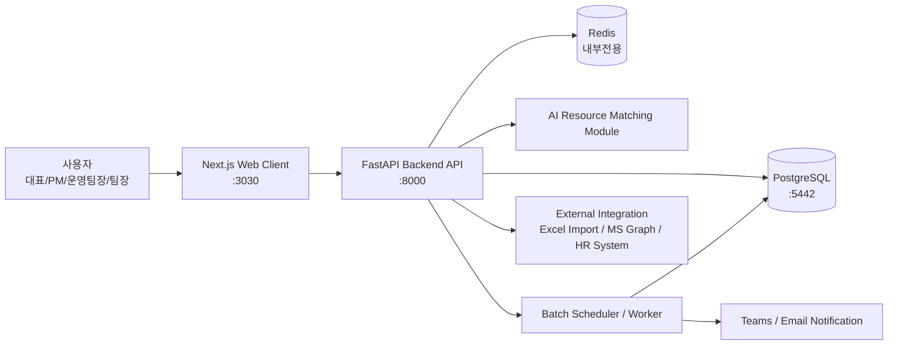
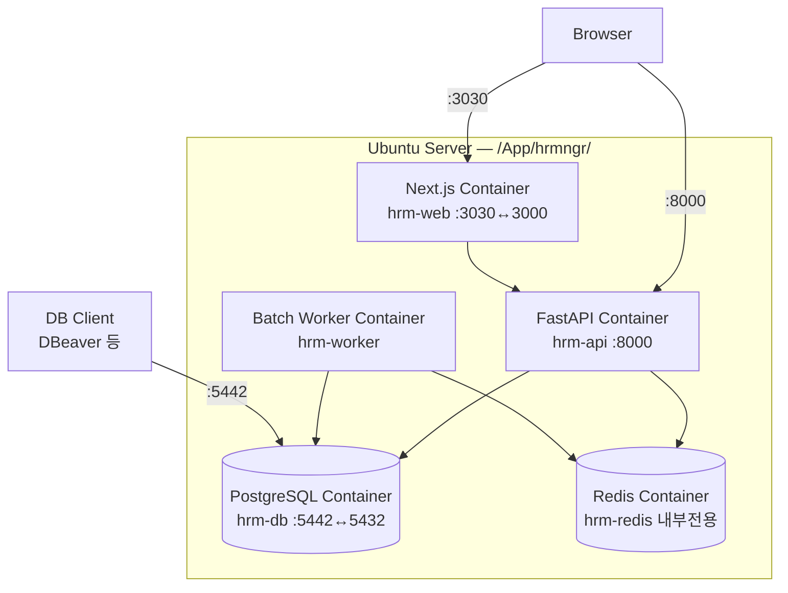
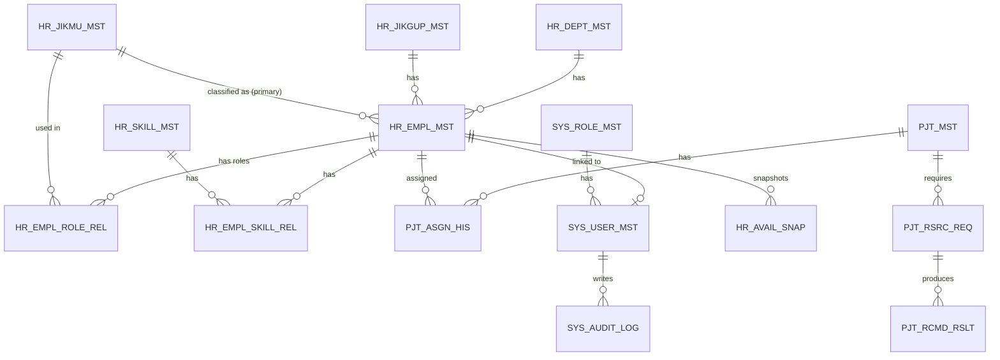
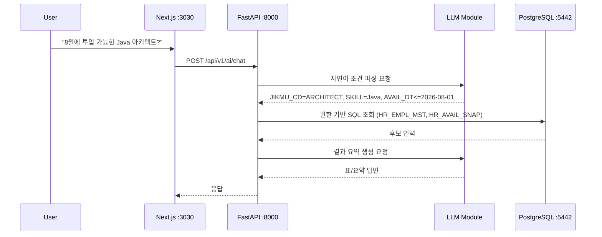

# Human Resource Management Automation System
## 통합 기획·설계서 v0.6

**작성일:** 2026년 7월 1일
**문서 목적:** 기존 MS 365 기반 리소스 관리 자동화 설계를 독립형 웹 애플리케이션 아키텍처로 리팩토링
**대상 시스템:** SI/IT 조직의 인력 현황, 기술 스택, 투입률, 프로젝트 배치, 가동 가능일, 리소스 추천 자동화 시스템

---

## 문서 변경 이력

| 버전 | 날짜 | 변경 내용 |
|---|---|---|
| v0.1 | 2026-07-01 | 초안 작성 (MS 365 기반 → FastAPI + PostgreSQL + Next.js 리팩토링 설계) |
| v0.2 | 2026-07-01 | Docker Compose 서비스 완성, 누락 테이블 설계 추가, ERD 보완, API 엔드포인트 보강, Next.js Dockerfile standalone 최적화, .env 보강, 보안 항목 보강, LLM/RAG 방향 보강, 프로젝트 구조 보강, 체크리스트 보완 |
| v0.3 | 2026-07-01 | Nginx 구성 전면 제거, PostgreSQL Docker 독립 설치(외부 포트 5442), 프로젝트 기준 경로 `/App/hrmngr/` 적용, Next.js 외부 포트 3030 변경, 직무 유형(`job_types`) 마스터 추가 |
| v0.4 | 2026-07-01 | 테이블명·컬럼명을 대한민국 HR 시스템 META 명명 규칙으로 전면 재정의 |
| v0.5 | 2026-07-01 | `ResourceManagement_v2.xlsx` 실데이터 반영 — `HR_EMPL_ROLE_REL` 사원역할 연결 테이블 신규, `PJT_ASGN_HIS.ASGN_TYPE_CD` 컬럼 추가(RUNNING/COMMITTED/PROPOSED), `HR_DEPT_MST`·`HR_JIKGUP_MST`·`HR_JIKMU_MST` Seed 데이터 확정, 신규 API(월별 가동률 매트릭스, 역할 관리, 3단계 가동률), 이관 단계 보완 |
| v0.6 | 2026-07-01 | §14.2 MVP 완료 체크리스트를 `ROADMAP.md`로 분리 — 설계 문서에서 제거, §14 제목 및 목차 정리 |

---

## 목차

1. [프로젝트 개요](#1-프로젝트-개요)
2. [기존 설계 대비 변경 방향](#2-기존-설계-대비-변경-방향)
3. [목표 아키텍처](#3-목표-아키텍처)
4. [업무 범위 및 주요 기능](#4-업무-범위-및-주요-기능)
5. [도메인 모델 및 데이터베이스 설계](#5-도메인-모델-및-데이터베이스-설계)
6. [FastAPI 백엔드 설계](#6-fastapi-백엔드-설계)
7. [Next.js 웹 클라이언트 설계](#7-nextjs-웹-클라이언트-설계)
8. [Docker 및 Ubuntu 운영 환경 설계](#8-docker-및-ubuntu-운영-환경-설계)
9. [AI 질의응답 및 리소스 추천 설계](#9-ai-질의응답-및-리소스-추천-설계)
10. [자동화 배치 및 알림 설계](#10-자동화-배치-및-알림-설계)
11. [보안·권한·감사 설계](#11-보안권한감사-설계)
12. [운영 프로세스](#12-운영-프로세스)
13. [마이그레이션 전략](#13-마이그레이션-전략)
14. [구현 일정](#14-구현-일정)
15. [리스크 및 대응 방안](#15-리스크-및-대응-방안)
16. [부록: 프로젝트 디렉토리 구조](#16-부록-프로젝트-디렉토리-구조)

---

## 1. 프로젝트 개요

본 시스템은 조직 내 인력 리소스를 체계적으로 관리하고, 프로젝트 투입 가능 인력과 기술 역량을 빠르게 검색·추천하기 위한 Human Resource Management Automation 시스템이다.

| 구분 | 적용 기술 |
|---|---|
| 백엔드 | FastAPI |
| 데이터베이스 | PostgreSQL 16 (Docker 컨테이너, 외부 포트 **5442**) |
| 웹 클라이언트 | Next.js (외부 포트 **3030**) |
| 운영 환경 | Ubuntu Server |
| 실행 환경 | Docker / Docker Compose |
| 프로젝트 기준 경로 | `/App/hrmngr/` |
| 인증 방식 | 1차 MVP: JWT 기반 자체 인증 / 확장: Microsoft Entra ID 연동 |
| 자동화 | FastAPI Background Task, APScheduler 또는 Celery 기반 배치 |
| 알림 | Teams Webhook, Email, Slack 등 확장 가능 |
| AI 연동 | LLM API 또는 사내 LLM 기반 자연어 질의응답 |

> **포트 정책 요약**
> - Next.js 웹 클라이언트: 외부 포트 **3030** (컨테이너 내부 3000, 매핑 `3030:3000`)
> - FastAPI 백엔드: **8000**
> - PostgreSQL: 외부 **5442** → 내부 **5432** (매핑 `5442:5432`)
> - Redis: 외부 미노출, Docker 내부 전용

### 1.1 목적

| 구분 | 내용 |
|---|---|
| 인력 현황 관리 | 직원, 부서, 직급, 직무 유형, 기술 스택, 숙련도, 프로젝트 투입 현황 통합 관리 |
| 가동률 관리 | 개인·부서·전체 조직 단위의 투입률, 대기 인력, 종료 예정자 현황 파악 |
| 리소스 매칭 | 직무 유형, 기술, 숙련도, 역할, 가동 가능일 기준으로 프로젝트 투입 후보 추천 |
| 운영 자동화 | 주간 업데이트, 월간 리포트, 가동률 알림, 프로젝트 종료 예정자 알림 자동화 |
| AI 질의응답 | "다음 달 투입 가능한 Java 아키텍트"와 같은 자연어 질의 지원 |

### 1.2 적용 대상

| 항목 | 기준 |
|---|---|
| 조직 규모 | 1차 기준 약 70명 |
| 확장 가능 규모 | 수백 명 수준까지 확장 가능 |
| 주요 사용자 | 대표, 임원, 운영팀장, PM, 팀장, 인사/리소스 관리자 |
| 주요 데이터 | 사원 정보, 직무 유형, 기술 역량, 프로젝트, 투입률, 가동 가능일, 리소스 이력 |

### 1.3 핵심 성공 기준

- 전체 인력의 현재 투입 상태를 웹 대시보드에서 즉시 확인할 수 있다.
- 직무 유형·기술·숙련도 조합으로 투입 가능 인력을 10초 이내에 조회할 수 있다.
- 프로젝트 종료 예정자와 대기 인력을 주간 단위로 자동 리포트한다.
- Excel 수작업 중심 관리에서 벗어나 PostgreSQL 기반의 정합성 있는 데이터 관리 체계를 구축한다.
- 향후 AI Agent, RAG, 프로젝트 이력 분석, 인력 수요 예측으로 확장 가능한 구조를 가진다.

---

## 2. 기존 설계 대비 변경 방향

### 2.1 기존 구조

| 영역 | 기존 설계 |
|---|---|
| 마스터 입력 | Excel ResourceTable |
| 저장소 | SharePoint List |
| 동기화 | Python Script 또는 Power Automate |
| AI 질의 | Power Virtual Agents / Copilot Studio |
| 운영 | Windows 작업 스케줄러, Teams 알림 |
| 장점 | 빠른 구축, 낮은 비용, MS 365 환경 활용 |
| 한계 | 데이터 정규화 한계, 권한 통제 제한, 화면 UX 제한, 이력 관리 취약, 확장성 제한 |

### 2.2 리팩토링 후 구조

| 영역 | 리팩토링 설계 |
|---|---|
| 마스터 입력 | Next.js 웹 화면 |
| 저장소 | PostgreSQL (Docker, 포트 5442) |
| API | FastAPI REST API |
| 인증/권한 | JWT + Role Based Access Control |
| 자동화 | 컨테이너 기반 Batch Worker |
| AI 질의 | FastAPI AI API + LLM/RAG 모듈 |
| 운영 | Ubuntu + Docker Compose, 기준 경로 `/App/hrmngr/` |
| 장점 | 데이터 정합성, 확장성, 감사 이력, 권한 관리, 독립 운영성, 시스템화 가능 |

### 2.3 전환 원칙

| 원칙 | 설명 |
|---|---|
| Excel은 입력 원장이 아니라 이관·업로드 수단으로 격하 | Single Source of Truth는 PostgreSQL |
| SharePoint List는 필수 구성에서 제외 | 필요 시 외부 연동 또는 백업 Export 대상으로만 사용 |
| PVA는 선택 사항으로 전환 | 사내 웹 AI Agent 또는 LLM API 기반으로 대체 가능 |
| 수작업 동기화보다 실시간 CRUD 우선 | 웹 화면에서 직접 등록·수정·삭제하는 구조 적용 |
| 감사 이력 필수화 | 인력 정보·투입률·프로젝트 배치 변경을 Audit Log로 관리 |
| PostgreSQL 완전 독립 컨테이너화 | 서버 OS 레벨 PostgreSQL과 분리, `/App/hrmngr/data/postgres/`에 데이터 영속화 |

---

## 3. 목표 아키텍처

### 3.1 논리 아키텍처



### 3.2 컨테이너 아키텍처



### 3.3 배포 구성

| 구성 요소 | 컨테이너명 | 외부 포트 | 내부 포트 | 역할 |
|---|---|---:|---:|---|
| Next.js | `hrm-web` | **3030** | 3000 | 웹 클라이언트 (사용자 접근) |
| FastAPI | `hrm-api` | 8000 | 8000 | REST API, 인증, 업무 로직 |
| PostgreSQL | `hrm-db` | **5442** | 5432 | 업무 데이터 저장소 |
| Redis | `hrm-redis` | 없음 (내부 전용) | 6379 | 캐시, 비동기 작업 큐 |
| Worker | `hrm-worker` | 없음 | - | 배치, 리포트, 알림 |

### 3.4 MVP 기준 구성

| 단계 | 권장 구성 |
|---|---|
| MVP | FastAPI + PostgreSQL(Docker, 5442) + Next.js(3030) + Docker Compose |
| 운영 안정화 | HTTPS(방화벽/업스트림 처리) + Backup + Audit Log + Redis 캐시 |
| 확장 단계 | Celery + AI/RAG + SSO + CI/CD + 리버스 프록시(필요 시) |

---

## 4. 업무 범위 및 주요 기능

### 4.1 사용자 역할

| 역할 | 설명 | 주요 권한 |
|---|---|---|
| Admin | 시스템 관리자 | 전체 설정, 사용자 관리, 권한 관리 |
| HR Manager | 인사/리소스 관리자 | 직원/기술/프로젝트/투입 정보 전체 관리 |
| PM | 프로젝트 관리자 | 프로젝트별 필요 인력 조회, 후보 추천, 투입 요청 |
| Team Lead | 팀장 | 소속 팀원 정보 조회·일부 수정 |
| Executive | 대표/임원 | 전체 현황, 가동률, 리포트 조회 |
| Viewer | 일반 조회자 | 제한된 조회 |

### 4.2 주요 메뉴

| 메뉴 | 기능 |
|---|---|
| 대시보드 | 전체 인원, 투입률, 대기 인력, 종료 예정자, 부서별·직무별 가동률 |
| 직원 관리 | 직원 등록, 수정, 퇴직 처리, 부서/직급/직무 관리 |
| 기술 스택 관리 | 기술 그룹, 기술명, 직원별 숙련도 관리 |
| 직무 유형 관리 | 아키텍트/개발자/BA 등 직무 마스터 관리 |
| 프로젝트 관리 | 프로젝트 등록, 기간, 고객사, 필요 기술, 투입 인력 관리 |
| 투입 관리 | 직원별 프로젝트 배치, 투입률, 시작일, 종료 예정일 관리 |
| 리소스 추천 | 직무 유형·기술·숙련도·가동 가능일·역할 기준 후보 추천 |
| AI 질의응답 | 자연어 기반 인력 검색 및 추천 |
| 리포트 | 주간/월간 가동률, 종료 예정자, 대기 인력, 기술·직무 유형 분포 |
| 설정 | 사용자, 권한, 코드, 알림 채널, 배치 주기 관리 |

### 4.3 MVP 기능 범위

| 우선순위 | 기능 | MVP 포함 여부 |
|---|---|---|
| P0 | 직원 기본 정보 CRUD | 포함 |
| P0 | 직무 유형 마스터 관리 및 직원 연결 | 포함 |
| P0 | 프로젝트 CRUD | 포함 |
| P0 | 투입률/가동 가능일 관리 | 포함 |
| P0 | 기술 스택 및 숙련도 관리 | 포함 |
| P0 | 대시보드 | 포함 |
| P0 | 리소스 검색/필터 (직무 유형 필터 포함) | 포함 |
| P1 | 추천 점수 기반 후보 추천 | 포함 |
| P1 | Excel Import/Export | 포함 |
| P1 | Teams 알림 | 포함 |
| P2 | AI 자연어 질의 | 2차 적용 가능 |
| P2 | Microsoft Entra ID SSO | 2차 적용 가능 |
| P3 | 인력 수요 예측 | 장기 확장 |

---

## 5. 도메인 모델 및 데이터베이스 설계

### 5.1 테이블 명명 규칙

본 시스템의 테이블명·컬럼명은 대한민국 HR 시스템에서 통용되는 META 명명 규칙을 따른다.

#### 테이블명 규칙

```text
{도메인 접두사}_{엔티티 약어}_{테이블 유형}

도메인 접두사
  HR_   인사(Human Resource) 도메인 — 사원, 부서, 직급, 직무, 기술
  PJT_  프로젝트(Project) 도메인 — 프로젝트, 투입, 요청, 추천
  SYS_  시스템(System) 도메인 — 사용자, 역할, 감사, 배치

테이블 유형 접미사
  _MST  마스터(Master) — 기준 코드·조직 정보
  _HIS  이력(History) — 변경·트랜잭션 이력
  _REL  연결(Relation) — 다대다 관계 연결
  _SNAP 스냅샷(Snapshot) — 특정 시점 상태 저장
  _REQ  요청(Request) — 인력 요청
  _RSLT 결과(Result) — 처리/추천 결과
  _LOG  로그(Log) — 감사·오류 기록
```

#### 컬럼명 규칙

```text
{대상 약어}_{필드 유형 접미사}

필드 유형 접미사
  _ID    식별자(UUID/PK/FK)
  _NO    관리 번호(사번 등 업무 식별자)
  _CD    코드(상태코드, 분류코드)
  _NM    명칭(한글/영문 이름)
  _ADDR  주소(이메일, URL 등)
  _DT    일자(DATE — 시분초 없음)
  _DTTM  일시(TIMESTAMPTZ — 시분초 포함)
  _YN    여부(BOOLEAN — Y/N 의미, DB는 BOOLEAN 타입 사용)
  _RT    율/비율(%)
  _CNT   건수
  _ORD   순서/정렬
  _DESC  설명(긴 텍스트)
  _JSON  JSON 구조 데이터
  _LEVL  레벨/수준
  _GRP   그룹 분류
  _SUMR  요약

공통 감사 컬럼 (모든 테이블 공통)
  REG_DTTM   등록일시 (created_at 대응)
  REG_USER   등록자 ID
  UPD_DTTM   수정일시 (updated_at 대응)
  UPD_USER   수정자 ID
```

#### 테이블 목록

| 도메인 | 테이블명 | 논리명 | 구 명칭(참고) |
|---|---|---|---|
| HR | `HR_EMPL_MST` | 사원 마스터 | employees |
| HR | `HR_DEPT_MST` | 부서 마스터 | teams |
| HR | `HR_JIKGUP_MST` | 직급 마스터 | positions |
| HR | `HR_JIKMU_MST` | 직무 마스터 | job_types |
| HR | `HR_SKILL_MST` | 기술 마스터 | skills |
| HR | `HR_EMPL_SKILL_REL` | 사원기술 연결 | employee_skills |
| HR | `HR_EMPL_ROLE_REL` | 사원역할 연결 | — (신규) |
| HR | `HR_AVAIL_SNAP` | 가동가능 스냅샷 | availability_snapshots |
| PJT | `PJT_MST` | 프로젝트 마스터 | projects |
| PJT | `PJT_ASGN_HIS` | 투입 이력 | assignments |
| PJT | `PJT_RSRC_REQ` | 리소스 요청 | resource_requests |
| PJT | `PJT_RCMD_RSLT` | 추천 결과 | recommendation_results |
| SYS | `SYS_USER_MST` | 시스템 사용자 마스터 | users |
| SYS | `SYS_ROLE_MST` | 역할 마스터 | roles |
| SYS | `SYS_AUDIT_LOG` | 감사 로그 | audit_logs |
| SYS | `SYS_BATCH_HIS` | 배치 실행 이력 | batch_jobs |

### 5.2 ERD 개요



### 5.3 테이블 상세 설계

#### 5.3.1 `HR_EMPL_MST` — 사원 마스터

| 컬럼명 | 타입 | 제약 | 설명 |
|---|---|---|---|
| `EMPL_ID` | UUID | PK | 사원 ID |
| `EMPL_NO` | VARCHAR(30) | UNIQUE NOT NULL | 사번 |
| `EMPL_NM` | VARCHAR(100) | NOT NULL | 성명 |
| `DEPT_ID` | UUID | FK | 소속 부서 ID (`HR_DEPT_MST`) |
| `JIKGUP_ID` | UUID | FK | 직급 ID (`HR_JIKGUP_MST`) |
| `JIKMU_ID` | UUID | FK NULL | 주 직무 ID (`HR_JIKMU_MST`) |
| `EMPL_STAT_CD` | VARCHAR(20) | NOT NULL | 재직상태코드 (ACTIVE / LEAVE / RETIRED) |
| `EMAIL_ADDR` | VARCHAR(255) | UNIQUE | 이메일 주소 |
| `MPHONE_NO` | VARCHAR(50) | NULL | 휴대폰 번호 |
| `HIRE_DT` | DATE | NULL | 입사일 |
| `RETIR_DT` | DATE | NULL | 퇴직일 |
| `REG_DTTM` | TIMESTAMPTZ | NOT NULL | 등록일시 |
| `REG_USER` | VARCHAR(100) | NULL | 등록자 |
| `UPD_DTTM` | TIMESTAMPTZ | NOT NULL | 수정일시 |
| `UPD_USER` | VARCHAR(100) | NULL | 수정자 |

> **`JIKMU_ID`** 는 NULL 허용. **주(Primary) 직무 1개**를 나타낸다. 복수 역할(예: "PM, AA") 보유 시 추가 역할은 `HR_EMPL_ROLE_REL`에 등록한다. (`ResourceManagement_v2.xlsx` 인력마스터 시트 기준)
>
> **`EMPL_STAT_CD` 코드값:** `ACTIVE`(재직), `LEAVE`(휴직), `RETIRED`(퇴직)

#### 5.3.2 `HR_DEPT_MST` — 부서 마스터

| 컬럼명 | 타입 | 제약 | 설명 |
|---|---|---|---|
| `DEPT_ID` | UUID | PK | 부서 ID |
| `DEPT_CD` | VARCHAR(30) | UNIQUE NOT NULL | 부서 코드 |
| `DEPT_NM` | VARCHAR(100) | NOT NULL | 부서명 |
| `PRNT_DEPT_ID` | UUID | FK (self) NULL | 상위 부서 ID (NULL = 최상위) |
| `DEPT_ORD` | SMALLINT | DEFAULT 0 | 정렬 순서 |
| `USE_YN` | BOOLEAN | DEFAULT TRUE | 사용여부 |
| `REG_DTTM` | TIMESTAMPTZ | NOT NULL | 등록일시 |
| `UPD_DTTM` | TIMESTAMPTZ | NOT NULL | 수정일시 |

**초기 Seed 데이터** (`ResourceManagement_v2.xlsx` 인력마스터 시트 기준):

| `DEPT_CD` | `DEPT_NM` | `PRNT_DEPT_ID` |
|---|---|---|
| `DELIVERY` | 딜리버리 | NULL |
| `SALES_PARTNER` | 세일즈파트너 | NULL |
| `SALES` | 영업 | NULL |

#### 5.3.3 `HR_JIKGUP_MST` — 직급 마스터

| 컬럼명 | 타입 | 제약 | 설명 |
|---|---|---|---|
| `JIKGUP_ID` | UUID | PK | 직급 ID |
| `JIKGUP_CD` | VARCHAR(30) | UNIQUE NOT NULL | 직급 코드 |
| `JIKGUP_NM` | VARCHAR(100) | NOT NULL | 직급명 |
| `JIKGUP_ORD` | SMALLINT | NOT NULL | 직급 정렬 순서 (낮을수록 상위) |
| `USE_YN` | BOOLEAN | DEFAULT TRUE | 사용여부 |
| `REG_DTTM` | TIMESTAMPTZ | NOT NULL | 등록일시 |
| `UPD_DTTM` | TIMESTAMPTZ | NOT NULL | 수정일시 |

**초기 Seed 데이터** (`ResourceManagement_v2.xlsx` 인력마스터 시트 드롭다운 기준):

| `JIKGUP_CD` | `JIKGUP_NM` | `JIKGUP_ORD` |
|---|---|---|
| `INTERN` | 인턴 | 10 |
| `SAWON` | 사원 | 20 |
| `DAERI` | 대리 | 30 |
| `CHAJANG` | 차장 | 40 |
| `BUJANG` | 부장 | 50 |
| `ISA` | 이사 | 60 |
| `SANGMUBO` | 상무보 | 70 |
| `SANGMU` | 상무 | 80 |
| `JUNMU` | 전무 | 90 |
| `BUDAEPYO` | 부대표 | 100 |

#### 5.3.4 `HR_JIKMU_MST` — 직무 마스터

직무 유형은 조직 내 인력의 전문 역할 분류를 나타내는 마스터 테이블이다. 직급(시니어리티)과는 별개로, 해당 인력이 어떤 전문 직무를 수행하는지를 구분한다.

| 컬럼명 | 타입 | 제약 | 설명 |
|---|---|---|---|
| `JIKMU_ID` | UUID | PK | 직무 ID |
| `JIKMU_CD` | VARCHAR(50) | UNIQUE NOT NULL | 직무 코드 (ARCHITECT, DEVELOPER 등) |
| `JIKMU_NM` | VARCHAR(100) | NOT NULL | 직무명 (한글 표시명) |
| `JIKMU_GRP_CD` | VARCHAR(50) | NULL | 직무 그룹 코드 (TECHNICAL / MANAGEMENT / ANALYSIS) |
| `JIKMU_DESC` | TEXT | NULL | 직무 설명 |
| `SORT_ORD` | SMALLINT | DEFAULT 0 | 화면 표시 정렬 순서 |
| `USE_YN` | BOOLEAN | DEFAULT TRUE | 사용여부 |
| `REG_DTTM` | TIMESTAMPTZ | NOT NULL | 등록일시 |
| `UPD_DTTM` | TIMESTAMPTZ | NOT NULL | 수정일시 |

**초기 Seed 데이터** (`ResourceManagement_v2.xlsx` 인력마스터 보유역할 코드 기준으로 갱신):

| `JIKMU_CD` | `JIKMU_NM` | `JIKMU_GRP_CD` | `JIKMU_DESC` | 엑셀 코드 |
|---|---|---|---|---|
| `ARCHITECT` | 아키텍트(AA) | TECHNICAL | 시스템/솔루션 아키텍처 설계 전문 인력 | AA |
| `TECH_LEAD` | 기술아키텍트(TA) | TECHNICAL | 기술 아키텍처·인프라 설계 전문 인력 | TA |
| `BA` | 비즈니스 애널리스트(BA) | ANALYSIS | 업무 요건 분석 및 요구사항 정의 인력 | BA |
| `DBA` | DBA | TECHNICAL | 데이터베이스 관리 전문 인력 | DBA |
| `PM` | 프로젝트 매니저(PM) | MANAGEMENT | 프로젝트 관리 전문 인력 | PM |
| `CONSULTANT` | 컨설턴트 | MANAGEMENT | 업무/IT 컨설팅 전문 인력 | 컨설턴트 |
| `PMO` | 사업관리 | MANAGEMENT | 사업 관리·원가 분석 전문 인력 | 사업관리 |
| `DEVELOPER` | 개발자 | TECHNICAL | 소프트웨어 개발 전문 인력 | — |
| `DA` | 데이터 애널리스트 | ANALYSIS | 데이터 분석 및 인사이트 도출 인력 | — |
| `QA` | QA 엔지니어 | TECHNICAL | 품질 보증 및 테스트 전문 인력 | — |
| `DEVOPS` | DevOps/인프라 | TECHNICAL | 인프라·배포·운영 자동화 전문 인력 | — |
| `DESIGNER` | UI/UX 디자이너 | TECHNICAL | 사용자 경험·인터페이스 설계 인력 | — |

> 엑셀 코드 열의 값은 `ResourceManagement_v2.xlsx`에서 실제로 사용 중인 코드명이다. 엑셀 Import 시 이 값을 `JIKMU_CD`로 매핑한다 (예: "AA" → `ARCHITECT`). "—"인 항목은 시스템 확장용 코드이며 현재 엑셀 원본에는 없다.

> **직급(`HR_JIKGUP_MST`) vs 직무(`HR_JIKMU_MST`) vs 투입 역할(`PJT_ASGN_HIS.PRJT_ROLE_NM`) 구분**
>
> | 구분 | 예시 | 의미 |
> |---|---|---|
> | 직급 (`JIKGUP_NM`) | 사원, 대리, 과장, 부장 | 조직 내 시니어리티/권한 계층 |
> | 직무 (`JIKMU_CD`) | ARCHITECT, DEVELOPER, BA | 전문 역할 분류 |
> | 투입 역할 (`PRJT_ROLE_NM`) | PM, Backend, Frontend | 특정 프로젝트에서 수행하는 역할 |
>
> 예: "과장급 아키텍트가 이번 프로젝트에서 Backend 역할로 투입"
> → `JIKGUP_NM`=과장, `JIKMU_CD`=ARCHITECT, `PRJT_ROLE_NM`=Backend

#### 5.3.5 `HR_SKILL_MST` — 기술 마스터

| 컬럼명 | 타입 | 제약 | 설명 |
|---|---|---|---|
| `SKILL_ID` | UUID | PK | 기술 ID |
| `SKILL_GRP_CD` | VARCHAR(50) | NOT NULL | 기술 그룹 코드 (BACKEND / FRONTEND / DB / CLOUD 등) |
| `SKILL_NM` | VARCHAR(100) | NOT NULL | 기술명 (Java, Spring, React, AWS 등) |
| `USE_YN` | BOOLEAN | DEFAULT TRUE | 사용여부 |
| `REG_DTTM` | TIMESTAMPTZ | NOT NULL | 등록일시 |
| `UPD_DTTM` | TIMESTAMPTZ | NOT NULL | 수정일시 |

#### 5.3.6 `HR_EMPL_SKILL_REL` — 사원기술 연결

| 컬럼명 | 타입 | 제약 | 설명 |
|---|---|---|---|
| `EMPL_SKILL_ID` | UUID | PK | 사원기술 ID |
| `EMPL_ID` | UUID | FK NOT NULL | 사원 ID (`HR_EMPL_MST`) |
| `SKILL_ID` | UUID | FK NOT NULL | 기술 ID (`HR_SKILL_MST`) |
| `PRFCY_LEVL` | SMALLINT | CHECK 1~5 | 숙련도 레벨 (1: 초급 ~ 5: 전문가) |
| `EXPR_YEAR` | NUMERIC(4,1) | NULL | 경력 연수 |
| `LAST_USE_DT` | DATE | NULL | 최근 사용일 |
| `RMRK` | TEXT | NULL | 비고 |
| `REG_DTTM` | TIMESTAMPTZ | NOT NULL | 등록일시 |
| `UPD_DTTM` | TIMESTAMPTZ | NOT NULL | 수정일시 |

#### 5.3.7 `PJT_MST` — 프로젝트 마스터

| 컬럼명 | 타입 | 제약 | 설명 |
|---|---|---|---|
| `PJT_ID` | UUID | PK | 프로젝트 ID |
| `PJT_CD` | VARCHAR(30) | UNIQUE NOT NULL | 프로젝트 코드 |
| `PJT_NM` | VARCHAR(200) | NOT NULL | 프로젝트명 |
| `CLNT_NM` | VARCHAR(200) | NULL | 고객사명 |
| `PJT_STAT_CD` | VARCHAR(20) | NOT NULL | 프로젝트 상태코드 (PLANNED / RUNNING / CLOSED / HOLD) |
| `STRT_DT` | DATE | NOT NULL | 시작일 |
| `END_DT` | DATE | NULL | 종료 예정일 |
| `PJT_DESC` | TEXT | NULL | 프로젝트 설명 |
| `REG_DTTM` | TIMESTAMPTZ | NOT NULL | 등록일시 |
| `REG_USER` | VARCHAR(100) | NULL | 등록자 |
| `UPD_DTTM` | TIMESTAMPTZ | NOT NULL | 수정일시 |
| `UPD_USER` | VARCHAR(100) | NULL | 수정자 |

#### 5.3.8 `PJT_ASGN_HIS` — 투입 이력

| 컬럼명 | 타입 | 제약 | 설명 |
|---|---|---|---|
| `ASGN_ID` | UUID | PK | 투입 ID |
| `EMPL_ID` | UUID | FK NOT NULL | 사원 ID (`HR_EMPL_MST`) |
| `PJT_ID` | UUID | FK NOT NULL | 프로젝트 ID (`PJT_MST`) |
| **`ASGN_TYPE_CD`** | VARCHAR(20) | NOT NULL DEFAULT 'RUNNING' | **투입 유형 코드** (RUNNING / COMMITTED / PROPOSED) |
| `PRJT_ROLE_NM` | VARCHAR(100) | NOT NULL | 프로젝트 내 역할명 (리드개발, 분석, 참여 등) |
| `ALLOC_RT` | SMALLINT | CHECK 0~100 | 투입률(%) |
| `ASGN_STRT_DT` | DATE | NOT NULL | 투입 시작일 |
| `ASGN_END_DT` | DATE | NULL | 투입 종료 예정일 |
| `ASGN_STAT_CD` | VARCHAR(20) | NOT NULL | 투입 상태코드 (PLANNED / ACTIVE / DONE / CANCELED) |
| `RMRK` | TEXT | NULL | 비고 |
| `REG_DTTM` | TIMESTAMPTZ | NOT NULL | 등록일시 |
| `REG_USER` | VARCHAR(100) | NULL | 등록자 |
| `UPD_DTTM` | TIMESTAMPTZ | NOT NULL | 수정일시 |
| `UPD_USER` | VARCHAR(100) | NULL | 수정자 |

> **`ASGN_TYPE_CD` vs `ASGN_STAT_CD` 구분:**
>
> | 컬럼 | 역할 | 코드값 |
> |---|---|---|
> | `ASGN_TYPE_CD` | 프로젝트 수주 단계 — 가동률 3단계 집계에 사용 | `RUNNING`(수행중) / `COMMITTED`(투입준비중) / `PROPOSED`(제안중) |
> | `ASGN_STAT_CD` | 이 투입 행 자체의 라이프사이클 | `PLANNED` / `ACTIVE` / `DONE` / `CANCELED` |
>
> **`ASGN_TYPE_CD` 코드 정의** (`ResourceManagement_v2.xlsx` 프로젝트투입 시트 기준):
>
> | `ASGN_TYPE_CD` | 한글명 | 의미 | 가동률 집계 단계 | 색상 |
> |---|---|---|---|---|
> | `RUNNING` | 수행중 | 계약 완료, 실제 투입 진행 | 1단계·2단계·3단계 전부 포함 | 🔵 파란색 |
> | `COMMITTED` | 투입준비중 | 수주 확정, 계약 전 대기 | 2단계·3단계 포함 | 🟠 주황색 |
> | `PROPOSED` | 제안중 | 제안서 작성·PT 준비 중 | 3단계만 포함 | 🟢 청록색 |
>
> **`RMRK`** — 비고. `ResourceManagement_v2.xlsx` 프로젝트투입 시트의 "비고" 컬럼과 매핑.
> **가동가능일** — `ASGN_END_DT + 1`로 자동 계산. 별도 저장하지 않으며 직접 입력 불가.

#### 5.3.9 `SYS_USER_MST` — 시스템 사용자 마스터

| 컬럼명 | 타입 | 제약 | 설명 |
|---|---|---|---|
| `USER_ID` | UUID | PK | 사용자 ID |
| `EMPL_ID` | UUID | FK NULL | 연결 사원 ID (선택, `HR_EMPL_MST`) |
| `USER_LGID` | VARCHAR(100) | UNIQUE NOT NULL | 로그인 ID |
| `EMAIL_ADDR` | VARCHAR(255) | UNIQUE NOT NULL | 이메일 주소 |
| `ENCR_PWD` | VARCHAR(255) | NULL | 암호화 비밀번호 (SSO 사용 시 NULL) |
| `ROLE_ID` | UUID | FK NOT NULL | 역할 ID (`SYS_ROLE_MST`) |
| `USE_YN` | BOOLEAN | DEFAULT TRUE | 계정 활성 여부 |
| `LAST_LGN_DTTM` | TIMESTAMPTZ | NULL | 최근 로그인 일시 |
| `REG_DTTM` | TIMESTAMPTZ | NOT NULL | 등록일시 |
| `UPD_DTTM` | TIMESTAMPTZ | NOT NULL | 수정일시 |

> **`EMPL_ID`** 는 NULL 허용. 시스템 관리 계정, 외부 협력사 계정 등 사원과 무관한 사용자를 지원한다.

#### 5.3.10 `SYS_ROLE_MST` — 역할 마스터

| 컬럼명 | 타입 | 제약 | 설명 |
|---|---|---|---|
| `ROLE_ID` | UUID | PK | 역할 ID |
| `ROLE_CD` | VARCHAR(50) | UNIQUE NOT NULL | 역할 코드 (ADMIN / HR_MGR / PM / TEAM_LEAD / EXEC / VIEWER) |
| `ROLE_NM` | VARCHAR(100) | NOT NULL | 역할명 |
| `ROLE_DESC` | TEXT | NULL | 역할 설명 |
| `PERM_JSON` | JSONB | NULL | 세부 권한 목록 JSON (확장용) |
| `USE_YN` | BOOLEAN | DEFAULT TRUE | 사용여부 |

#### 5.3.11 `SYS_AUDIT_LOG` — 감사 로그

| 컬럼명 | 타입 | 제약 | 설명 |
|---|---|---|---|
| `AUDIT_ID` | UUID | PK | 감사 로그 ID |
| `USER_ID` | UUID | FK NOT NULL | 수행 사용자 ID (`SYS_USER_MST`) |
| `ACT_CD` | VARCHAR(50) | NOT NULL | 행위 코드 (CREATE / UPDATE / DELETE / LOGIN / IMPORT 등) |
| `TGT_TBL_NM` | VARCHAR(100) | NOT NULL | 대상 테이블명 |
| `TGT_ID` | UUID | NULL | 대상 레코드 ID |
| `BFR_VAL_JSON` | JSONB | NULL | 변경 전 값 |
| `AFT_VAL_JSON` | JSONB | NULL | 변경 후 값 |
| `CLNT_IP` | VARCHAR(45) | NULL | 클라이언트 IP |
| `USER_AGT` | TEXT | NULL | 사용자 에이전트 (브라우저 정보) |
| `REG_DTTM` | TIMESTAMPTZ | NOT NULL | 발생 일시 |

#### 5.3.12 `PJT_RSRC_REQ` — 리소스 요청

| 컬럼명 | 타입 | 제약 | 설명 |
|---|---|---|---|
| `REQ_ID` | UUID | PK | 요청 ID |
| `PJT_ID` | UUID | FK NOT NULL | 프로젝트 ID (`PJT_MST`) |
| `REQ_USER_ID` | UUID | FK NOT NULL | 요청자 ID (`SYS_USER_MST`) |
| `REQ_JIKMU_ID` | UUID | FK NULL | 필요 직무 ID (`HR_JIKMU_MST`, 선택) |
| `REQ_ROLE_NM` | VARCHAR(100) | NOT NULL | 필요 역할명 |
| `REQ_SKILL_JSON` | JSONB | NOT NULL | 필요 기술 및 최소 숙련도 목록 JSON |
| `MIN_ALLOC_RT` | SMALLINT | NOT NULL | 최소 투입률(%) |
| `REQ_AVAIL_DT` | DATE | NOT NULL | 투입 가능 희망일 |
| `REQ_HC` | SMALLINT | DEFAULT 1 | 필요 인원수 |
| `REQ_STAT_CD` | VARCHAR(20) | NOT NULL | 요청 상태코드 (OPEN / IN_REVIEW / FULFILLED / CANCELED) |
| `RMRK` | TEXT | NULL | 비고 |
| `REG_DTTM` | TIMESTAMPTZ | NOT NULL | 등록일시 |
| `REG_USER` | VARCHAR(100) | NULL | 등록자 |
| `UPD_DTTM` | TIMESTAMPTZ | NOT NULL | 수정일시 |
| `UPD_USER` | VARCHAR(100) | NULL | 수정자 |

#### 5.3.13 `PJT_RCMD_RSLT` — 추천 결과

| 컬럼명 | 타입 | 제약 | 설명 |
|---|---|---|---|
| `RCMD_ID` | UUID | PK | 추천 ID |
| `REQ_ID` | UUID | FK NOT NULL | 요청 ID (`PJT_RSRC_REQ`) |
| `EMPL_ID` | UUID | FK NOT NULL | 추천 사원 ID (`HR_EMPL_MST`) |
| `RCMD_RANK` | SMALLINT | NOT NULL | 추천 순위 |
| `TOT_SCORE` | NUMERIC(5,2) | NOT NULL | 종합 추천 점수 |
| `SCORE_DTL_JSON` | JSONB | NULL | 항목별 점수 상세 JSON |
| `RCMD_RSN` | TEXT | NULL | 추천 사유 |
| `SEL_YN` | BOOLEAN | DEFAULT FALSE | 최종 선택 여부 |
| `REG_DTTM` | TIMESTAMPTZ | NOT NULL | 등록일시 |

#### 5.3.14 `HR_AVAIL_SNAP` — 가동가능 스냅샷

| 컬럼명 | 타입 | 제약 | 설명 |
|---|---|---|---|
| `SNAP_ID` | UUID | PK | 스냅샷 ID |
| `EMPL_ID` | UUID | FK NOT NULL | 사원 ID (`HR_EMPL_MST`) |
| `SNAP_DT` | DATE | NOT NULL | 기준 일자 |
| `TOT_ALLOC_RT` | SMALLINT | NOT NULL | 총 투입률(%) |
| `AVAIL_RT` | SMALLINT | NOT NULL | 가동 가능률(%) |
| `AVAIL_STRT_DT` | DATE | NULL | 가동 가능 시작일 |
| `AVAIL_STAT_CD` | VARCHAR(20) | NOT NULL | 가동 상태코드 (AVAILABLE / PARTIAL / FULL) |
| `REG_DTTM` | TIMESTAMPTZ | NOT NULL | 등록일시 |

#### 5.3.15 `SYS_BATCH_HIS` — 배치 실행 이력

| 컬럼명 | 타입 | 설명 |
|---|---|---|
| `BATCH_ID` | UUID | 배치 실행 ID (PK) |
| `BATCH_NM` | VARCHAR(100) | 배치명 |
| `EXEC_STAT_CD` | VARCHAR(20) | 실행 상태코드 (SUCCESS / FAILED / RUNNING) |
| `EXEC_STRT_DTTM` | TIMESTAMPTZ | 실행 시작 일시 |
| `EXEC_END_DTTM` | TIMESTAMPTZ | 실행 종료 일시 |
| `RSLT_SUMR` | TEXT | 처리 결과 요약 |
| `ERR_MSG` | TEXT | 오류 메시지 |
| `CRT_CNT` | INTEGER | 생성 건수 |
| `UPD_CNT` | INTEGER | 수정 건수 |
| `FAIL_CNT` | INTEGER | 실패 건수 |
| `REG_DTTM` | TIMESTAMPTZ | 등록일시 |

#### 5.3.16 `HR_EMPL_ROLE_REL` — 사원역할 연결 *(신규)*

사원의 복수 보유역할을 관리하는 다대다 연결 테이블이다. `HR_EMPL_MST.JIKMU_ID`가 주(Primary) 직무 1개를 나타내는 반면, 이 테이블은 "PM, AA"처럼 복수 역할을 보유한 경우를 처리한다.

> 추가 배경: `ResourceManagement_v2.xlsx` 인력마스터 시트의 "보유역할" 컬럼이 쉼표 구분 복수값(예: "PM, AA")을 허용함에 따라 신규 설계.

| 컬럼명 | 타입 | 제약 | 설명 |
|---|---|---|---|
| `EMPL_ROLE_ID` | UUID | PK | 사원역할 ID |
| `EMPL_ID` | UUID | FK NOT NULL | 사원 ID (`HR_EMPL_MST`) |
| `JIKMU_ID` | UUID | FK NOT NULL | 직무 ID (`HR_JIKMU_MST`) |
| `IS_PRIMARY` | BOOLEAN | DEFAULT FALSE | 주 직무 여부 |
| `REG_DTTM` | TIMESTAMPTZ | NOT NULL | 등록일시 |
| `UPD_DTTM` | TIMESTAMPTZ | NOT NULL | 수정일시 |

> **유니크 제약:** `(EMPL_ID, JIKMU_ID)` 복합 Unique — 동일 사원에 동일 직무 중복 등록 방지
>
> **`IS_PRIMARY`:** TRUE인 행의 `JIKMU_ID`는 `HR_EMPL_MST.JIKMU_ID`와 일치해야 한다. 데이터 정합성은 애플리케이션 레이어에서 보장한다.
>
> **엑셀 Import 처리:** "PM, AA" → 쉼표 분리 후 각각 `JIKMU_CD` 조회 → `HR_EMPL_ROLE_REL` 다중 Insert. 첫 번째 역할을 `IS_PRIMARY=TRUE`로 설정하고 `HR_EMPL_MST.JIKMU_ID`에도 반영한다.

### 5.4 가동 가능일 산정 기준

```text
가동 가능일 산정 (HR_AVAIL_SNAP.AVAIL_STRT_DT) =
1. ASGN_STAT_CD = 'ACTIVE'인 PJT_ASGN_HIS가 없거나 ALLOC_RT 합계 = 0%  → 오늘
2. ALLOC_RT 합계 < 100%  → 부분 투입 가능 (AVAIL_STAT_CD = 'PARTIAL')
3. ALLOC_RT 합계 >= 100% → MAX(ASGN_END_DT) + 1일 (AVAIL_STAT_CD = 'FULL')
```

> **자동계산 원칙** (`ResourceManagement_v2.xlsx` 주석 기준): 가동가능일은 `ASGN_END_DT + 1`로 자동 계산하며, UI에서 직접 입력받지 않는다. 투입 등록 폼의 가동가능일 필드는 Read-Only로 처리한다.

### 5.5 데이터 정합성 규칙

| 규칙 | 설명 |
|---|---|
| `EMPL_NO` 기준키 사용 | 동명이인 방지를 위해 `HR_EMPL_MST.EMPL_NO` 또는 `EMPL_ID`(UUID)를 기준으로 사용 |
| `ALLOC_RT` 합계 검증 | 동일 기간 동일 사원의 `PJT_ASGN_HIS.ALLOC_RT` 합계가 100% 초과 불가 |
| 투입 종료일 검증 | `ASGN_END_DT`는 `PJT_MST.END_DT`보다 늦을 수 없음 (운영 예외 가능) |
| 기술명 표준화 | `HR_SKILL_MST` 마스터 기준으로만 등록; 자유 입력 금지 |
| 직무 유형 표준화 | `HR_JIKMU_MST` 마스터 기준으로만 등록; 자유 입력 금지 |
| 복수 역할 일관성 | `HR_EMPL_MST.JIKMU_ID`와 `HR_EMPL_ROLE_REL.IS_PRIMARY=TRUE` 행의 `JIKMU_ID`는 반드시 일치 |
| 퇴직자 상태 처리 | 삭제 금지 — `EMPL_STAT_CD = 'RETIRED'`로 상태 변경 후 `RETIR_DT` 입력 |
| 퇴직자 계정 처리 | `EMPL_STAT_CD = 'RETIRED'` 처리 시 연결 `SYS_USER_MST.USE_YN = FALSE` 자동 처리 |
| 감사 로그 | `SYS_AUDIT_LOG`에 변경 전(`BFR_VAL_JSON`) · 후(`AFT_VAL_JSON`) 값 기록 |
| 가동가능일 직접 입력 금지 | `ASGN_END_DT + 1`로 자동 계산; UI 및 API에서 직접 저장 불가 |

---

## 6. FastAPI 백엔드 설계

### 6.1 백엔드 역할

FastAPI 백엔드는 다음 역할을 수행한다.

- REST API 제공
- 인증 및 권한 검증
- 사원/프로젝트/투입/기술/직무 유형 관리
- 리소스 검색 및 추천 로직 수행
- AI 질의응답 API 제공
- 배치 작업 트리거 및 실행 이력 관리
- 감사 로그 기록

### 6.2 백엔드 기술 구성

| 영역 | 권장 기술 |
|---|---|
| Web Framework | FastAPI |
| ASGI Server | Uvicorn (MVP) / Gunicorn + Uvicorn Worker (운영) |
| ORM | SQLAlchemy 2.x |
| Migration | Alembic |
| Validation | Pydantic v2 |
| Auth | JWT, OAuth2 Password Flow |
| DB Driver | psycopg3 (동기) 또는 asyncpg (비동기) |
| Cache | Redis (선택, 운영 안정화 단계) |
| Rate Limiting | slowapi 또는 FastAPI middleware |
| Test | Pytest + httpx |
| Logging | structlog 또는 Python logging (JSON 포맷 권장) |
| Batch | APScheduler 또는 Celery |
| API 문서 | OpenAPI / Swagger UI (`/docs`), ReDoc (`/redoc`) |

### 6.3 API Prefix

```text
/api/v1
```

### 6.4 주요 API 설계

#### 시스템

| Method | Endpoint | 설명 |
|---|---|---|
| GET | `/health` | 헬스 체크 |
| GET | `/api/v1/version` | 서비스 버전 정보 |

#### 인증

| Method | Endpoint | 설명 |
|---|---|---|
| POST | `/api/v1/auth/login` | 로그인 (Access Token + Refresh Token 발급) |
| POST | `/api/v1/auth/refresh` | Access Token 갱신 |
| GET | `/api/v1/auth/me` | 현재 사용자 조회 |
| POST | `/api/v1/auth/logout` | 로그아웃 (Refresh Token 무효화) |
| POST | `/api/v1/auth/change-password` | 비밀번호 변경 |

#### 사원

| Method | Endpoint | 설명 |
|---|---|---|
| GET | `/api/v1/employees` | 사원 목록 조회 (페이지네이션, 직무 유형 필터 포함) |
| POST | `/api/v1/employees` | 사원 등록 |
| GET | `/api/v1/employees/{empl_id}` | 사원 상세 조회 (응답에 `roles` 배열 포함) |
| PATCH | `/api/v1/employees/{empl_id}` | 사원 정보 수정 |
| DELETE | `/api/v1/employees/{empl_id}` | 사원 퇴직 처리 (`EMPL_STAT_CD = 'RETIRED'`) |
| GET | `/api/v1/employees/{empl_id}/skills` | 사원 기술 조회 |
| PUT | `/api/v1/employees/{empl_id}/skills` | 사원 기술 일괄 수정 |
| GET | `/api/v1/employees/{empl_id}/assignments` | 사원 투입 이력 조회 |
| **GET** | **`/api/v1/employees/{empl_id}/roles`** | **사원 보유역할 조회** (`HR_EMPL_ROLE_REL`) |
| **PUT** | **`/api/v1/employees/{empl_id}/roles`** | **사원 보유역할 일괄 수정** (Request Body: `roles` 배열) |
| POST | `/api/v1/employees/import` | Excel 일괄 Import (인력마스터 시트 형식, 보유역할 복수 처리 포함) |
| GET | `/api/v1/employees/export` | Excel 일괄 Export |

#### 부서 / 직급 코드

| Method | Endpoint | 설명 |
|---|---|---|
| GET | `/api/v1/departments` | 부서 목록 조회 |
| POST | `/api/v1/departments` | 부서 등록 |
| PATCH | `/api/v1/departments/{dept_id}` | 부서 수정 |
| GET | `/api/v1/positions` | 직급 목록 조회 |
| POST | `/api/v1/positions` | 직급 등록 |
| PATCH | `/api/v1/positions/{jikgup_id}` | 직급 수정 |

#### 직무 유형

| Method | Endpoint | 설명 |
|---|---|---|
| GET | `/api/v1/job-types` | 직무 목록 조회 |
| POST | `/api/v1/job-types` | 직무 등록 |
| GET | `/api/v1/job-types/{jikmu_id}` | 직무 상세 조회 |
| PATCH | `/api/v1/job-types/{jikmu_id}` | 직무 수정 |
| DELETE | `/api/v1/job-types/{jikmu_id}` | 직무 비활성 (`USE_YN = FALSE`) |

#### 기술 스택

| Method | Endpoint | 설명 |
|---|---|---|
| GET | `/api/v1/skills` | 기술 목록 조회 |
| POST | `/api/v1/skills` | 기술 등록 |
| PATCH | `/api/v1/skills/{skill_id}` | 기술 수정 |
| DELETE | `/api/v1/skills/{skill_id}` | 기술 비활성 (`USE_YN = FALSE`) |

#### 프로젝트

| Method | Endpoint | 설명 |
|---|---|---|
| GET | `/api/v1/projects` | 프로젝트 목록 |
| POST | `/api/v1/projects` | 프로젝트 등록 |
| GET | `/api/v1/projects/{pjt_id}` | 프로젝트 상세 |
| PATCH | `/api/v1/projects/{pjt_id}` | 프로젝트 수정 |
| GET | `/api/v1/projects/{pjt_id}/assignments` | 프로젝트 투입 현황 |

#### 투입 관리

| Method | Endpoint | 설명 |
|---|---|---|
| GET | `/api/v1/assignments` | 투입 현황 조회 (`asgn_type_cd` 필터 파라미터 추가: RUNNING / COMMITTED / PROPOSED) |
| POST | `/api/v1/assignments` | 투입 등록 (Request Body에 `asgn_type_cd` 필수) |
| PATCH | `/api/v1/assignments/{asgn_id}` | 투입 수정 (`asgn_type_cd` 수정 가능) |
| DELETE | `/api/v1/assignments/{asgn_id}` | 투입 취소 (`ASGN_STAT_CD = 'CANCELED'`) |
| GET | `/api/v1/availability` | 가동 가능 인력 조회 (직무 유형 필터 포함) |

#### 리소스 추천

| Method | Endpoint | 설명 |
|---|---|---|
| POST | `/api/v1/resource-requests` | 인력 요청 등록 (`PJT_RSRC_REQ`) |
| GET | `/api/v1/resource-requests` | 인력 요청 목록 |
| POST | `/api/v1/recommendations/search` | 조건 기반 후보 검색 (직무 유형 필터 포함) |
| POST | `/api/v1/recommendations/score` | 점수 기반 후보 추천 (`PJT_RCMD_RSLT` 저장) |
| GET | `/api/v1/recommendations/{req_id}` | 추천 결과 조회 |

#### 대시보드/리포트

| Method | Endpoint | 설명 |
|---|---|---|
| GET | `/api/v1/dashboard/summary` | 전체 요약 |
| GET | `/api/v1/dashboard/dept-utilization` | 부서별 가동률 |
| GET | `/api/v1/dashboard/job-type-distribution` | 직무 유형별 인력 분포 및 가동률 |
| **GET** | **`/api/v1/dashboard/utilization-by-type?month={yyyyMM}`** | **3단계 조직 평균 가동률** (수행중/+준비중/전체) |
| GET | `/api/v1/reports/weekly` | 주간 리포트 조회 |
| GET | `/api/v1/reports/monthly` | 월간 리포트 조회 |
| POST | `/api/v1/reports/weekly/send` | 주간 리포트 수동 발송 |
| **GET** | **`/api/v1/reports/utilization-matrix?from={yyyyMM}&to={yyyyMM}&dept_id={id}`** | **월별 가동률 통계 매트릭스** (가동률_통계 시트 기준) |
| **GET** | **`/api/v1/reports/utilization-matrix/export`** | **월별 가동률 통계 Excel 내보내기** |

#### 배치 관리

| Method | Endpoint | 설명 |
|---|---|---|
| GET | `/api/v1/batch/jobs` | 배치 실행 이력 조회 (`SYS_BATCH_HIS`) |
| POST | `/api/v1/batch/jobs/{batch_nm}/trigger` | 배치 수동 트리거 (Admin 전용) |

#### AI 질의

| Method | Endpoint | 설명 |
|---|---|---|
| POST | `/api/v1/ai/chat` | 자연어 질의응답 |
| POST | `/api/v1/ai/parse-resource-query` | 자연어 조건 파싱 (직무 유형 인식 포함) |
| POST | `/api/v1/ai/recommend` | AI 기반 리소스 추천 |

#### 사용자/권한 관리 (Admin)

| Method | Endpoint | 설명 |
|---|---|---|
| GET | `/api/v1/users` | 사용자 목록 (`SYS_USER_MST`) |
| POST | `/api/v1/users` | 사용자 등록 |
| PATCH | `/api/v1/users/{user_id}` | 사용자 정보/권한 수정 |
| DELETE | `/api/v1/users/{user_id}` | 사용자 비활성 (`USE_YN = FALSE`) |
| GET | `/api/v1/audit-logs` | 감사 로그 조회 (`SYS_AUDIT_LOG`) |

### 6.5 API 응답 표준

**단건/기본 응답:**

```json
{
  "success": true,
  "data": {},
  "message": "OK",
  "trace_id": "f80f1d32-0000-0000-0000-000000000000"
}
```

**목록 응답 (페이지네이션):**

```json
{
  "success": true,
  "data": {
    "items": [],
    "total": 70,
    "page": 1,
    "size": 20,
    "pages": 4
  },
  "message": "OK",
  "trace_id": "f80f1d32-0000-0000-0000-000000000000"
}
```

**오류 응답:**

```json
{
  "success": false,
  "error": {
    "code": "VALIDATION_ERROR",
    "message": "투입률은 0~100 사이여야 합니다.",
    "details": []
  },
  "trace_id": "f80f1d32-0000-0000-0000-000000000000"
}
```

**페이지네이션 쿼리 파라미터:**

| 파라미터 | 설명 | 기본값 |
|---|---|---|
| `page` | 페이지 번호 (1부터 시작) | 1 |
| `size` | 페이지당 항목 수 | 20 |
| `sort` | 정렬 기준 컬럼명 | `reg_dttm` |
| `order` | 정렬 방향 (`asc` / `desc`) | `desc` |

### 6.6 추천 점수 산정

```text
추천 점수 = 직무 유형 일치 점수 15%   (HR_JIKMU_MST 기반)
        + 기술 매칭 점수 35%          (HR_EMPL_SKILL_REL 기반)
        + 숙련도 점수 25%             (PRFCY_LEVL 기반)
        + 가동 가능일 점수 15%        (HR_AVAIL_SNAP 기반)
        + 유사 프로젝트 경험 7%       (PJT_ASGN_HIS 기반)
        + 역할 적합도 3%              (PRJT_ROLE_NM 이력 기반)
```

---

## 7. Next.js 웹 클라이언트 설계

### 7.1 웹 클라이언트 역할

Next.js는 사용자가 인력 현황을 조회·관리하는 프론트엔드 역할을 수행한다. 외부 접근 포트는 **3030**이다.

### 7.2 권장 화면 구성

| URL | 화면명 | 주요 기능 |
|---|---|---|
| `/login` | 로그인 | 사용자 인증 |
| `/dashboard` | 대시보드 | 전체 인원, 가동률, 대기 인력, 종료 예정자, 직무 유형 분포 |
| `/employees` | 사원 목록 | 검색, 필터(직무 유형 포함), 등록, 수정, Excel Import/Export |
| `/employees/[id]` | 사원 상세 | 기본 정보, 직무 유형, 기술, 투입 이력 |
| `/skills` | 기술 관리 | `HR_SKILL_MST` 마스터 관리 |
| `/job-types` | 직무 유형 관리 | `HR_JIKMU_MST` 마스터 관리 |
| `/projects` | 프로젝트 목록 | 프로젝트 검색, 등록, 수정 |
| `/projects/[id]` | 프로젝트 상세 | 투입 인력, 필요 기술, 진행 상태 |
| `/assignments` | 투입 관리 | 사원별/프로젝트별 투입률 관리 |
| `/availability` | 가동 가능 인력 | 날짜·직무 유형·기술·숙련도 필터 |
| `/recommendations` | 리소스 추천 | 조건 입력(직무 유형 포함) 및 후보 추천 |
| `/ai-chat` | AI 질의응답 | 자연어 검색 |
| `/reports` | 리포트 | 주간/월간 리포트 |
| `/settings` | 설정 | 사용자, 권한, 코드, 알림 채널 관리 |
| `/settings/users` | 사용자 관리 | `SYS_USER_MST` 계정 관리 |
| `/settings/audit-logs` | 감사 로그 | `SYS_AUDIT_LOG` 조회 (Admin 전용) |

### 7.3 대시보드 지표

| 지표 | 관련 테이블/컬럼 |
|---|---|
| 전체 재직 인원 | `HR_EMPL_MST.EMPL_STAT_CD = 'ACTIVE'` COUNT |
| 즉시 투입 가능 인원 | `HR_AVAIL_SNAP.AVAIL_STAT_CD = 'AVAILABLE'` |
| 평균 가동률 | `HR_AVAIL_SNAP.TOT_ALLOC_RT` 평균 |
| 100% 투입 인원 | `HR_AVAIL_SNAP.AVAIL_STAT_CD = 'FULL'` |
| 부분 가동 가능 인원 | `HR_AVAIL_SNAP.AVAIL_STAT_CD = 'PARTIAL'` |
| 이번 달 종료 예정자 | `PJT_ASGN_HIS.ASGN_END_DT` 당월 + `ASGN_STAT_CD = 'ACTIVE'` |
| 직무 유형별 분포 | `HR_JIKMU_MST` JOIN `HR_EMPL_MST` 집계 |
| 기술별 인력 분포 | `HR_SKILL_MST` JOIN `HR_EMPL_SKILL_REL` 집계 |
| 부서별 가동률 | `HR_DEPT_MST` JOIN `HR_AVAIL_SNAP` 집계 |

### 7.4 리소스 추천 화면 입력 항목

| 항목 | 연결 데이터 |
|---|---|
| 직무 유형 | `HR_JIKMU_MST.JIKMU_CD` |
| 필요 기술 | `HR_SKILL_MST.SKILL_ID` 복수 선택 |
| 최소 숙련도 | `HR_EMPL_SKILL_REL.PRFCY_LEVL` (1~5) |
| 투입 시작 희망일 | `PJT_RSRC_REQ.REQ_AVAIL_DT` |
| 최소 투입률 | `PJT_RSRC_REQ.MIN_ALLOC_RT` |
| 역할 | `PJT_RSRC_REQ.REQ_ROLE_NM` |
| 정렬 기준 | 추천 점수(`TOT_SCORE`), 가동 가능일, 숙련도, 투입률 |

---

## 8. Docker 및 Ubuntu 운영 환경 설계

### 8.1 프로젝트 기준 경로

```text
/App/hrmngr/
├── backend/              # FastAPI 소스코드
├── frontend/             # Next.js 소스코드
├── data/
│   ├── postgres/         # HR_EMPL_MST 등 PostgreSQL 데이터 파일 (bind mount)
│   └── redis/            # Redis 데이터 파일 (bind mount)
├── backup/
│   └── postgres/         # DB 백업 파일 저장
├── logs/
├── docker-compose.yml
├── .env
├── .env.example
├── .gitignore
└── README.md
```

**디렉토리 초기 생성:**

```bash
mkdir -p /App/hrmngr/{backend,frontend,data/postgres,data/redis,backup/postgres,logs}
cd /App/hrmngr
```

### 8.2 서버 기본 구성

| 항목 | 권장값 |
|---|---|
| OS | Ubuntu Server 24.04 LTS 이상 |
| CPU | MVP: 2 vCPU 이상 / 권장: 4 vCPU 이상 |
| Memory | MVP: 4GB 이상 / 권장: 8GB 이상 |
| Disk | 50GB 이상, DB 백업 고려 시 100GB 이상 |
| Runtime | Docker Engine, Docker Compose Plugin |

### 8.3 Docker Compose 구성

파일 위치: `/App/hrmngr/docker-compose.yml`

```yaml
# --- 타임존 정책: 전 컨테이너 Asia/Seoul(KST) 통일 (2026-07-03, §8.3-1 참조) ---
x-tz-env: &tz-env
  TZ: Asia/Seoul

x-tz-localtime-ro: &tz-localtime-ro /etc/localtime:/etc/localtime:ro
x-tz-timezone-ro: &tz-timezone-ro /etc/timezone:/etc/timezone:ro

services:

  api:
    build:
      context: ./backend
      dockerfile: Dockerfile
    container_name: hrm-api
    restart: unless-stopped
    env_file:
      - .env
    environment:
      <<: *tz-env
    ports:
      - "8000:8000"
    depends_on:
      db:
        condition: service_healthy
      redis:
        condition: service_started
    volumes:
      - *tz-localtime-ro
      - *tz-timezone-ro
    healthcheck:
      test: ["CMD", "curl", "-f", "http://localhost:8000/health"]
      interval: 30s
      timeout: 10s
      retries: 3
      start_period: 20s
    networks:
      - hrm-net

  web:
    build:
      context: ./frontend
      dockerfile: Dockerfile
    container_name: hrm-web
    restart: unless-stopped
    env_file:
      - .env
    environment:
      <<: *tz-env
    ports:
      - "3030:3000"           # 외부 3030 → 컨테이너 내부 3000
    depends_on:
      - api
    volumes:
      - *tz-localtime-ro
      - *tz-timezone-ro
    networks:
      - hrm-net

  worker:
    build:
      context: ./backend
      dockerfile: Dockerfile
    container_name: hrm-worker
    restart: unless-stopped
    env_file:
      - .env
    environment:
      <<: *tz-env
    command: ["python", "-m", "app.worker"]
    depends_on:
      db:
        condition: service_healthy
      redis:
        condition: service_started
    volumes:
      - *tz-localtime-ro
      - *tz-timezone-ro
    networks:
      - hrm-net

  db:
    image: postgres:16-alpine
    container_name: hrm-db
    restart: unless-stopped
    environment:
      <<: *tz-env
      PGTZ: Asia/Seoul
      POSTGRES_DB: ${POSTGRES_DB}
      POSTGRES_USER: ${POSTGRES_USER}
      POSTGRES_PASSWORD: ${POSTGRES_PASSWORD}
      PGDATA: /var/lib/postgresql/data/pgdata
    ports:
      - "5442:5432"           # 외부 5442 → 컨테이너 내부 5432
    volumes:
      - /App/hrmngr/data/postgres:/var/lib/postgresql/data
      - *tz-localtime-ro
      - *tz-timezone-ro
    healthcheck:
      test: ["CMD-SHELL", "pg_isready -U ${POSTGRES_USER} -d ${POSTGRES_DB}"]
      interval: 10s
      timeout: 5s
      retries: 5
      start_period: 15s
    networks:
      - hrm-net

  redis:
    image: redis:7-alpine
    container_name: hrm-redis
    restart: unless-stopped
    environment:
      <<: *tz-env
    command: redis-server --save 60 1 --loglevel warning
    volumes:
      - /App/hrmngr/data/redis:/data
      - *tz-localtime-ro
      - *tz-timezone-ro
    networks:
      - hrm-net

networks:
  hrm-net:
    driver: bridge
```

### 8.3-1 컨테이너 타임존 정책 (Asia/Seoul 통일)

> 2026-07-03 추가 — 운영 환경 구성 관련 갱신. 업무/DB/화면/API 설계 내용에는 영향 없음.

**정책**

- `api`/`web`/`worker`/`db`/`redis` 5개 서비스 모두 `TZ=Asia/Seoul`을 명시한다 (위 §8.3 YAML anchor `x-tz-env` 참조, 중복 최소화).
- Ubuntu 호스트의 `/etc/localtime`, `/etc/timezone`을 5개 서비스 컨테이너에 읽기 전용(`:ro`)으로 바인드 마운트해, 호스트가 KST로 설정되어 있으면 컨테이너도 그대로 따르도록 한다. 호스트 자체가 KST가 아니면 이 바인드 마운트만으로는 KST가 되지 않으므로, 호스트 타임존을 먼저 `Asia/Seoul`로 설정해야 한다 (`sudo timedatectl set-timezone Asia/Seoul`).
- `.env` 파일에는 `TZ`를 추가하지 않는다 — compose 레벨 anchor로 고정하며, 사용자별 환경변수 파일 관리 범위와 분리한다.
- PostgreSQL은 `PGTZ=Asia/Seoul`을 추가로 지정해 서버/세션 타임존을 KST로 맞춘다. 단 `TIMESTAMPTZ` 컬럼의 **내부 저장 형식은 UTC 그대로 유지**한다 (설계서 §5 데이터 모델 변경 없음) — `PGTZ`/세션 타임존은 조회 시 출력 표현과 `NOW()` 등 함수의 로컬 표기에만 영향을 준다.
- 화면 표시, 애플리케이션 로그, 배치 실행 기준(`HR_AVAIL_SNAP_GEN` 01:00, `SYS_DB_BACKUP` 02:00 등 §10.1 배치 스케줄)은 모두 KST 기준으로 통일한다.

**Alpine 이미지 tzdata 관련 참고사항 (Dockerfile 미수정)**

- `redis:7-alpine`, `postgres:16-alpine`은 공식 이미지를 그대로 사용하며(자체 Dockerfile 없음), `backend/frontend`의 `python:3.12-slim`/`node:22-alpine` 기반 Dockerfile도 이번 작업에서 수정하지 않는다.
- Alpine(musl libc) 계열 이미지는 `tzdata` 패키지가 없으면 `TZ=Asia/Seoul` 같은 이름 기반 타임존 지정이 무시되고 UTC로 동작할 수 있다. 본 정책은 이를 `/etc/localtime`·`/etc/timezone` 바인드 마운트로 우회한다 — 바인드 마운트된 `/etc/localtime`은 이미 컴파일된 타임존 규칙 파일이므로 `tzdata` 설치 여부와 무관하게 시스템 로컬타임 조회(`date`, 각 언어 런타임의 로컬타임 API)에 정확히 반영된다.
- 다만 컨테이너 내부에서 `TZ` 환경변수 이름을 직접 참조해 `/usr/share/zoneinfo/Asia/Seoul` 파일을 찾는 도구(일부 CLI 유틸리티)는 `tzdata` 미설치 시 정상 동작하지 않을 수 있다. 운영 중 실제 문제가 확인되면 `backend/Dockerfile`에 `apt-get install -y tzdata`(Debian slim 계열, `api`/`worker`), `frontend/Dockerfile`에 `apk add --no-cache tzdata`(Alpine 계열, `web`) 추가를 검토한다 — 이번 작업에서는 실제 이슈가 확인되지 않아 적용하지 않았다.

**운영 검증 명령 (§11 운영·보안 요건과 연계)**

```bash
# 호스트 타임존 확인/설정
timedatectl
sudo timedatectl set-timezone Asia/Seoul

# 컨테이너별 시간/타임존 확인
docker compose exec api date
docker compose exec web date
docker compose exec worker date
docker compose exec db date
docker compose exec redis date

# PostgreSQL 서버/세션 타임존 확인
docker compose exec db psql -U ${POSTGRES_USER} -d ${POSTGRES_DB} -c "SHOW timezone;"
docker compose exec db psql -U ${POSTGRES_USER} -d ${POSTGRES_DB} -c "SELECT now(), now() AT TIME ZONE 'UTC';"
```

`SHOW timezone;` 결과가 `Asia/Seoul`(또는 동일 오프셋)이고, `now()` 출력이 KST 기준 현재 시각과 일치하면 정상이다. `TIMESTAMPTZ` 컬럼은 내부적으로 UTC로 저장되므로 `now() AT TIME ZONE 'UTC'` 결과와 9시간 차이가 나는 것이 정상 동작이다.

### 8.4 포트 접근 경로 정리

| 서비스 | Docker 내부 통신 | 호스트 접속 | 외부 접속 |
|---|---|---|---|
| Next.js (웹) | `hrm-web:3000` | `localhost:3030` | `{서버IP}:3030` |
| FastAPI (API) | `hrm-api:8000` | `localhost:8000` | `{서버IP}:8000` |
| PostgreSQL | `db:5432` | `localhost:5442` | `{서버IP}:5442` (방화벽 제한 권장) |
| Redis | `hrm-redis:6379` | 미노출 | 미노출 |

### 8.5 FastAPI Dockerfile 예시

```dockerfile
FROM python:3.12-slim
WORKDIR /app
ENV PYTHONDONTWRITEBYTECODE=1
ENV PYTHONUNBUFFERED=1

RUN apt-get update \
    && apt-get install -y --no-install-recommends gcc libpq-dev curl \
    && rm -rf /var/lib/apt/lists/*

COPY requirements.txt .
RUN pip install --no-cache-dir -r requirements.txt
COPY . .

HEALTHCHECK --interval=30s --timeout=10s --start-period=20s --retries=3 \
  CMD curl -f http://localhost:8000/health || exit 1

CMD ["uvicorn", "app.main:app", "--host", "0.0.0.0", "--port", "8000"]
```

### 8.6 Next.js Dockerfile 예시 (standalone 최적화)

```dockerfile
FROM node:22-alpine AS deps
WORKDIR /app
COPY package.json package-lock.json ./
RUN npm ci

FROM node:22-alpine AS builder
WORKDIR /app
COPY --from=deps /app/node_modules ./node_modules
COPY . .
RUN npm run build

FROM node:22-alpine AS runner
WORKDIR /app
ENV NODE_ENV=production
ENV PORT=3000

COPY --from=builder /app/.next/standalone ./
COPY --from=builder /app/.next/static ./.next/static
COPY --from=builder /app/public ./public

EXPOSE 3000
CMD ["node", "server.js"]
```

> `next.config.js`에 `output: 'standalone'` 필수. Docker Compose에서 `3030:3000` 매핑으로 외부 3030 노출.

### 8.7 `.env` 예시

```env
APP_ENV=production
APP_NAME=HRM Automation System
LOG_LEVEL=INFO

# PostgreSQL (내부 통신: db:5432 / 외부 접속: 서버IP:5442)
POSTGRES_DB=hrm
POSTGRES_USER=hrm_user
POSTGRES_PASSWORD=change_me_db_password
DATABASE_URL=postgresql+psycopg://hrm_user:change_me_db_password@db:5432/hrm

# JWT
JWT_SECRET_KEY=change_me_to_long_random_secret_min_32_chars
JWT_ALGORITHM=HS256
ACCESS_TOKEN_EXPIRE_MINUTES=60
REFRESH_TOKEN_EXPIRE_DAYS=7

# CORS (웹 포트 3030 기준)
CORS_ORIGINS=http://localhost:3030,http://{서버IP}:3030

# Redis
REDIS_URL=redis://hrm-redis:6379/0

# Next.js 클라이언트 (브라우저 → API)
NEXT_PUBLIC_API_BASE_URL=http://{서버IP}:8000

# 알림
TEAMS_WEBHOOK_URL=
SMTP_HOST=
SMTP_PORT=587
SMTP_USER=
SMTP_PASSWORD=
EMAIL_FROM=hrm-noreply@example.com

# AI
OPENAI_API_KEY=
# LLM_BASE_URL=http://internal-llm-server:8080
```

### 8.8 운영 명령어

```bash
cd /App/hrmngr

# 최초 빌드 및 실행
docker compose up -d --build

# 서비스 상태 확인
docker compose ps

# 로그 확인
docker compose logs -f api
docker compose logs -f web
docker compose logs -f db

# DB 직접 접속 (컨테이너 내부)
docker compose exec db psql -U hrm_user -d hrm

# DB 직접 접속 (호스트 psql, 포트 5442)
psql -h localhost -p 5442 -U hrm_user -d hrm

# Alembic 마이그레이션
docker compose exec api alembic upgrade head
docker compose exec api alembic downgrade -1
docker compose exec api alembic current

# 중지 (데이터 유지 — data/ 디렉토리는 삭제 안 됨)
docker compose down
```

### 8.9 백업 정책

```bash
#!/bin/bash
# /App/hrmngr/backup/backup_db.sh

BACKUP_DIR="/App/hrmngr/backup/postgres"
TIMESTAMP=$(date +%Y%m%d_%H%M%S)

docker compose -f /App/hrmngr/docker-compose.yml exec -T db \
  pg_dump -U hrm_user -d hrm \
  | gzip > "${BACKUP_DIR}/hrm_${TIMESTAMP}.sql.gz"

find "${BACKUP_DIR}" -name "*.sql.gz" -mtime +14 -delete
```

```bash
# crontab -e
0 2 * * * /bin/bash /App/hrmngr/backup/backup_db.sh >> /App/hrmngr/logs/backup.log 2>&1
```

---

## 9. AI 질의응답 및 리소스 추천 설계

### 9.1 AI 적용 방향

AI는 `PJT_MST`, `HR_EMPL_MST` 등 PostgreSQL 데이터를 직접 변경하지 않고, 조회·추천·요약 보조 역할로 제한한다. 기준 데이터 조회와 권한 검증은 반드시 FastAPI에서 수행한다.

### 9.2 LLM 연동 옵션

| 옵션 | 적합 상황 |
|---|---|
| OpenAI API (GPT-4o 등) | 보안 규정이 허용되는 경우 |
| Anthropic API (Claude) | 긴 컨텍스트, 복잡한 조건 파싱 |
| Azure OpenAI | 기업 컴플라이언스 요구 시 |
| 사내 LLM (Ollama 등) | 개인정보 보안 규정이 엄격한 경우 |

### 9.3 RAG 확장 방향

| 단계 | 내용 |
|---|---|
| MVP | 자연어 조건 파싱 → SQL 조회 → LLM 요약 |
| RAG 1단계 | 프로젝트 이력(`PJT_ASGN_HIS`) 등 벡터 DB(pgvector) 임베딩 |
| RAG 2단계 | 유사 프로젝트 경험 검색, 과거 `PJT_RCMD_RSLT` 패턴 분석 |
| Agent 단계 | LLM이 API 도구 직접 호출 |

### 9.4 AI 질의 처리 흐름



### 9.5 AI 시스템 프롬프트 초안

```text
너는 회사 내부 HRM 리소스 매니저다.
PostgreSQL HRM 시스템에서 조회된 데이터만 사용하여 답변한다.
데이터가 없거나 불확실하면 "데이터를 확인할 수 없습니다"라고 답한다.

답변 규칙:
1. 투입 가능 여부는 HR_AVAIL_SNAP의 TOT_ALLOC_RT, AVAIL_STRT_DT를 기준으로 판단한다.
2. 직무 유형은 HR_JIKMU_MST의 JIKMU_CD 기준으로 인식한다.
3. 기술 매칭은 HR_SKILL_MST와 HR_EMPL_SKILL_REL 데이터를 기준으로 판단한다.
4. 후보 추천 시 성명(EMPL_NM), 부서(DEPT_NM), 직무(JIKMU_NM), 주요 기술,
   숙련도(PRFCY_LEVL), 현재 투입률(TOT_ALLOC_RT), 가동 가능일(AVAIL_STRT_DT),
   추천 사유를 포함한다.
5. 권한 없는 정보 요청 시 "권한이 없습니다"라고 답한다.
6. 전달된 데이터에 없는 내용은 창작하거나 추론하지 않는다.
```

### 9.6 추천 결과 예시

| 순위 | 성명 | 부서 | 직무 | 주요 기술 | 숙련도 | 투입률 | 가동 가능일 | 추천 사유 |
|---:|---|---|---|---|---:|---:|---|---|
| 1 | 홍길동 | 개발1팀 | 아키텍트 | Java, Spring | 5 | 0% | 2026-07-01 | 즉시 투입 가능, 직무·기술 완전 일치 |
| 2 | 김철수 | 개발2팀 | 기술 리더 | Java, AWS | 4 | 50% | 2026-07-15 | 부분 투입 가능 |
| 3 | 박영희 | 개발3팀 | 개발자 | Java, React | 4 | 100% | 2026-08-01 | 요청 시작일 이후 투입 가능 |

---

## 10. 자동화 배치 및 알림 설계

### 10.1 자동화 대상

| 배치명 (`BATCH_NM`) | 주기 | 설명 |
|---|---|---|
| `HR_AVAIL_SNAP_GEN` | 매일 01:00 | `HR_AVAIL_SNAP` 가동가능 스냅샷 생성 |
| `PJT_WEEKLY_RPT` | 매주 월요일 09:00 | 주간 리소스 리포트 생성 및 발송 |
| `PJT_ASGN_END_ALERT` | 매주 금요일 17:00 | 30일 이내 `ASGN_END_DT` 도래 건 알림 |
| `HR_DATA_QUALITY_CHK` | 매주 금요일 18:00 | 투입률 초과, 종료일 누락, 기술·직무 미등록 점검 |
| `SYS_DB_BACKUP` | 매일 02:00 | PostgreSQL 백업 → `/App/hrmngr/backup/postgres/` |

### 10.2 Teams 알림 예시

```text
📅 HRM 주간 리소스 리포트

👥 전체 재직 인원: 70명 (HR_EMPL_MST ACTIVE)
✅ 즉시 투입 가능: 8명 (AVAIL_STAT_CD = AVAILABLE)
🟡 부분 투입 가능: 11명 (AVAIL_STAT_CD = PARTIAL)
🔴 풀 투입: 51명 (AVAIL_STAT_CD = FULL)

📌 이번 달 종료 예정: 6명 (PJT_ASGN_HIS)
📌 기술 미등록 인원: 3명 (HR_EMPL_SKILL_REL 없음)
📌 직무 유형 미등록 인원: 5명 (HR_EMPL_MST.JIKMU_ID IS NULL)
📌 투입률 초과 데이터: 1건

상세 현황은 HRM 대시보드를 확인하세요.
```

---

## 11. 보안·권한·감사 설계

### 11.1 인증 방식

| 단계 | 방식 |
|---|---|
| MVP | 자체 계정(`SYS_USER_MST`) + JWT 인증 |
| 운영 확장 | Microsoft Entra ID OAuth2/OIDC 연동 |
| 사내망 전용 | VPN 또는 내부망 접근 제한과 병행 가능 |

**JWT 토큰 정책:**

| 항목 | 정책 |
|---|---|
| Access Token 만료 | 60분 |
| Refresh Token 만료 | 7일 |
| Refresh Token 저장 | DB 또는 Redis (HttpOnly Cookie 권장) |
| 로그아웃 처리 | Refresh Token 무효화 |

### 11.2 권한 모델

| 기능 | Admin | HR Manager | PM | Team Lead | Executive | Viewer |
|---|---:|---:|---:|---:|---:|---:|
| 사원 전체 조회 | O | O | O | 일부 | O | 일부 |
| 사원 등록/수정 | O | O | X | 일부 | X | X |
| 기술/직무 수정 | O | O | X | 일부 | X | X |
| 프로젝트 등록/수정 | O | O | O | 일부 | X | X |
| 투입률 수정 | O | O | O | 일부 | X | X |
| 추천 조회 | O | O | O | O | O | 일부 |
| AI 질의 | O | O | O | O | O | 일부 |
| 시스템 설정 | O | X | X | X | X | X |

### 11.3 `SYS_AUDIT_LOG` 기록 대상

| 이벤트 | `ACT_CD` | 필수 여부 |
|---|---|---|
| 사원 생성/수정/퇴직 처리 | CREATE / UPDATE / DELETE | 필수 |
| 직무 유형 변경 | UPDATE | 필수 |
| 기술 숙련도 변경 | UPDATE | 필수 |
| 프로젝트 생성/수정/종료 | CREATE / UPDATE | 필수 |
| 투입률 변경 | UPDATE | 필수 |
| 권한 변경 | UPDATE | 필수 |
| Excel Import | IMPORT | 필수 |
| 로그인 성공/실패 | LOGIN | 필수 |
| AI 질의 | AI_QUERY | 선택 (민감정보 요청은 기록 권장) |

### 11.4 보안 고려사항

- `.env` 파일은 Git에 포함하지 않는다.
- `/App/hrmngr/data/` 디렉토리 권한: `700` 또는 `750` 설정.
- PostgreSQL 포트 5442는 방화벽(UFW)으로 내부망 또는 관리자 IP만 허용.
- `SYS_USER_MST.ENCR_PWD`는 bcrypt 또는 argon2로 해시 저장. 평문 저장 금지.
- CORS: `CORS_ORIGINS`에 `http://{서버IP}:3030` 명시. 와일드카드(`*`) 금지.
- Rate Limiting: 로그인 API IP 기준 분당 10회 이하 제한.
- `SYS_AUDIT_LOG` 기록 시 JWT·비밀번호·API Key 마스킹.

**방화벽 설정 예시 (UFW):**

```bash
sudo ufw allow 3030/tcp              # 웹 클라이언트
sudo ufw allow 8000/tcp              # API
sudo ufw allow from 192.168.1.0/24 to any port 5442  # PostgreSQL: 내부망만
sudo ufw enable
```

---

## 12. 운영 프로세스

### 12.1 주간 운영 사이클

| 시점 | 담당 | 업무 |
|---|---|---|
| 상시 | PM/운영팀장 | 프로젝트·투입률 변경 시 즉시 등록 |
| 매주 금요일 17:00 | 시스템 | `PJT_ASGN_END_ALERT` 배치 자동 실행 |
| 매주 금요일 18:00 | 시스템 | `HR_DATA_QUALITY_CHK` 배치 자동 실행 |
| 매주 월요일 09:00 | 시스템 | `PJT_WEEKLY_RPT` 리포트 자동 발송 |
| 매일 02:00 | 시스템 | `SYS_DB_BACKUP` 자동 실행 |
| 월 1회 | 운영팀장 | 전체 데이터 정합성 점검 |
| 분기 1회 | 관리자 | `SYS_USER_MST` 계정·권한 점검, 직무 유형 마스터 점검 |

### 12.2 데이터 품질 기준

| 품질 항목 | 기준 |
|---|---|
| `HR_EMPL_MST` 기본정보 | `EMPL_STAT_CD = 'ACTIVE'`인 사원은 `DEPT_ID`, `JIKGUP_ID`, `EMAIL_ADDR` 필수 |
| `HR_EMPL_MST.JIKMU_ID` | `EMPL_STAT_CD = 'ACTIVE'`인 사원은 직무 유형 등록 권장 |
| `HR_EMPL_SKILL_REL` | `EMPL_STAT_CD = 'ACTIVE'`인 사원은 최소 1개 이상 기술 등록 |
| `HR_EMPL_SKILL_REL.PRFCY_LEVL` | 1~5 범위 준수 |
| `PJT_ASGN_HIS.ALLOC_RT` | 동일 기간 동일 `EMPL_ID`의 합계 ≤ 100% |
| `PJT_ASGN_HIS.ASGN_END_DT` | `ASGN_STAT_CD = 'ACTIVE'` 건은 종료 예정일 입력 권장 |
| 퇴직 처리 | `EMPL_STAT_CD = 'RETIRED'` + `RETIR_DT` 입력 + 연결 `SYS_USER_MST.USE_YN = FALSE` |

### 12.3 운영 지표

| 지표 | 목표 |
|---|---|
| 데이터 최신성 | 주요 변경 1영업일 이내 반영 |
| `PJT_WEEKLY_RPT` 성공률 | 99% 이상 |
| 시스템 가용성 | 업무시간 기준 99% 이상 |
| 검색 응답시간 | 일반 조회 2초 이내 |
| 추천 응답시간 | 5초 이내 |
| AI 응답시간 | 10초 이내 |

---

## 13. 마이그레이션 전략

### 13.1 기존 Excel/SharePoint 데이터 이관 컬럼 매핑

**인력마스터 (`ResourceManagement_v2.xlsx` 인력마스터_ResourceTable 시트):**

| 엑셀 컬럼 | 신규 테이블 | 신규 컬럼 | 비고 |
|---|---|---|---|
| 사번 | `HR_EMPL_MST` | `EMPL_NO` | 이관 키 |
| 성명 | `HR_EMPL_MST` | `EMPL_NM` | — |
| 팀 | `HR_DEPT_MST` → `HR_EMPL_MST` | `DEPT_NM` → `DEPT_ID` | Seed 데이터 기준 조회 |
| 직급 | `HR_JIKGUP_MST` → `HR_EMPL_MST` | `JIKGUP_NM` → `JIKGUP_ID` | Seed 데이터 기준 조회 |
| 보유역할 | `HR_EMPL_MST` + `HR_EMPL_ROLE_REL` | `JIKMU_ID` (주 역할) + 다중 행 | 쉼표 분리 후 `JIKMU_CD` 조회. 첫 번째 = `IS_PRIMARY=TRUE` |
| 주요기술 | `HR_SKILL_MST` / `HR_EMPL_SKILL_REL` | `SKILL_NM` / `SKILL_ID` | 쉼표 분리 후 기술 마스터 조회·연결 |
| 숙련도 | `HR_EMPL_SKILL_REL` | `PRFCY_LEVL` | 전체 기술에 단일 숙련도 적용 후 수동 보정 |
| 입사일 | `HR_EMPL_MST` | `HIRE_DT` | YYYY-MM-DD |
| 재직상태 | `HR_EMPL_MST` | `EMPL_STAT_CD` | 재직→`ACTIVE`, 퇴직→`RETIRED` |
| 휴대폰번호 | `HR_EMPL_MST` | `MPHONE_NO` | 알림톡 발송용 |

**프로젝트투입 (`ResourceManagement_v2.xlsx` 프로젝트투입_ProjectTable 시트):**

| 엑셀 컬럼 | 신규 테이블 | 신규 컬럼 | 비고 |
|---|---|---|---|
| 사번 | `HR_EMPL_MST` | `EMPL_NO` → `EMPL_ID` | FK 조회 |
| 프로젝트유형 | `PJT_ASGN_HIS` | `ASGN_TYPE_CD` | 수행중→`RUNNING`, 투입준비중→`COMMITTED`, 제안중→`PROPOSED` |
| 프로젝트명 | `PJT_MST` | `PJT_NM` → `PJT_ID` | 미존재 시 자동 생성 |
| 프로젝트내역할 | `PJT_ASGN_HIS` | `PRJT_ROLE_NM` | 자유 텍스트 |
| 투입시작일 | `PJT_ASGN_HIS` | `ASGN_STRT_DT` | YYYY-MM-DD |
| 투입종료일 | `PJT_ASGN_HIS` | `ASGN_END_DT` | YYYY-MM-DD |
| 투입률(%) | `PJT_ASGN_HIS` | `ALLOC_RT` | "100%" → 100 변환 |
| 가동가능일 | **무시** | — | 자동계산(`ASGN_END_DT+1`), Import 시 값 무시 |
| 비고 | `PJT_ASGN_HIS` | `RMRK` | — |

### 13.2 이관 단계

| 단계 | 작업 |
|---|---|
| 1 | 기존 Excel 데이터 정리 |
| 2 | `EMPL_NO` 사번 부여 |
| 3 | `HR_DEPT_MST`, `HR_JIKGUP_MST`, `HR_JIKMU_MST`, `HR_SKILL_MST` 마스터 Seed 입력 |
| 4 | `HR_EMPL_MST` 직원 데이터 Import (인력마스터 시트) |
| 5 | `HR_EMPL_ROLE_REL` 보유역할 Import (보유역할 쉼표 분리 처리) |
| 6 | `HR_EMPL_SKILL_REL` 기술 스택 Import (주요기술 쉼표 분리 처리) |
| **7-a** | **`PJT_MST` + `PJT_ASGN_HIS` 프로젝트투입 Import** (프로젝트투입 시트, `ASGN_TYPE_CD` 자동 매핑) |
| **7-b** | **가동률_통계 시트와 Import 결과 대조 검증** (월별 투입률 합계 일치 확인) |
| 8 | `HR_EMPL_MST.JIKMU_ID` 직무 유형 수동 보정 (누락분) |
| 9 | `HR_AVAIL_SNAP` 가동률 스냅샷 초기 생성 및 검증 |
| 10 | 운영팀 사용자 검수 |
| 11 | 웹 시스템 기준 운영 전환 |

### 13.3 Excel Import 기능 설계

| 기능 | 설명 |
|---|---|
| 템플릿 다운로드 | `HR_EMPL_MST`, `HR_EMPL_SKILL_REL` 기준 표준 양식 제공 (`JIKMU_CD` 컬럼 포함) |
| 사전 검증 | 필수값, `JIKMU_CD`·`SKILL_GRP_CD` 코드값, `ALLOC_RT`, 날짜 형식 검증 |
| 미리보기 | Import 전 오류/경고 표시 |
| 부분 반영 | 정상 행만 반영 또는 전체 실패 선택 가능 |
| 이력 저장 | `SYS_AUDIT_LOG` ACT_CD=IMPORT로 실행자, 파일명, 처리 건수, 오류 저장 |

---

## 14. 구현 일정

### 14.1 권장 구현 일정

| 주차 | 단계 | 주요 작업 |
|---|---|---|
| 1주차 | 기획 확정 | 요구사항, 권한, 데이터 항목, 화면 범위 확정 |
| 2주차 | DB/백엔드 기반 | Docker 환경, PostgreSQL 스키마(`HR_*`, `PJT_*`, `SYS_*`), Alembic, FastAPI 기본 구조 |
| 3주차 | 사원/기술/프로젝트 | CRUD API 및 화면, `HR_JIKMU_MST` 직무 유형 구현 |
| 4주차 | 투입/가동률 | `PJT_ASGN_HIS` 투입률 계산, `HR_AVAIL_SNAP` 스냅샷, 대시보드 |
| 5주차 | 추천/리포트 | `PJT_RCMD_RSLT` 추천 점수, 주간 리포트, Teams 알림 |
| 6주차 | 운영 환경 | Ubuntu 배포, 백업, 로그, 방화벽, 운영 가이드 |
| 7주차 | AI 연동 | 자연어 조건 파싱(`JIKMU_CD` 인식), AI 답변, 권한 필터링 |
| 8주차 | 안정화 | 데이터 이관, 직무 유형 보정, 사용자 테스트, 오류 보완, 정식 오픈 |

> **구현 체크리스트**는 `ROADMAP.md` §11 MVP 구현 체크리스트에서 관리한다.

---

## 15. 리스크 및 대응 방안

| 구분 | 리스크 | 수준 | 대응 방안 |
|---|---|---:|---|
| 데이터 | 기존 Excel 데이터 품질 낮음 | 높음 | Import 전 검증, 오류 리포트, 마스터 정제 |
| 데이터 | 기존 데이터에 `JIKMU_ID` 정보 없음 | 중간 | NULL 허용 이관 후 수동 보정 |
| 운영 | 운영자가 웹 입력보다 Excel 선호 | 중간 | Excel Import/Export 제공, 초기 병행 운영 |
| 보안 | `HR_EMPL_MST` 개인정보 노출 | 높음 | RBAC, `SYS_AUDIT_LOG`, 최소 정보 노출, 방화벽 |
| 기술 | Docker 운영 경험 부족 | 중간 | 운영 명령어 문서화, 자동 재시작, 로그 표준화 |
| DB | 백업 누락 | 높음 | crontab `SYS_DB_BACKUP`, 월 1회 복구 테스트 |
| DB | 기존 시스템 PostgreSQL 포트 충돌 | 중간 | Docker 외부 포트 5442 사용으로 완전 분리 |
| AI | 부정확한 추천/환각 | 중간 | AI는 보조 역할, SQL 조회 결과 기반 답변 |
| AI | LLM 외부 API 개인정보 유출 | 높음 | `HR_EMPL_MST` 권한 필터링 후 전달, 사내 LLM 전환 준비 |
| 확장 | 초기 단일 서버 한계 | 낮음 | 추후 DB 분리, Redis/Celery, CI/CD 확장 |

---

## 16. 부록: 프로젝트 디렉토리 구조

### 16.1 전체 서버 디렉토리 구조

```text
/App/hrmngr/
│
├── backend/
│   ├── app/
│   │   ├── main.py
│   │   ├── core/
│   │   │   ├── config.py
│   │   │   ├── security.py
│   │   │   ├── logging.py
│   │   │   └── deps.py
│   │   ├── db/
│   │   │   ├── session.py
│   │   │   └── base.py
│   │   ├── models/                    # SQLAlchemy ORM 모델 (테이블명 매핑)
│   │   │   ├── hr_empl_mst.py         # HR_EMPL_MST
│   │   │   ├── hr_dept_mst.py         # HR_DEPT_MST
│   │   │   ├── hr_jikgup_mst.py       # HR_JIKGUP_MST
│   │   │   ├── hr_jikmu_mst.py        # HR_JIKMU_MST
│   │   │   ├── hr_skill_mst.py        # HR_SKILL_MST
│   │   │   ├── hr_empl_skill_rel.py   # HR_EMPL_SKILL_REL
│   │   │   ├── hr_empl_role_rel.py    # HR_EMPL_ROLE_REL (신규)
│   │   │   ├── hr_avail_snap.py       # HR_AVAIL_SNAP
│   │   │   ├── pjt_mst.py             # PJT_MST
│   │   │   ├── pjt_asgn_his.py        # PJT_ASGN_HIS (ASGN_TYPE_CD 추가)
│   │   │   ├── pjt_rsrc_req.py        # PJT_RSRC_REQ
│   │   │   ├── pjt_rcmd_rslt.py       # PJT_RCMD_RSLT
│   │   │   ├── sys_user_mst.py        # SYS_USER_MST
│   │   │   ├── sys_role_mst.py        # SYS_ROLE_MST
│   │   │   ├── sys_audit_log.py       # SYS_AUDIT_LOG
│   │   │   └── sys_batch_his.py       # SYS_BATCH_HIS
│   │   ├── schemas/
│   │   │   ├── employee.py
│   │   │   ├── job_type.py
│   │   │   ├── skill.py
│   │   │   ├── project.py
│   │   │   ├── assignment.py          # asgn_type_cd 필드 포함
│   │   │   ├── user.py
│   │   │   └── common.py
│   │   ├── repositories/
│   │   ├── services/
│   │   │   ├── availability_service.py
│   │   │   ├── recommendation_service.py
│   │   │   ├── report_service.py       # utilization_matrix() 메서드 포함
│   │   │   ├── import_export_service.py
│   │   │   └── ai_service.py
│   │   ├── api/
│   │   │   └── v1/
│   │   │       ├── auth.py
│   │   │       ├── employees.py        # /roles 엔드포인트 포함
│   │   │       ├── departments.py
│   │   │       ├── positions.py
│   │   │       ├── job_types.py
│   │   │       ├── skills.py
│   │   │       ├── projects.py
│   │   │       ├── assignments.py      # asgn_type_cd 필터 포함
│   │   │       ├── dashboard.py        # utilization_by_type 엔드포인트 포함
│   │   │       ├── recommendations.py
│   │   │       ├── reports.py          # utilization_matrix 엔드포인트 포함
│   │   │       ├── batch.py
│   │   │       ├── users.py
│   │   │       ├── audit_logs.py
│   │   │       └── ai.py
│   │   └── worker.py
│   ├── alembic/
│   ├── tests/
│   ├── requirements.txt
│   └── Dockerfile
│
├── frontend/                          # Next.js (외부 포트 3030)
│   ├── app/
│   │   ├── login/
│   │   ├── dashboard/
│   │   ├── employees/
│   │   │   └── [id]/
│   │   ├── skills/
│   │   ├── job-types/
│   │   ├── projects/
│   │   │   └── [id]/
│   │   ├── assignments/
│   │   ├── availability/
│   │   ├── recommendations/
│   │   ├── ai-chat/
│   │   ├── reports/
│   │   └── settings/
│   │       ├── users/
│   │       └── audit-logs/
│   ├── components/
│   ├── lib/
│   │   ├── api.ts
│   │   ├── auth.ts
│   │   └── utils.ts
│   ├── package.json
│   ├── next.config.js
│   └── Dockerfile
│
├── data/
│   ├── postgres/                      # HR_EMPL_MST 등 데이터 파일 (bind mount)
│   └── redis/
│
├── backup/
│   ├── postgres/
│   └── backup_db.sh
│
├── logs/
├── docker-compose.yml
├── .env
├── .env.example
├── .gitignore
└── README.md
```

### 16.2 `.gitignore` 필수 항목

```gitignore
.env
data/
backup/postgres/*.sql.gz
logs/
__pycache__/
*.pyc
.venv/
node_modules/
.next/
.DS_Store
```

---

## 최종 정리

본 리팩토링 설계는 기존 MS 365 기반 경량 자동화 문서의 핵심 업무 목적은 유지하되, 운영 기준점을 PostgreSQL 중심의 독립형 HRM 웹 시스템으로 전환한다.

핵심 변경 사항은 다음과 같다.

1. Excel/SharePoint 중심 관리에서 PostgreSQL 중심 관리로 전환
2. Power Automate/Python 단일 스크립트에서 FastAPI 기반 업무 API로 전환
3. PVA 중심 AI 질의에서 백엔드 통제형 AI 질의응답 구조로 전환
4. Windows 작업 스케줄러에서 Ubuntu + Docker 기반 배치 Worker로 전환
5. 단순 리스트 관리에서 정규화된 HR 업무 시스템으로 전환
6. PostgreSQL Docker 독립 설치 (외부 포트 **5442**), Next.js 외부 포트 **3030**, 프로젝트 기준 경로 `/App/hrmngr/` 적용
7. `HR_JIKMU_MST` 직무 유형 마스터 도입으로 아키텍트(AA)·기술아키(TA)·BA·DBA·PM·컨설턴트·사업관리 등 체계적 분류
8. **테이블명·컬럼명을 대한민국 HR 시스템 META 명명 규칙(`HR_*_MST`, `PJT_*_HIS`, `SYS_*`)으로 전면 재정의**
9. **`ResourceManagement_v2.xlsx` 실데이터 반영** — `HR_EMPL_ROLE_REL`(복수 역할 지원), `PJT_ASGN_HIS.ASGN_TYPE_CD`(수행중/투입준비중/제안중 3단계), Seed 데이터 확정(팀 3종·직급 10종·직무 12종), 월별 가동률 매트릭스 API 신규

이 구조는 초기 70명 규모에서 가볍게 운영 가능하며, 향후 수백 명 규모·AI Agent·리소스 배치 의사결정으로 확장 가능한 기반 구조가 된다.
